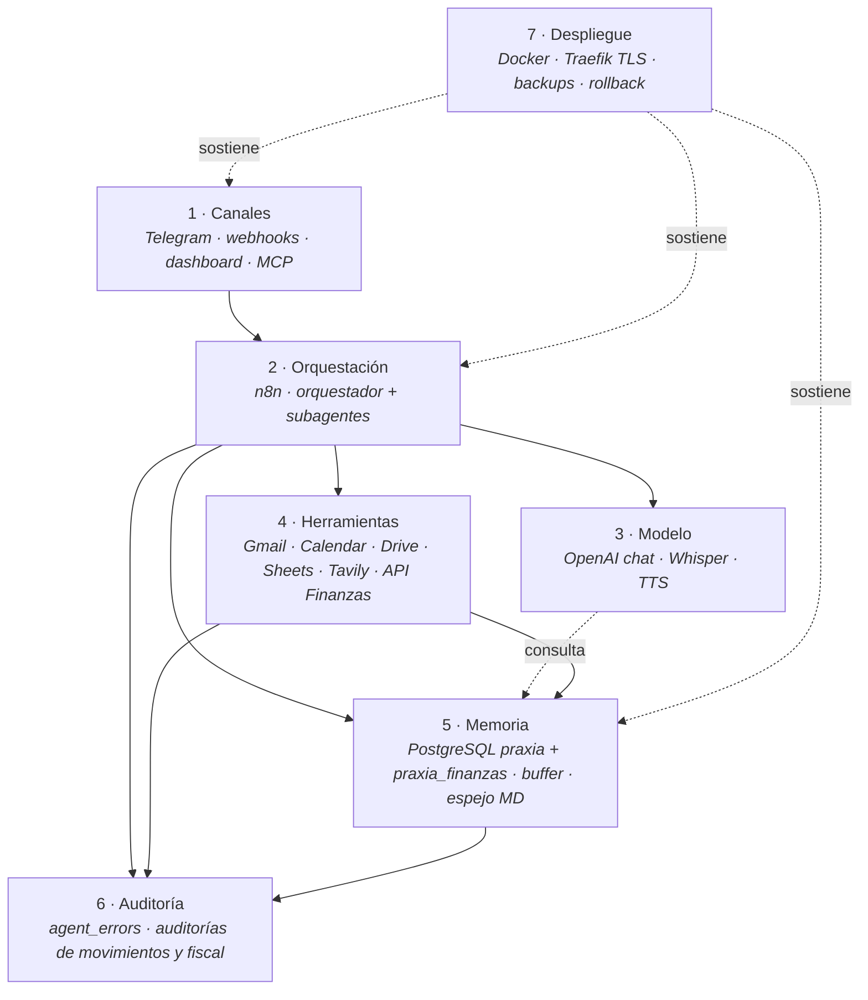

# Arquitectura

Cómo está armado PraxIA Ops: siete capas, un orquestador, quince subagentes, dos esquemas de base y una regla de aprobación humana que atraviesa todo.

Esta sección describe **la forma del sistema**. Si buscás qué hace y cómo se usa, andá al [manual de usuario](../00-manual-de-usuario/). Si buscás el criterio para elegir entre SQL, n8n, subagente, MCP o API propia, andá al [desglose técnico](../02-desglose-tecnico/). Si buscás por qué se eligió cada cosa, andá a [decisiones](../04-decisiones/).

---

## Índice de la sección

| # | Documento | Qué responde |
|---|---|---|
| 1 | [Visión general](vision-general.md) | ¿Cómo se ve el sistema completo y qué pasa cuando llega un mensaje? |
| 2 | [Estado actual (AS-IS)](estado-actual-as-is.md) | ¿Qué hay hoy, de verdad, incluido lo que está mal? |
| 3 | [Estado objetivo (TO-BE)](estado-objetivo-to-be.md) | ¿Adónde va esto y qué dispara cada paso? |
| 4 | [Modelo de datos](modelo-de-datos.md) | ¿Dónde vive cada dato y cómo se protege el sensible? |
| 5 | [Modelo de permisos](modelo-de-permisos.md) | ¿Quién puede hacer qué, y qué exige un humano? |
| 6 | [Escalamiento multiagente](escalamiento-multiagente.md) | ¿Cómo se agregan agentes y clientes sin mezclar datos? |

---

## Las siete capas

La arquitectura en siete capas se decidió el **2026-07-14**, el mismo día que las decisiones fundacionales D-1 a D-8, y antes de que existiera el primer workflow. Ese orden no es casual: es la aplicación de la regla que ordena el proyecto.

> *"Sin orden no hay sistema, solo experimentos. El error a evitar no es técnico, es de secuencia."*

| # | Capa | Responsabilidad | Tecnología en este sistema |
|---|---|---|---|
| 1 | **Canales** | Recibir el pedido, identificar a quién lo hace, aceptar texto, voz, imagen y PDF, y devolver la respuesta en el mismo canal | Telegram (`Telegram Trigger` + `If - Owner Only`), webhooks de n8n, dashboard web, servidor MCP para clientes LLM externos |
| 2 | **Orquestación** | Decidir qué herramienta o subagente resuelve el pedido, mantener el hilo, encadenar pasos, capturar errores | n8n autohospedado · workflow `Oppenheimer - Orquestador` (51 nodos al 2026-08-03) · subagentes vía `toolWorkflow` / `executeWorkflow` |
| 3 | **Modelo** | Interpretar lenguaje natural, redactar, resumir, clasificar, transcribir y hablar | OpenAI: chat, Whisper (voz→texto), TTS (texto→voz, "Jarvis"). Capa de abstracción para poder cambiar de proveedor (**D-1**) |
| 4 | **Herramientas** | Ejecutar la acción real contra un sistema externo, con contrato de entrada y salida | Gmail · Google Calendar · Google Drive · Google Sheets · Tavily · Open-Meteo · Europe PMC + OpenAlex · API de PraxIA Finanzas · 22 herramientas MCP en 4 scopes |
| 5 | **Memoria** | Recordar lo que importa entre conversaciones, y sólo eso | PostgreSQL 16 (`praxia` para memoria, `praxia_finanzas` para finanzas) · `Memory Buffer` de n8n · espejo Markdown en Obsidian · gate determinístico antes del modelo |
| 6 | **Auditoría** | Dejar rastro de qué se hizo, cuándo, con qué herramienta y bajo qué permiso — y avisar cuando algo falla | `praxia.agent_errors` + `errorWorkflow` global · `movimientos_auditoria` · `fiscal_auditoria` (inmutable) · `ingesta_raw` con `idempotency_key` · logs de ejecución de n8n |
| 7 | **Despliegue** | Correr 24/7, publicar con TLS, respaldar, y poder volver atrás | VPS propio · Docker Compose · Traefik con TLS · sin puertos publicados al host · backups diarios/semanales/mensuales con `manifest.json` y `restore_check.sh` |

### Cómo se relacionan

Las capas 6 y 7 no están "abajo" ni "arriba": son transversales. La auditoría observa a todas las demás; el despliegue las sostiene a todas.

---

## Tres reglas que atraviesan las siete capas

1. **La identidad se resuelve en la capa 1**, antes de gastar un token de modelo. Identidad por `chat_id` (**D-6**). Ver [modelo de permisos](modelo-de-permisos.md).
2. **Las invariantes viven en la capa 5**, no en el prompt. Un trigger de PostgreSQL no alucina. Ver [cuándo uso SQL](../02-desglose-tecnico/01-cuando-uso-sql.md).
3. **Cuatro acciones exigen un humano**: enviar mail, borrar, gastar y publicar (**D-7**). Ver [ADR-004](../04-decisiones/adr-004-aprobacion-humana-en-acciones-consecuentes.md).

---

## Dónde seguir

| Si querés… | Andá a |
|---|---|
| Ver el sistema completo en un diagrama | [Visión general](vision-general.md) |
| Ver la ficha de cada subsistema | [`systems/`](../../systems/) |
| Ver el SQL reconstruido | [`artifacts/sql/`](../../artifacts/sql/) |
| Ver el prompt de sistema del orquestador | [`artifacts/prompts/`](../../artifacts/prompts/) |
| Ver el método de trabajo con agentes de IA | [Gobernanza](../05-gobernanza/) |

> Última verificación: 2026-08-05
