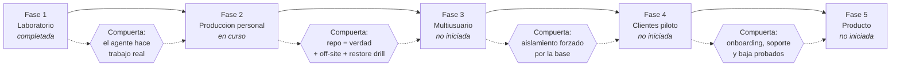

# Escalamiento multiagente

Cómo se pasa de un agente para una persona a varios agentes para varias personas sin que los datos de una terminen en la conversación de otra.

La regla que ordena todo el escalamiento se escribió el 2026-07-14, antes del primer workflow:

> *"Sin orden no hay sistema, solo experimentos. El error a evitar no es técnico, es de secuencia. Hay que construir un agente excelente (Oppenheimer) sobre una arquitectura de datos que ya contemple multiusuario."*

Las dos mitades de esa frase se contradicen sólo en apariencia. **Construir uno** es la decisión de producto: no dispersarse. **Contemplar varios** es la decisión de datos: que la tabla tenga `perfil` desde el día uno aunque haya un solo perfil. Lo caro no es agregar el segundo agente; lo caro es agregarlo sobre un esquema que asumió que había uno.

---

## Las cinco fases

Cada flecha punteada es una compuerta. No se pasa de fase porque haya ganas: se pasa porque se cumplió la condición.

---

### Fase 1 — Laboratorio · **completada**

**Qué era:** un agente personal funcional para Aldo. Telegram + n8n + OpenAI + Sheets + Calendar + Gmail básico.

**Qué se hizo:** el orquestador nació el 2026-07-14 23:05 con seis subagentes base. En una semana ya tenía briefings programados, agente de papers, memoria en PostgreSQL y export nocturno a Markdown.

**Compuerta que se cumplió:** el agente hace trabajo real todos los días, no demos.

**Lo que dejó como deuda:** todo lo que hace que la Fase 1 sea rápida —probar en producción, no versionar, iterar sobre el lienzo— es exactamente lo que hay que desarmar en la Fase 2. Los 125 workflows de laboratorio son el precio de esta fase, y está bien que se haya pagado: no había sistema que proteger todavía.

---

### Fase 2 — Producción personal · **en curso**

**Qué es:** VPS 24/7, dominio, HTTPS, PostgreSQL, backups, Oppenheimer estable.

**Qué ya está:** VPS con Docker y Traefik con TLS, sin puertos publicados al host. PostgreSQL 16 en contenedor propio, sólo en loopback. SSH cerrado tras el despliegue verificado del 2026-07-23. `errorWorkflow` global con deduplicación. Backups diarios, semanales y mensuales con lock, `manifest.json` y `restore_check.sh`. Finanzas con 606 tests y migraciones en transacción.

**Qué falta para cerrar la fase:**

| Falta | Por qué bloquea el paso a Fase 3 |
|---|---|
| Repositorio como fuente de verdad para los workflows | Sin esto no se puede replicar un agente: no hay de dónde copiarlo |
| Ambientes separados | Con dos usuarios, probar en producción deja de ser una travesura y pasa a ser un incidente ajeno |
| Backup off-site | Perder el VPS con datos de una sola persona es grave; con dos, es una promesa incumplida |
| Restore drill documentado | Sin el tiempo medido no hay RTO que ofrecer |
| Higiene del runtime | 125 workflows de laboratorio hacen imposible saber qué corre para quién |

**Compuerta:** repositorio como fuente de verdad + off-site + restore drill ejecutado.

Ver [estado objetivo (TO-BE)](estado-objetivo-to-be.md).

---

### Fase 3 — Multiusuario familiar y de proyecto · **no iniciada**

**Qué es:** el agente de la segunda persona, Nativo Salvaje, Ciencia Aplicada y PraxIA Ops, cada uno con memoria y contexto separados.

**Orden de construcción decidido:** Oppenheimer → PraxIA Ops → Ciencia Aplicada → agente de la segunda persona → marca outdoor → clientes.

Notar que **el agente de la segunda persona va cuarto, no segundo**. La razón es de riesgo, no de afecto: un agente de proyecto que se equivoca produce un documento mal archivado; un agente de otra persona que se equivoca produce una filtración entre personas que conviven. Se practica el aislamiento con datos propios antes de practicarlo con datos de otro.

**Qué hace falta:**

- Los cinco puntos pendientes de la Fase 2, sin excepción.
- Un procedimiento repetible de alta de agente: crear bot, crear credenciales, importar workflows desde el repositorio, configurar `chat_id`, verificar aislamiento.
- **Row Level Security** en la base. Con el segundo dueño de datos, el aislamiento lógico deja de alcanzar.
- Logs y errores separables por agente: `praxia.agent_errors` tiene columna de workflow; hace falta poder responder "¿qué le falló al agente de la segunda persona?" sin leer los errores de Aldo.
- Una prueba de aislamiento explícita: pedirle a un agente un dato del otro y verificar que no lo tiene, ni siquiera parcialmente.

**Compuerta:** aislamiento forzado por la base, no por la consulta. Y la prueba de aislamiento en verde.

---

### Fase 4 — Clientes piloto · **no iniciada**

**Qué es:** tres a cinco clientes boutique, con permisos claros, onboarding, documentación, soporte y costos controlados.

**Qué cambia respecto de la Fase 3:** todo lo que era disciplina personal pasa a ser obligación contractual.

| Dimensión | Fase 3 | Fase 4 |
|---|---|---|
| Aislamiento | Entre personas de confianza | Entre partes sin relación, con consecuencias legales |
| Credenciales | Del dueño del sistema | **Del cliente**, y el cliente las puede revocar |
| Datos | Se pueden mirar para depurar | **No se pueden mirar** sin permiso explícito |
| Caída | Molestia | Incumplimiento |
| Baja | Borrar un bot | Procedimiento de exportación y eliminación verificable |
| Costo | Presupuesto techo personal (**D-8**: 250.000 ARS/mes) | Costo por cliente medible, o el modelo de negocio no cierra |

**Qué hace falta además de la Fase 3:**

- Onboarding documentado y cronometrado.
- Contrato de servicio con alcance, límites y qué **no** hace el agente.
- Procedimiento de baja y revocación probado antes del primer alta. Se prueba la salida antes de vender la entrada.
- Medición de costo por cliente (tokens, almacenamiento, ejecuciones).
- Un canal de soporte con tiempos declarados.

**Compuerta:** onboarding, soporte y baja probados con un cliente ficticio de punta a punta, antes del primer cliente real.

---

### Fase 5 — Producto · **no iniciada**

**Qué es:** panel de administración, métricas, facturación, plantillas, despliegue repetible, onboarding más automatizado.

**La condición previa que suele saltearse:** un producto es un despliegue repetible. Mientras dar de alta un cliente requiera que alguien recuerde nueve pasos, no hay producto: hay un servicio artesanal con precio de producto.

**Qué hace falta:** que las Fases 3 y 4 hayan producido un procedimiento tan aburrido y tan escrito que automatizarlo sea trivial.

Está fuera del horizonte de planificación con evidencia. No se detalla más porque cualquier detalle sería invención.

---

## Los cinco principios de aislamiento

Aplican en todas las fases. La diferencia entre fases es cuán forzados están, no si valen.

### 1. Credenciales separadas

Cada agente tiene sus propias credenciales, en el almacén de n8n, referenciadas por **nombre simbólico** desde los workflows versionados. Nunca por ID, nunca por valor, nunca en el JSON exportado.

Corolario incómodo pero necesario: **si dos agentes comparten una credencial, no son dos agentes.** Son uno con dos caras, y el aislamiento es decorativo.

### 2. Permisos explícitos y mínimos

Un agente recibe el scope más chico que le permite hacer su trabajo, y nada más. El modelo de cuatro scopes MCP —`read`, `fiscal.read`, `write`, `modify`— es la forma concreta que toma esto hoy: un agente que sólo informa saldos recibe `praxia.read` y jamás toca `praxia.modify`.

Nada se concede "por las dudas". Un permiso concedido por las dudas se usa por accidente.

### 3. Datos separados desde el esquema

`perfil`, `proyecto`, `owner` y `agent` existen en las tablas desde el día uno, aunque hoy haya un solo valor posible en varias de ellas. Agregar una columna de tenant a una tabla vacía es gratis; agregarla a una tabla con datos de dos clientes es una migración con riesgo.

A partir de la Fase 3 esto deja de ser una columna y pasa a ser una política de RLS: la diferencia entre "la consulta filtra" y "la base no te deja ver".

### 4. Logs y auditoría por tenant

Cada acción registrada tiene que poder atribuirse a un agente y a un dueño de datos. Hoy `praxia.agent_errors` registra workflow y nodo; `movimientos_auditoria` registra qué cambió y cuándo; `ingesta_raw` registra canal y actor.

La pregunta que el sistema tiene que poder responder en Fase 4 es: *"mostrame todo lo que este agente hizo con los datos de este cliente el mes pasado"* — y responderla **sin mostrar nada de ningún otro cliente**. Un log que hay que filtrar a mano para poder mostrarlo no sirve como evidencia.

### 5. Baja y revocación

Un agente tiene que poder apagarse sin romper el sistema, y un cliente tiene que poder irse llevándose sus datos.

Componentes: revocar credenciales, desactivar workflows, exportar los datos del cliente en formato legible, eliminar lo que corresponda —respetando que en finanzas no hay borrado físico: la baja es lógica y auditada—, y dejar constancia del procedimiento.

**Se prueba antes de necesitarlo.** Un procedimiento de baja que se escribe el día que un cliente se va, se escribe mal.

---

## Lo que hace que esto sea posible: decisiones tomadas antes de tiempo

Cuatro decisiones del 2026-07-14 y del 2026-07-18 son las que permiten escalar sin reescribir:

| Decisión | Cómo habilita el escalamiento |
|---|---|
| **D-1** — OpenAI con capa de abstracción | Un cliente que exija otro proveedor no obliga a rehacer el orquestador |
| **D-6** — Identidad por `chat_id` desde el primer nodo | El aislamiento entre personas ya existe; falta endurecerlo, no inventarlo |
| **D-7** — Aprobación humana en las cuatro acciones consecuentes | Lo que se le puede ofrecer a un cliente es exactamente lo que ya se practica |
| **Perfiles y proyectos en el esquema desde v3.1** | La separación multi-contexto no es una migración futura: es una columna que ya está |

Y una decisión negativa igual de importante: **no se construyeron los otros cinco agentes cuando había entusiasmo para hacerlo.** Ver [ADR-001](../04-decisiones/adr-001-un-agente-excelente-antes-que-muchos.md). El costo de esa contención es que hoy hay un solo agente; el beneficio es que hay uno que funciona y un método que se puede repetir.

---

## Riesgos del escalamiento

| Riesgo | Mitigación | Estado |
|---|---|---|
| Filtración entre usuarios por consulta mal filtrada | RLS en la base | **Pendiente** — brecha 9 del TO-BE |
| Un agente nuevo hereda credenciales del anterior por comodidad | Alta de credenciales como paso obligatorio del onboarding | Pendiente de procedimiento |
| El costo por cliente supera lo cobrado | Medición de tokens, ejecuciones y almacenamiento por tenant | **Pendiente de verificar** — no hay medición por tenant hoy |
| Un cliente pide sus datos y no se los puede entregar prolijo | Exportación como parte del procedimiento de baja | Pendiente |
| Se prometen tiempos de recuperación sin haberlos medido | Restore drill | **Pendiente** — brecha 7 del TO-BE |
| Crecer en agentes antes de cerrar la Fase 2 | Las compuertas de este documento | Vigente |

El último riesgo es el más probable de todos, porque es el único que se siente como progreso mientras ocurre.

---

## Nivel de evidencia de este documento

| Afirmación | Nivel |
|---|---|
| Las cinco fases y su contenido | Verificado (definidas en la planificación del proyecto) |
| Estado de la Fase 1 y de la Fase 2 | Verificado |
| Orden de construcción de agentes | Verificado |
| D-1, D-6, D-7, D-8 | Verificado |
| Compuertas entre fases | Inferido (propuestas acá, coherentes con el TO-BE verificado) |
| Comparación Fase 3 vs Fase 4 | Inferido |
| Costos, plazos y precios de las fases 4 y 5 | Pendiente de verificar — no se estiman acá |

> Última verificación: 2026-08-05
