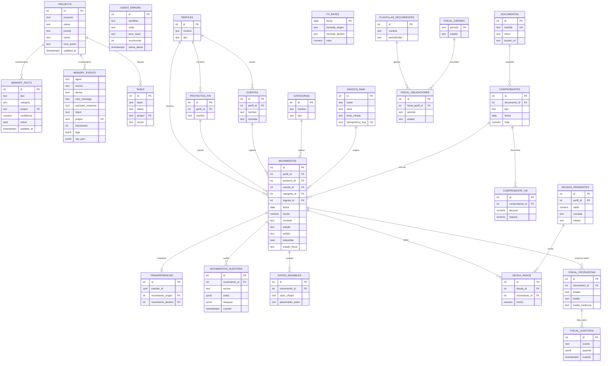
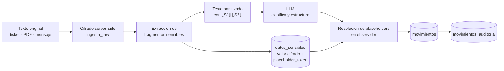

# Modelo de datos

Dos esquemas en la misma base de PostgreSQL: `praxia` para lo que el agente recuerda, `praxia_finanzas` para lo que el agente no puede inventar.

Este documento da la visión unificada. El SQL reconstruido y ejecutable está en [`artifacts/sql/`](../../artifacts/sql/); el criterio de cuándo una regla va a la base y no al prompt está en [cuándo uso SQL](../02-desglose-tecnico/01-cuando-uso-sql.md).

---

## Por qué dos esquemas y una sola base

La decisión del **2026-07-26** fue no construir un sistema financiero nuevo:

> *"Sí tiene sentido y sí vale la pena — pero NO como sistema nuevo. PraxIA Contable debe construirse como un esquema adicional (`praxia_finanzas`) dentro del PostgreSQL que ya corre en el VPS. Reutiliza ~80% de infraestructura existente. Construir una app aparte sería tirar a la basura el Memory Core."*

El resultado: una base `praxia_memory`, dos esquemas, dos roles, dos conjuntos de reglas.

| | `praxia` | `praxia_finanzas` |
|---|---|---|
| **Qué guarda** | Hechos, eventos, tareas, proyectos, errores | Movimientos, comprobantes, deudas, obligaciones fiscales |
| **Quién escribe** | Los subagentes de memoria vía n8n | Únicamente `POST /api/ingesta` |
| **Naturaleza del dato** | Aproximado, corregible, con `confidence` | Exacto, inmutable en su contenido, auditado |
| **Si falta un dato** | El agente dice que no lo tiene registrado | Ausencia de fila, nunca un cero |
| **Borrado** | `active = false` (baja lógica) | Físicamente prohibido por trigger |
| **Rol de base** | Escritura desde n8n | `praxia_finanzas_rw`, **sin `DELETE`** |
| **Versión** | Esquema v1 (2026-07-16), estable | v4.8 (2026-08-05), 35 tablas |

La distinción de fondo: **la memoria puede equivocarse y corregirse; la contabilidad no puede equivocarse en silencio.**

---

## Entidades principales

> El diagrama muestra las entidades principales y sus relaciones, no todas las columnas ni todas las tablas. La lista completa por versión de migración está en la [ficha de PraxIA Finanzas](../../systems/praxia-finanzas/).

---

## Esquema `praxia` — la memoria

Cinco tablas, ninguna sorpresa.

| Tabla | Para qué |
|---|---|
| `memory_facts` | Lo que hay que recordar. Categorías vistas: `decision`, `recordar`, `preferencia`, `regla`, `seguridad`, `familia`. Tiene `confidence` y `active` porque un hecho puede estar mal y puede dejar de ser cierto |
| `memory_events` | Traza de conversación: agente, canal, dispositivo, mensaje, respuesta, intención, importancia, tags. Es la materia prima, no la memoria |
| `projects` | Proyectos con estado, prioridad, dueño y próxima acción |
| `tasks` | Tareas, atadas a proyecto |
| `agent_errors` | Errores del runtime, con `praxia.upsert_agent_error` para deduplicar y reservar la alerta |

Previstas en el diseño original y aún no pobladas: `papers`, `content_calendar`. Están declaradas como *pendientes*, no como existentes.

### Cómo se lee la memoria

`Consultar Memoria` corre dentro de `BEGIN TRANSACTION READ ONLY`. No es cosmético: es la garantía de que el camino de lectura **no puede escribir**, aunque alguien se equivoque al editar el SQL. Adentro: normalización de acentos, stop-words en español, `to_tsvector('spanish')` y dos niveles de match (tier estricto y tier laxo, para no devolver vacío ante una diferencia de redacción).

### Cómo se escribe

`Guardar Hecho` deduplica por normalización —no por igualdad de texto— y auto-clasifica las reglas de seguridad. La escritura se verifica después de hacerse: el subagente lee lo que acaba de escribir antes de confirmar.

---

## Esquema `praxia_finanzas` — el dinero

35 tablas al 2026-08-05, construidas en once migraciones desde el DDL v3.1 del 2026-07-27.

### Núcleo

`perfiles` · `proyectos` · `cuentas` · `categorias` · `fx_rates` (+ `fx_vigente()`) · `movimientos` · `transferencias` · `valuaciones` · `cuotas_movimientos` · `ingesta_raw` · `datos_sensibles` · `movimientos_auditoria` · `schema_migrations`.

### Capas agregadas por versión

| Versión | Qué agregó |
|---|---|
| v3.6 | `documentos` con `sha256` y deduplicación |
| v4.0 | Núcleo fiscal: `comprobantes`, `comprobante_iva`, `fiscal_perfiles`, `fiscal_reglas`, `fiscal_obligaciones`, `fiscal_cierres`, `fiscal_borradores`, `fiscal_auditoria` (inmutable) |
| v4.2 | `fiscal_exportaciones` |
| v4.3 – v4.5 | Deudas: `deudas_pendientes`, `deuda_auditoria`, `deuda_pagos` con guards de moneda y recálculo de saldo |
| v4.6 | Recurrencias y planes: `plantillas_recurrentes`, `planes_pago`, `generacion_ejecuciones`. Identidad de ocurrencia `(plantilla_id, occurrence_key)` |
| v4.7 | `estado_fiscal` **derivado** de `ambito` + `deducible`. Ya no puede divergir |
| v4.8 | `fiscal_propuestas` con `huella` y `huella_evidencia` |

### Las reglas que no dependen de nadie

Están en la base como triggers y funciones. No en un prompt, no en la API, no en la UI.

| Regla | Cómo está implementada |
|---|---|
| Nunca se borra físicamente | Trigger `prohibir_delete_fisico` + rol sin `DELETE` + ningún endpoint `DELETE` |
| Un pago no puede tener moneda distinta a su deuda | `deuda_pago_validar` |
| El saldo de una deuda no lo calcula la aplicación | `recalcular_saldo_deuda` |
| Un movimiento no puede respaldar una deuda que no corresponde | `movimiento_respaldo_deuda_guard` |
| Una propuesta nace pendiente y su contenido no cambia | `propuesta_nace_pendiente`, `propuesta_contenido_inmutable` |
| Una propuesta no salta de estado | `propuesta_transicion_valida` |
| Un cierre fiscal no salta de estado | `cierre_transicion_valida` |
| El estado fiscal no puede contradecir al ámbito | `movimiento_estado_fiscal_derivado` |
| Una transferencia no cuenta como gasto | Dos patas con `transfer_id` + vista `v_transferencias_invalidas` |

Y la regla que gobierna todo el flujo de plata:

> *"Registrar una deuda, una cuota, un vencimiento o un gasto esperado no modifica saldos. El impacto financiero ocurre únicamente al registrar o vincular un pago real, y un pago se contabiliza exactamente una vez."*

### Un solo camino de entrada

> *"Toda entrada — Telegram, dashboard, PDF, CSV, email o un agente — produce el mismo contrato universal y termina en la misma base (`praxia_finanzas`)."*

`POST /api/ingesta`, con `idempotency_key` en `ingesta_raw`. Un adaptador nuevo no toca el núcleo: normaliza hacia el contrato y llama a la misma puerta.

---

## Separación por perfil y por proyecto

El aislamiento hoy tiene tres niveles, de más fuerte a más débil:

| Nivel | Dónde | Qué separa | Fuerza |
|---|---|---|---|
| **Canal** | `If - Owner Only`, identidad por `chat_id` | Un humano de otro humano | Fuerte: si no sos el dueño, el flujo termina en el nodo 2 |
| **Instancia de agente** | Bots separados: Oppenheimer para Aldo, un bot distinto para la segunda persona | Un agente de otro agente | Fuerte: credenciales y workflows distintos, sin memoria compartida (**D-6**) |
| **Fila** | `perfil_id` (`ALDO_PERSONAL` / `ALDO_PROFESIONAL` / proyectos) y `proyecto_id` | Contextos del mismo humano | **Lógico, no forzado por la base** |

El tercer nivel es el que hay que reforzar antes de que entre un cliente. Hoy la separación entre lo personal y lo profesional depende de que la consulta filtre bien. Eso alcanza para un dueño único; no alcanza para dos dueños de datos distintos. Ver [escalamiento multiagente](escalamiento-multiagente.md) y la brecha 9 del [TO-BE](estado-objetivo-to-be.md).

---

## Clasificación de datos

Cuatro niveles. Cada tabla, cada campo y cada artefacto de este repositorio cae en uno.

| Nivel | Definición | Ejemplos en este sistema | Puede salir del sistema |
|---|---|---|---|
| **Público** | Puede publicarse tal cual | Nombres de tablas y columnas, estados de máquina, contratos, arquitectura, métricas agregadas | Sí |
| **Interno** | Del sistema, no secreto, pero sin valor fuera y con riesgo de correlación | IDs de workflow, nombres de nodos, conteos por categoría, versiones de esquema | Sólo agregado o abreviado |
| **Sensible** | Identifica a una persona o expone su vida | Contenido de `memory_facts` de categoría `familia`, montos reales, comprobantes, direcciones de correo, `chat_id` | **No** |
| **Prohibido** | Nunca entra al sistema, ni siquiera cifrado en el lugar equivocado | Contraseñas, tokens, API keys, claves privadas, datos bancarios completos | **No, y además se rechaza en la entrada** |

### La categoría "prohibido" tiene un gate propio

No es una recomendación: es un nodo. El router de memoria tiene un paso *"¿Tiene secreto?"* que deriva a `Rechazo Secreto`. Y la propia memoria guarda la regla como hecho #14:

> *"Nunca guardar contraseñas, tokens, API keys, claves privadas, credenciales ni datos bancarios completos. Si Aldo intenta guardar algo sensible, advertirle y sugerir guardar solo una referencia segura."*

Un sistema que le pide a su dueño que no guarde secretos está delegando el control en la disciplina. Uno que lo rechaza en el nodo, no.

Evidencia de que funciona: el export del 2026-08-05 registró **0 secretos omitidos** — porque ninguno llegó a intentar entrar.

---

## Tratamiento de datos sensibles: cifrado y placeholders

Éste es el mecanismo que permite que un LLM procese un texto financiero sin ver el dato sensible que contiene.

### Cómo funciona

1. El texto original entra por `POST /api/ingesta` y se guarda **cifrado server-side** en `ingesta_raw`, junto con canal, actor e `idempotency_key`.
2. Los fragmentos sensibles se extraen a `datos_sensibles`, cifrados, cada uno con un **`placeholder_token`** de la forma `⟦S1⟧`, `⟦S2⟧`, etc.
3. El texto que se le manda al modelo lleva los placeholders, no los valores.
4. El modelo trabaja sobre la estructura: clasifica, extrae fechas, detecta el tipo de comprobante, propone categoría.
5. Al persistir, el sistema —no el modelo— resuelve los placeholders contra `datos_sensibles`.

### Por qué esto es distinto de "no mandar datos sensibles al LLM"

La versión ingenua es no mandar nada y perder la capacidad de estructurar texto libre. La versión de este sistema **manda la forma y se guarda el contenido**: el modelo ve `"pago de ⟦S1⟧ el 12/07 con tarjeta ⟦S2⟧"` y puede clasificarlo perfectamente sin haber visto nunca el número.

La clave de cifrado, además, **vive fuera del volumen** — corrección aplicada en la migración v3.4 del 2026-07-27, junto con el cierre de seguridad.

### Qué cubre y qué no

| | |
|---|---|
| **Cubre** | Que el proveedor de LLM no vea datos sensibles; que un dump de la tabla de ingesta no sea legible; que la resolución quede auditada |
| **No cubre** | Que alguien con acceso al servidor y a la clave lea todo. No es cifrado de conocimiento cero, y no se lo presenta como tal |

---

## Cómo se prueba todo esto

554 casos en 27 archivos, con `node --test` y un harness de **PGlite que replica el esquema real**. No hay mocks de la base: el DDL de verdad corre en cada test.

La cobertura incluye explícitamente sanitización, datos sensibles, normalización de montos ambiguos, separador decimal, tipo de cambio, transferencias y sus guards, migraciones v4.6 y v4.7, y lectura fiscal en JS y en SQL.

Ver [testing y evidencia](../02-desglose-tecnico/09-testing-y-evidencia.md).

---

## Nivel de evidencia de este documento

| Afirmación | Nivel |
|---|---|
| Nombres de esquemas, tablas, vistas, triggers y funciones | Verificado |
| Versiones de migración y qué agregó cada una | Verificado |
| Mecanismo de cifrado y placeholders | Verificado |
| Tipos de columna y cardinalidades exactas del `erDiagram` | Inferido (reconstrucción razonable; los nombres son fieles) |
| Clasificación de datos en cuatro niveles | Inferido (marco propuesto, coherente con la política de publicación verificada) |
| Contenido y volumen de `papers` y `content_calendar` | Pendiente de verificar (declaradas, no pobladas) |

> Última verificación: 2026-08-05
