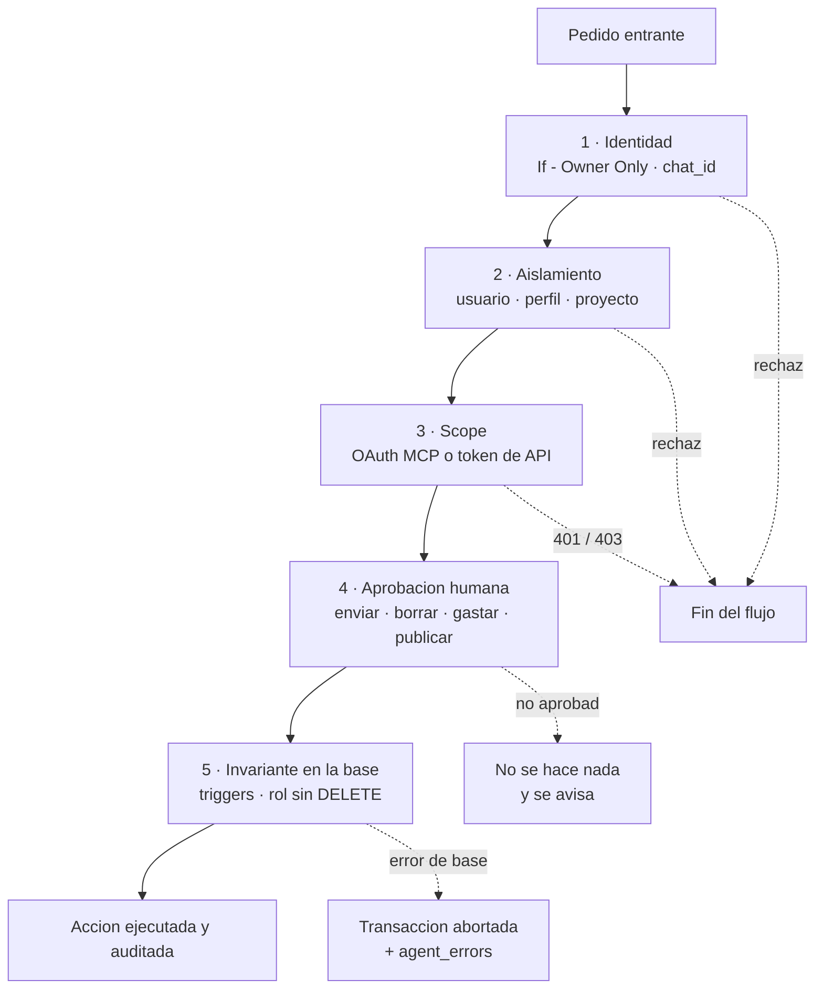

# Modelo de permisos

Quién puede hacer qué, dónde se controla, y las cuatro acciones que ningún agente ejecuta solo.

El principio de fondo cabe en una línea de la línea base de gobernanza del 2026-08-03:

> *"Los agentes de IA pueden proponer, implementar y verificar trabajo. No se convierten en el dueño responsable del riesgo, el acceso o la decisión de release."*

---

## Los cinco anillos de control

Un pedido que quiere modificar algo tiene que atravesar cinco controles independientes. Ninguno confía en el anterior.

El diseño asume que los cuatro primeros pueden fallar. El quinto —la base— es el único que no depende de que un prompt se comporte bien, y por eso es donde viven las reglas que no pueden romperse nunca.

---

## Anillo 1 — Identidad por `chat_id`

La decisión **D-6** (2026-07-14): *identidad por `chat_id`*. Oppenheimer es el bot de Aldo; un bot distinto es el de la segunda persona; los datos están separados por usuario.

La implementación es el segundo nodo del flujo: `Telegram Trigger` → `If - Owner Only`. Si el `chat_id` no coincide, el flujo termina.

Tres propiedades que valen la pena:

- **Es determinístico.** No hay modelo involucrado en decidir quién sos.
- **Es barato.** Se resuelve antes de gastar un token.
- **Es temprano.** Un pedido no autorizado no llega a tocar memoria, ni herramientas, ni la base.

El `chat_id` real no se publica en ningún lado de este repositorio. La regla de diseño sí.

> **Limitación honesta:** el `chat_id` identifica un dispositivo/cuenta de Telegram, no a una persona. Es suficiente para un sistema de un usuario. Para clientes hace falta identidad verificable y revocable — ver [escalamiento multiagente](escalamiento-multiagente.md).

---

## Anillo 2 — Aislamiento por usuario, perfil y proyecto

| Frontera | Mecanismo | Fuerza |
|---|---|---|
| Titular ↔ segunda persona | Bots distintos, workflows distintos, credenciales distintas, memoria distinta | Fuerte |
| Personal ↔ Profesional | `perfil_id` en `praxia_finanzas`: `ALDO_PERSONAL`, `ALDO_PROFESIONAL` | Lógica |
| Proyecto ↔ Proyecto | `proyecto_id` en finanzas, `project` en `memory_facts` y `memory_events` | Lógica |

Las dos últimas dependen de que la consulta filtre bien. Es aceptable con un solo dueño de datos y deja de serlo con dos: por eso la brecha de Row Level Security se activa con el **segundo tenant**, no con el primero.

---

## Anillo 3 — Scopes y tokens

### Servidor MCP: cuatro scopes OAuth, 22 herramientas

El servidor MCP (TypeScript, Express, `@modelcontextprotocol/sdk`, SSE, OAuth/JWT/PKCE) expone las herramientas repartidas en cuatro scopes que se conceden por separado.

| Scope | Herramientas | Qué habilita | Riesgo |
|---|---|---|---|
| `praxia.read` | 8 — `salud`, `consultar_catalogos`, `consultar_saldos`, `consultar_movimientos`, `consultar_pendientes`, `consultar_resumen`, `consultar_auditoria`, `consultar_duplicados` | Ver el estado financiero | Confidencialidad |
| `praxia.fiscal.read` | 10 — `consultar_cierre_fiscal` + las nueve de lectura fiscal (`fiscal_movimientos_confirmados`, `fiscal_movimientos_pendientes`, `fiscal_deuda`, `fiscal_deuda_pagos`, `fiscal_obligaciones`, `fiscal_documentos`, `fiscal_cambios_historicos`, `fiscal_resumen_periodo`, `fiscal_discrepancias`) | Ver el estado fiscal | Confidencialidad elevada |
| `praxia.write` | 1 — `registrar_movimiento` | Crear un movimiento nuevo | Integridad; mitigado por idempotencia y estado inicial pendiente |
| `praxia.modify` | 4 — `corregir_movimiento`, `confirmar_movimiento`, `anular_movimiento`, `importar_documento` | Alterar lo ya registrado | **Alto.** Marcadas "¡REQUIERE CONFIRMACIÓN EXPLÍCITA!" |

Que la lectura fiscal tenga scope propio y separado de la lectura general no es burocracia: un cliente LLM que necesita saber el saldo no necesita ver la clasificación fiscal de cada movimiento.

Que `write` tenga **una sola** herramienta tampoco es casual. Es el reflejo del contrato universal: hay un solo camino de alta, así que hay una sola herramienta de alta.

### API HTTP: token en todos los endpoints, ninguno `DELETE`

Los 60+ endpoints de la API exigen token. Y hay una ausencia deliberada: **no existe ningún endpoint `DELETE`**. No está protegido, no está restringido — no existe. Ver [ADR-007](../04-decisiones/adr-007-sin-borrado-fisico.md).

### Credenciales de n8n

Las credenciales reales viven en el almacén de credenciales de n8n. Los workflows versionados las referencian por **nombre simbólico**, nunca por ID ni por valor. Los IDs de credencial no se publican. Ver [versionado no-code](../05-gobernanza/versionado-no-code.md).

---

## Anillo 4 — Las cuatro acciones que exigen un humano

Decisión **D-7**, 2026-07-14:

| # | Acción | Por qué | Dónde está implementado |
|---|---|---|---|
| 1 | **Enviar mail** | Es irreversible y sale con tu nombre | `Oppenheimer - Agente de Email`: `Telegram - Approve Send` → `If - Approved`. El borrador completo se muestra antes de aprobar |
| 2 | **Borrar** | Es irreversible y destruye evidencia | Resuelto por diseño: no hay borrado físico. Trigger `prohibir_delete_fisico`, rol sin `DELETE`, cero endpoints `DELETE`. La baja lógica queda auditada |
| 3 | **Gastar** | Compromete dinero real | Las 4 herramientas de `praxia.modify` requieren confirmación explícita. Un movimiento nace pendiente y necesita `confirmar_movimiento` |
| 4 | **Publicar** | Es irreversible hacia afuera y expone a terceros | Compuerta 5 de la [política de publicación](../05-gobernanza/politica-de-publicacion.md): aprobación humana antes de publicar cualquier artefacto |

### Tres reglas finas sobre la aprobación

**La aprobación no ejecuta.**

> *"La aprobación no ejecuta nada financieramente."*

Aprobar una propuesta fiscal la marca como aprobada. No mueve saldos. El impacto ocurre sólo al registrar o vincular un pago real, y exactamente una vez.

**El agente no puede insistir hasta ganar.**

> *"Un agente que puede repreguntar sin límite termina consiguiendo el 'sí' por cansancio."*

Por eso `fiscal_propuestas` tiene `huella` y `huella_evidencia`: la huella impide volver a proponer lo mismo, y la huella de evidencia impide aprobar algo cuyo sustento ya caducó. El control contra la fatiga de aprobación está en la base de datos, no en la buena voluntad del prompt.

**El rechazo es un camino de primera clase.** Cuando la respuesta es "no", el sistema confirma explícitamente que no hizo nada. Un agente que se queda callado tras un rechazo es indistinguible de uno que falló.

---

## Anillo 5 — Invariantes en la base

El último anillo no confía en ninguno de los anteriores. Si un bug, una alucinación o un pedido malicioso atraviesan los cuatro primeros, acá se detiene.

| Invariante | Trigger / mecanismo |
|---|---|
| No se borra físicamente | `prohibir_delete_fisico` + rol `praxia_finanzas_rw` sin `DELETE` |
| Un pago no cambia de moneda | `deuda_pago_validar` |
| El saldo no lo calcula la app | `recalcular_saldo_deuda` |
| Una propuesta no cambia de contenido | `propuesta_contenido_inmutable` |
| Los estados no saltan | `propuesta_transicion_valida`, `cierre_transicion_valida` |
| El estado fiscal no contradice al ámbito | `movimiento_estado_fiscal_derivado` |
| Una entrada no se procesa dos veces | `idempotency_key` en `ingesta_raw` |
| La auditoría fiscal no se toca | `fiscal_auditoria` inmutable |

Ver el SQL en [`artifacts/sql/04-invariantes-y-triggers.sql`](../../artifacts/sql/04-invariantes-y-triggers.sql).

---

## Matriz actor × acción

Actores del sistema:

- **Aldo** — dueño, usuario único, aprobador.
- **Orquestador** — `Oppenheimer - Orquestador`, decide y delega.
- **Subagente** — Email, Calendario, Planillas, Papers, Buscador, Memoria, consulta financiera.
- **Agente IA externo** — un cliente LLM conectado por MCP con scopes concedidos.
- **API Finanzas** — el proceso servidor que ejecuta contra la base.
- **Rutina programada** — briefings, export nocturno, generación de recurrencias.

| Acción | Aldo | Orquestador | Subagente | Agente IA externo | API Finanzas | Rutina | ¿Requiere aprobación humana? |
|---|---|---|---|---|---|---|---|
| Leer memoria | Sí | Sí | Sí (Memoria) | No | — | Sí | No |
| Guardar hecho en memoria | Sí | Vía subagente | Sí (Memoria) | No | — | No | No |
| Guardar un secreto | **Prohibido** | **Prohibido** | **Prohibido** (`Rechazo Secreto`) | **Prohibido** | **Prohibido** | **Prohibido** | N/A — se rechaza |
| Leer agenda | Sí | Vía subagente | Sí (Calendario) | No | — | Sí (briefing) | No |
| Crear / modificar evento | Sí | Vía subagente | Sí (Calendario) | No | — | No | No |
| Leer correo | Sí | Vía subagente | Sí (Email) | No | — | Sí (briefing) | No |
| Redactar borrador de correo | Sí | Vía subagente | Sí (Email) | No | — | No | No |
| **Enviar correo** | Sí | No directo | Sólo tras aprobación | No | — | No | **Sí — D-7** |
| Buscar en la web | Sí | Vía subagente | Sí (Tavily) | No | — | No | No |
| Buscar papers | Sí | Vía subagente | Sí (Papers) | No | — | No | No |
| Leer / escribir planillas | Sí | Vía subagente | Sí (Planillas) | No | — | No | No |
| Consultar saldos y movimientos | Sí | Vía workflow de solo lectura | Sí (solo lectura) | Sí (`praxia.read`) | Sí | No | No |
| Consultar estado fiscal | Sí | Vía workflow de solo lectura | Sí (solo lectura) | Sí (`praxia.fiscal.read`) | Sí | No | No |
| **Registrar movimiento** | Sí | No directo | No | Sí (`praxia.write`) | Sí | Sí (recurrencias) | No para crear — **sí para confirmar** |
| **Confirmar movimiento** | Sí | No | No | Sí (`praxia.modify`) | Sí | No | **Sí — confirmación explícita** |
| **Corregir movimiento** | Sí | No | No | Sí (`praxia.modify`) | Sí | No | **Sí — confirmación explícita** |
| **Anular movimiento** | Sí | No | No | Sí (`praxia.modify`) | Sí | No | **Sí — confirmación explícita** |
| **Importar documento** | Sí | No | No | Sí (`praxia.modify`) | Sí | No | **Sí — confirmación explícita** |
| Vincular un pago a una deuda | Sí | No | No | No | Sí | No | **Sí — es "gastar"** |
| Proponer clasificación fiscal | — | No | No | No | Sí (`fiscal_motor.mjs`) | Sí | No para proponer — **sí para decidir** |
| Aprobar propuesta fiscal | Sí | No | No | No | — | No | **Sí, por definición** |
| **Borrar cualquier cosa** | **Nadie** | **Nadie** | **Nadie** | **Nadie** | **Nadie** | **Nadie** | N/A — no existe |
| Publicar un workflow en producción | Sí | No | No | No | — | No | **Sí — D-7 + compuerta de release** |
| Publicar contenido hacia afuera | Sí | No | No | No | — | No | **Sí — D-7 + política de publicación** |
| Desplegar una migración | Sí | No | No | No | — | No | **Sí — [runbook](../06-runbooks/despliegue-de-una-migracion.md)** |
| Rotar o leer una credencial | Sí | No | No | No | No | No | **Sí — sólo humano** |

### Cómo se lee la matriz

Tres patrones se repiten:

1. **El orquestador casi nunca actúa directo.** Delega en subagentes con contrato. Eso acota el radio de daño de un prompt mal interpretado a un solo dominio.
2. **Leer es libre, escribir es caro.** Toda la columna de lectura dice "sí" sin condiciones; toda la de escritura consecuente exige un humano.
3. **"Nadie" aparece una sola vez, en borrar.** No es un permiso denegado: es una capacidad que no existe en el sistema.

---

## Lo que ningún agente puede hacer nunca

Independientemente del scope, del token y de la aprobación:

- Borrar físicamente una fila.
- Leer, escribir o rotar una credencial.
- Guardar un secreto en la memoria.
- Modificar `fiscal_auditoria`.
- Cambiar sus propios permisos o scopes.
- Aprobar su propia propuesta.
- Publicar hacia afuera sin pasar por las seis compuertas de revisión.

Ver el [acuerdo de trabajo con agentes](../05-gobernanza/acuerdo-de-trabajo-con-agentes.md), donde esta lista se extiende a los agentes de codificación que trabajan sobre el propio repositorio.

---

## Nivel de evidencia de este documento

| Afirmación | Nivel |
|---|---|
| D-6, D-7, scopes MCP y sus 22 herramientas, ausencia de `DELETE`, triggers | Verificado |
| Flujo de aprobación del Agente de Email | Verificado |
| `huella` / `huella_evidencia` como control anti-insistencia | Verificado |
| La matriz actor × acción | Inferido (síntesis de reglas verificadas; no es un ACL exportado del sistema) |
| Los "cinco anillos" como marco | Inferido (modelo descriptivo propuesto acá) |
| Política formal de rotación de credenciales | Pendiente de verificar |

> Última verificación: 2026-08-05
