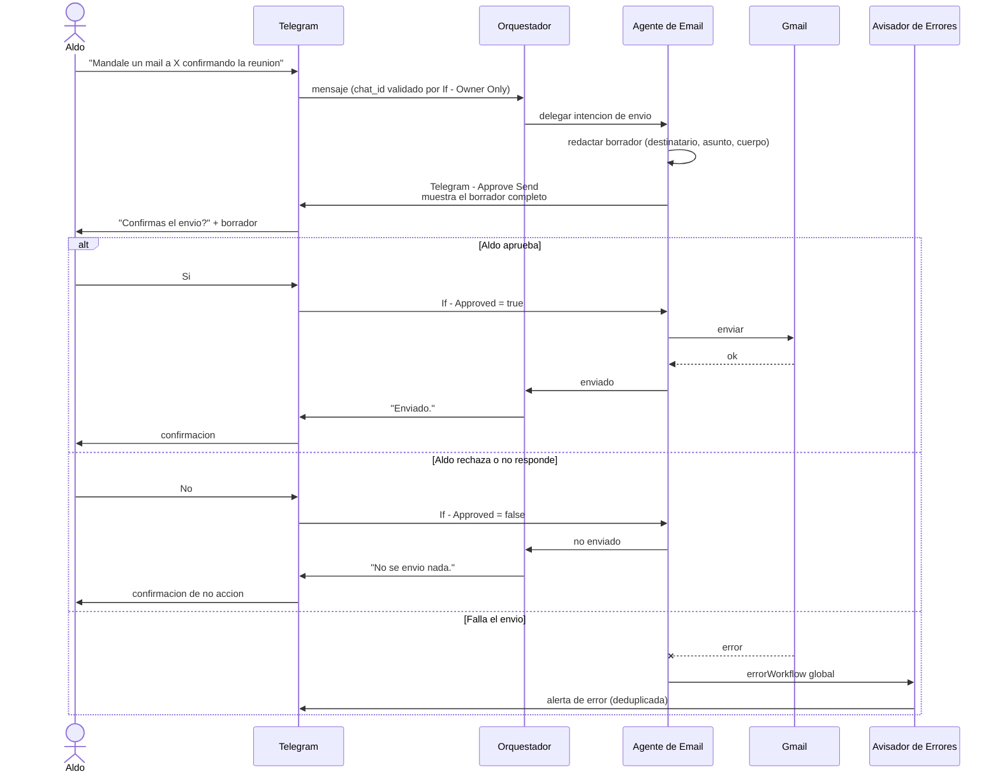

# Visión general de la arquitectura

El sistema completo de punta a punta: qué recibe, quién decide, quién ejecuta, dónde queda el rastro y cómo vuelve la respuesta.

---

## La idea en un párrafo

Un mensaje de Telegram entra a un runtime de n8n autohospedado. Antes de llegar al modelo pasa por dos filtros determinísticos: uno de identidad y otro de memoria. El orquestador decide si contesta solo o delega en un subagente especializado. Cada subagente tiene su propio contrato, sus propias credenciales y —cuando la acción es consecuente— su propia aprobación humana. Todo lo que se recuerda va a PostgreSQL; todo lo que falla va a una tabla de errores y a un aviso por Telegram. Las finanzas viven en un esquema aparte con sus propias invariantes y su propia API. Nada de eso corre en la máquina de nadie: corre en un VPS con Docker, Traefik y backups.

---

## El sistema completo

```mermaid
flowchart TB
    subgraph CANALES["1 · Canales"]
        TG["Telegram<br/>texto · voz · imagen · PDF"]
        WH["Webhooks<br/>recordatorios · TradingView"]
        DSH["Dashboard web<br/>SPA de un archivo"]
        LLM["Clientes LLM externos<br/>via MCP + OAuth"]
    end

    subgraph GATES["Filtros determinísticos (sin LLM)"]
        OWN["If - Owner Only<br/>identidad por chat_id"]
        MIG["Code - Memory Intent Gate<br/>+ IF Memory Required"]
    end

    subgraph ORQ["2 · Orquestación — n8n"]
        ORQC["Oppenheimer - Orquestador<br/>51 nodos · activo"]
        ERR["PraxIA — Avisador de Errores v1<br/>errorWorkflow global"]
    end

    subgraph MODELO["3 · Modelo"]
        CHAT["OpenAI chat"]
        WSP["Whisper<br/>voz a texto"]
        TTS["TTS 'Jarvis'<br/>texto a voz"]
    end

    subgraph SUBS["4 · Subagentes y herramientas"]
        SMAIL["Agente de Email<br/>con aprobacion humana"]
        SCAL["Agente de Calendario"]
        SSHE["Agente de Planillas"]
        SPAP["Agente Papers v2.1"]
        SWEB["Buscador Web Tavily V1<br/>9 nodos · contrato de evidencia"]
        SMEM["PraxIA Memory — Router"]
        SFIN["Consulta financiera<br/>workflow de solo lectura"]
        TOOLS["Herramientas directas<br/>Drive · Clima · Calculator · Think"]
    end

    subgraph MEM["5 · Memoria"]
        BUF["Memory Buffer<br/>conversacion reciente"]
        PGM[("PostgreSQL 16<br/>esquema praxia<br/>memory_facts · memory_events<br/>tasks · projects")]
        MD["Espejo Markdown<br/>Obsidian + OneDrive<br/>export 23:30 ART"]
    end

    subgraph FIN["Finanzas — PraxIA Finanzas"]
        API["API Node.js sin framework<br/>POST /api/ingesta<br/>unico camino de alta"]
        MCPS["Servidor MCP<br/>22 herramientas · 4 scopes"]
        PGF[("PostgreSQL 16<br/>esquema praxia_finanzas<br/>v4.13 · 39 tablas")]
        AGF["Agente Fiscal<br/>capa de solo lectura<br/>9 operaciones · 13 detectores"]
    end

    subgraph AUD["6 · Auditoria"]
        AERR[("praxia.agent_errors")]
        AMOV[("movimientos_auditoria")]
        AFIS[("fiscal_auditoria<br/>inmutable")]
        AING[("ingesta_raw<br/>idempotency_key")]
    end

    subgraph INFRA["7 · Despliegue"]
        DOCK["Docker Compose<br/>n8n · Traefik · praxia-memory-db"]
        TRF["Traefik + TLS<br/>sin puertos publicados"]
        BKP["Backups diarios/semanales/mensuales<br/>manifest.json + restore_check.sh"]
    end

    subgraph CRON["Rutinas programadas"]
        BN["06:30 Briefing Noticias"]
        BD["07:00 Briefing Diario"]
        EX["23:30 Export memoria a MD"]
    end

    TG --> OWN
    WH --> ORQC
    DSH --> API
    LLM --> MCPS

    OWN --> MIG
    MIG -->|"si hace falta"| SMEM
    MIG --> ORQC

    ORQC <--> CHAT
    TG -.audio.-> WSP --> ORQC
    ORQC --> TTS -.audio.-> TG

    ORQC --> SMAIL
    ORQC --> SCAL
    ORQC --> SSHE
    ORQC --> SPAP
    ORQC --> SWEB
    ORQC --> SMEM
    ORQC --> SFIN
    ORQC --> TOOLS

    ORQC <--> BUF
    SMEM <--> PGM
    PGM --> MD

    SFIN --> API
    MCPS --> API
    API --> PGF
    AGF --> API

    ORQC -.error.-> ERR --> AERR
    SMAIL -.error.-> ERR
    SWEB -.error.-> ERR
    API --> AING
    API --> AMOV
    PGF --> AFIS

    CRON --> ORQC
    EX --> MD

    DOCK -.corre.-> ORQC
    DOCK -.corre.-> PGM
    DOCK -.corre.-> PGF
    TRF -.expone.-> API
    TRF -.expone.-> MCPS
    BKP -.respalda.-> PGM
    BKP -.respalda.-> PGF
```

---

## Recorrido de un pedido típico

Tomemos un pedido realista y mixto: **"¿Qué tengo mañana y cuánto gasté este mes en el proyecto?"**. Es un buen ejemplo porque toca agenda, finanzas y memoria en la misma frase.

### 1. Llega el mensaje

`Telegram Trigger` recibe la actualización. El primer nodo después del trigger no es el modelo: es `If - Owner Only`. Si el `chat_id` no es el del dueño, el flujo termina ahí. **No se gasta un token de modelo antes de saber quién habla.**

Si el mensaje hubiera sido un audio, acá se intercala Whisper y el texto transcripto sigue exactamente el mismo camino que un mensaje escrito. Si hubiera sido una imagen, entra por `Analyze Image`. Si hubiera sido un PDF, entra a la máquina de estados `received → validated → text_extracted → reviewed → archived | failed`, con límite de 20 MiB y verificación de la firma `%PDF-` — controles que existen porque el 2026-07-25 un PDF de 21,9 MB rompió la ejecución 1292.

### 2. Se decide si hace falta memoria, sin preguntarle al modelo

`Code - Memory Intent Gate` evalúa el texto con código, no con un LLM. Si detecta que el pedido depende de algo que el sistema debería recordar, `IF Memory Required` deriva a `PraxIA Memory Preflight`, que consulta la memoria **antes** de que el modelo redacte nada.

La regla que fuerza este comportamiento está escrita en el prompt de sistema:

> *"Está prohibido responder 'no tengo registrado' sin haber llamado primero a PraxIA_Memory con action=consultar y haber recibido facts=[]"*.

El detalle importa: la diferencia entre un agente que recuerda y uno que finge recordar no es el modelo, es un `if` determinístico ejecutado antes del modelo. Ver [memoria y RAG](../02-desglose-tecnico/07-memoria-y-rag.md).

### 3. El orquestador decide el plan

Con el contexto de memoria cargado y el `Memory Buffer` de la conversación reciente, el orquestador arma el plan. Para nuestro pedido son dos llamadas:

- **Agenda** → `Oppenheimer - Agente de Calendario`, operación *Get* sobre Google Calendar.
- **Gasto del mes** → el workflow de consulta financiera, que es de **solo lectura** y llega a los endpoints `GET` de la API de Finanzas.

El orquestador no consulta la base financiera por su cuenta. Pasa por la API, porque la API es donde viven la validación, la deduplicación y la auditoría. Un agente con acceso directo a la tabla es un agente que puede saltearse las tres.

### 4. Cada subagente ejecuta con su propio contrato

Cada subagente recibe una entrada tipada y devuelve una salida tipada. El de búsqueda web, por ejemplo, no devuelve "un texto": devuelve uno de siete estados explícitos —`ok`, `clarification_required`, `no_reliable_source`, `search_not_configured`, `technical_error`, `stable_knowledge_handoff`, `insufficient_evidence`—. El orquestador sabe qué hacer con cada uno.

En finanzas rige otra regla dura del contrato:

> *"Ninguna cotización se inventa. Ausencia de dato es ausencia de fila, nunca un cero."*

Si no hay tipo de cambio vigente para el día pedido, la consulta no devuelve cero: devuelve nada, y el agente lo dice.

### 5. Vuelve la respuesta

El orquestador compone una sola respuesta con las dos partes, la manda por Telegram y —si el pedido entró por voz— la manda también hablada con TTS.

### 6. Queda el rastro

La ejecución queda en el historial de n8n. Si algo hubiera fallado en cualquier nodo, el `errorWorkflow` global `PraxIA — Avisador de Errores v1` lo habría capturado, registrado en `praxia.agent_errors` vía `praxia.upsert_agent_error` —con deduplicación y anti-spam— y avisado por Telegram.

Nada de este recorrido escribió en ningún lado. **Ése es el punto**: la lectura es libre, la escritura no.

---

## Cuando el pedido sí escribe: la aprobación humana

La decisión **D-7** (2026-07-14) establece que cuatro tipos de acción exigen un humano en el medio: **enviar mail, borrar, gastar y publicar**. La implementación más visible es el envío de correo.

Tres cosas a notar en ese diagrama:

1. **El borrador se muestra entero antes de aprobar.** Aprobar a ciegas no es aprobar.
2. **El "no" es un camino de primera clase**, con confirmación explícita de que no se hizo nada. Un agente que se queda callado cuando lo rechazan es un agente en el que no se puede confiar.
3. **El error tiene su propio camino**, que no pasa por el orquestador. Si el orquestador es el que falla, el aviso igual sale.

En finanzas la misma idea toma otra forma: las cuatro herramientas MCP del scope `praxia.modify` están marcadas "¡REQUIERE CONFIRMACIÓN EXPLÍCITA!", y el contrato aclara algo que suele confundirse:

> *"La aprobación no ejecuta nada financieramente."*

Aprobar una propuesta fiscal no mueve plata. El impacto financiero sólo ocurre al registrar o vincular un pago real. Y el agente que las propone no puede aprobarlas: su token recibe **403** en la ruta de decisión. Ver [modelo de permisos](modelo-de-permisos.md), [ADR-004](../04-decisiones/adr-004-aprobacion-humana-en-acciones-consecuentes.md) y la ficha del [Agente Fiscal](../../systems/praxia-agente-fiscal/).

---

## Lo que este diagrama no muestra

Un diagrama de arquitectura siempre es más prolijo que el sistema. Para leer el estado real, incluidas las 125 nomenclaturas de laboratorio conviviendo con producción y la ausencia de separación de ambientes, ver [estado actual (AS-IS)](estado-actual-as-is.md).

---

## Para seguir

| Tema | Documento |
|---|---|
| Qué hay hoy de verdad | [Estado actual (AS-IS)](estado-actual-as-is.md) |
| Adónde va | [Estado objetivo (TO-BE)](estado-objetivo-to-be.md) |
| Dónde vive cada dato | [Modelo de datos](modelo-de-datos.md) |
| Ficha completa del agente | [`systems/oppenheimer`](../../systems/oppenheimer/) |
| Ficha completa de finanzas | [`systems/praxia-finanzas`](../../systems/praxia-finanzas/) |
| Ficha completa del agente fiscal | [`systems/praxia-agente-fiscal`](../../systems/praxia-agente-fiscal/) |
| Estructura del orquestador nodo por nodo | [`artifacts/workflows-n8n/estructura-orquestador.md`](../../artifacts/workflows-n8n/estructura-orquestador.md) |

> Última verificación: 2026-08-06
