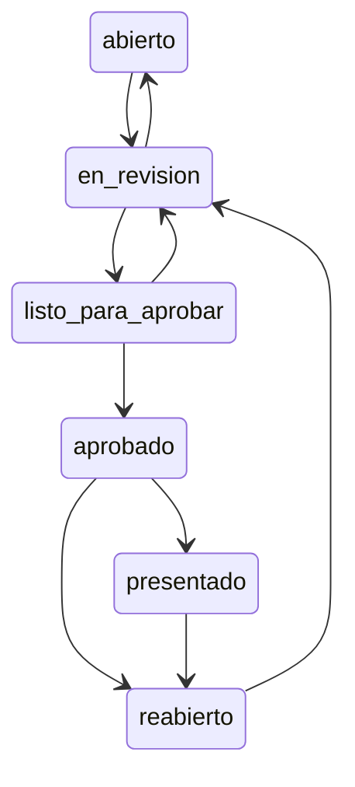

# ADR-012 — La invariante vive en la base

La regla estaba escrita en el código y no alcanzó, porque el código no es el único camino a la base. Lo que tiene que ser siempre cierto se garantiza donde pasan todos los caminos.

> **In English** — Why the invariants in this system live in PostgreSQL rather than in application code. On
> 2026-08-05, 22 movements ended up correctly classified in `ambito` and `deducible` while their
> `estado_fiscal` marker stayed at `sin_clasificar`: the agent saw them as classified, `cierre_chequeos()`
> kept flagging them as blockers, and nothing raised an error. The same day a function guarding the closing
> state machine was found never to have executed — an HTTP route issued a direct UPDATE, so a freshly opened
> period could be marked as filed. The fix was migration v4.7: `estado_fiscal` became a derived value enforced
> by trigger, the transition graph moved into the database, and the corrective migration verifies itself with
> a `DO $$` block that raises and aborts if any incoherent row survives. The declared cost is logic split
> across `.mjs` and `.sql`, mitigated by a test that fails if the two copies of the graph diverge.

<!-- fin del resumen en inglés -->

## Estado

Vigente.

## Fecha

2026-08-05 — decidida e implementada con la migración v4.7 (`estado_fiscal` derivado y máquina de estados del cierre), a partir de dos hallazgos del mismo día.

## Contexto

El 2026-08-05 se clasificaron 22 movimientos. Quedaron con `ambito` y `deducible` correctos, y con el marcador `estado_fiscal` sin actualizar, en `'sin_clasificar'`.

El resultado fue una contradicción operativa: el Agente Fiscal los veía clasificados —porque mira `ambito` y `deducible`— y la función `cierre_chequeos()` los seguía marcando como bloqueantes —porque mira `estado_fiscal`—. El período no podía pasar a `listo_para_aprobar` por movimientos que estaban, de hecho, clasificados.

> *«Dos partes del sistema, dos respuestas distintas a la misma pregunta, sin que nada avisara de la contradicción.»*
> — `44_Migration_v4_7_estado_fiscal_derivado.sql`

La contradicción no era el problema más grave. El problema era que **nada avisaba**. No hubo error, no hubo excepción, no hubo log. Hubo un cierre que no cerraba y un diagnóstico que decía que estaba todo bien, y hasta que alguien puso las dos cosas al lado no había forma de notarlo.

La reacción intuitiva es corregir el código que clasifica: que además de escribir `ambito` y `deducible`, escriba `estado_fiscal`. Es una línea. Y no alcanza:

> *«el día que alguien escriba `ambito` por otra vía —una importación, un flujo de n8n, un psql suelto— vuelven a divergir. Lo que hace falta es que no puedan.»*

Ese mismo día apareció el segundo hallazgo, que es la misma enfermedad con otro síntoma. `api/fiscal.mjs` definía una función `puedeTransicionar()` con el grafo completo de estados del cierre. Estaba bien escrita. **Nunca se ejecutaba**: la ruta HTTP hacía un `UPDATE` directo, y el `CHECK` de la tabla solo verificaba que el valor fuera uno de los seis estados válidos, no que la transición tuviera sentido.

Verificado el 2026-08-05: un pedido con `estado = 'presentado'` sobre un período recién abierto **se aceptaba**.

> *«El sistema quedaría afirmando que se presentó ante ARCA algo que nunca se presentó.»*

## Decisión

**Lo que tiene que ser siempre cierto se garantiza con triggers y constraints en la base de datos, no con validaciones de aplicación.**

> *«Porque la regla ya estaba escrita en el código y no alcanzó. […] La base es el único lugar por donde pasan todos los caminos.»*
> — `44_Migration_v4_7_estado_fiscal_derivado.sql`, Parte 2

Tres implementaciones concretas salieron de la v4.7:

### 1 · `estado_fiscal` deja de ser un campo que se escribe y pasa a ser uno que se deriva

Trigger `trg_mov_estado_fiscal_derivado`, `BEFORE INSERT OR UPDATE OF ambito, deducible, estado_fiscal ON movimientos`, con la función `movimiento_estado_fiscal_derivado()`:

- `ambito` y `deducible` no nulos y `estado_fiscal = 'sin_clasificar'` → pasa a `'clasificado'`.
- `ambito` o `deducible` nulos y `estado_fiscal = 'clasificado'` → vuelve a `'sin_clasificar'`.

**No toca** `observado`, `incluido_en_cierre` ni `presentado`:

> *«Esos tres son decisiones deliberadas de un proceso posterior, no consecuencias del encuadre. Un movimiento ya presentado ante ARCA no puede volver atrás porque alguien le corrija un campo.»*

La migración además corrige las filas ya incoherentes con un `UPDATE`, y después **verifica en un bloque `DO $$` que no quede ninguna, con `RAISE EXCEPTION` si las hay**. Es decir: la migración se aborta a sí misma si la corrección no funcionó. El rollback advierte que las filas corregidas no se revierten, porque *«volverlas atrás sería reintroducir el error»*.

### 2 · La máquina de estados del cierre pasa a la base

Trigger `trg_cierre_transicion_valida`, `BEFORE UPDATE OF estado ON fiscal_cierres`:

Cualquier otra transición produce un `check_violation`, con mensaje distinto según el origen sea un estado terminal o una transición inválida, y con un `HINT` que trae el recorrido correcto para que el operador no tenga que ir a buscar el grafo. Se agregó también `chk_cierre_nace_abierto`: `CHECK (estado <> 'presentado' OR presentado_en IS NOT NULL) NOT VALID` — `NOT VALID` porque no revisa las filas viejas.

### 3 · Lo mismo para las propuestas

Los tres triggers de la v4.8 son la misma decisión aplicada a `fiscal_propuestas`: `trg_propuesta_nace_pendiente` (nadie inserta directamente en `aprobada`), `trg_propuesta_inmutable` (14 columnas congeladas al dejar de estar pendiente) y `trg_propuesta_transicion` (los tres estados finales son terminales).

## El costo: la lógica queda repartida

Hay que decirlo sin suavizarlo. **La lógica de negocio ahora vive en dos lugares**: en el código JavaScript y en la base de datos. Eso tiene consecuencias reales:

- Para entender una regla hay que leer dos archivos, uno `.mjs` y uno `.sql`.
- Los mensajes de error nacen en la base y hay que traducirlos a algo que un usuario entienda.
- Un trigger es más difícil de depurar que una función: no aparece en un stack trace de la aplicación.
- Los tests necesitan una base real. Por eso el arnés levanta **PGlite** con el DDL consolidado y las 16 migraciones: *«una prueba con un pool falso valida la forma de la respuesta, pero no detecta que una columna no existe o que un JOIN está mal escrito. Esto sí.»*

La duplicación es **deliberada y controlada**, no un descuido. El grafo de transiciones del cierre vive a propósito en dos lugares: en `fiscal.mjs`, para poder dar un mensaje claro **antes** de intentar la operación, y en el trigger de la base, que es la garantía real. Uno es cortesía, el otro es la ley.

Y la duplicación tiene su propia red de seguridad: **hay un test que compara los dos grafos y falla si divergen**. Sin ese test, la duplicación sería exactamente el problema que la v4.7 vino a resolver — dos lugares que responden distinto a la misma pregunta, sin que nada avise.

## Opciones consideradas

| Opción | A favor | En contra | Veredicto |
|---|---|---|---|
| **Triggers y constraints en la base** | Cubre todos los caminos: API, importación, workflow de n8n, `psql` suelto. La invariante no depende de que alguien se acuerde | Lógica repartida en dos lenguajes; errores más difíciles de traducir; tests que necesitan una base real | **Elegida** |
| Corregir el código que clasifica y listo | Una línea, cero riesgo de migración | Deja abiertos todos los otros caminos de escritura. Es la solución que había fallado, escrita otra vez | Rechazada |
| Validación centralizada en una capa de servicio única | Un solo lugar donde leer la regla; en un lenguaje cómodo | Exige que **nadie** escriba nunca por fuera de esa capa. En este sistema hay al menos cuatro caminos a la base, y ya se demostró que uno se salta la validación sin que nadie lo note | Rechazada |
| Chequeo periódico que detecte incoherencias y avise | Detecta también lo que los triggers no cubren | Detecta **después**. El período ya estuvo trabado, o el movimiento ya se presentó | Postergada — es complemento útil, no reemplazo |
| Quitar `estado_fiscal` y calcularlo siempre al vuelo | Elimina la duplicación en el origen: una sola verdad | Reescribir `cierre_chequeos()` entera, que son trece ramas `UNION ALL`, y todas las consultas que la usan. Riesgo alto para un beneficio equivalente | Postergada |

## Consecuencias

### Positivas

- **`estado_fiscal` ya no puede divergir de `ambito` y `deducible`**, venga la escritura de donde venga.
- **Un cierre no puede saltar etapas.** El salto `abierto → presentado` está rechazado por la base y hay un test que lo verifica.
- **La migración se autoverifica.** El bloque `DO $$` con `RAISE EXCEPTION` hace que una corrección incompleta aborte el despliegue en vez de dejarlo a medias.
- **El error educa.** El `HINT` del trigger trae el recorrido válido, así que el operador no tiene que buscar el grafo en el código.
- **La garantía sobrevive a un refactor del código.** Es la propiedad que ninguna validación de aplicación tiene.

### Negativas

- **La lógica está repartida** entre `.mjs` y `.sql`. Es el costo directo y no hay forma de evitarlo manteniendo la garantía.
- **El grafo de transiciones está escrito dos veces.** Mitigado por un test que falla si divergen, pero sigue siendo duplicación que hay que mantener.
- **Depurar un trigger es más difícil** que depurar una función: no aparece en el stack de la aplicación y el mensaje llega como `check_violation`.
- **Cambiar una invariante ahora exige una migración**, con backup, transacción y verificación de no-regresión. Es más lento a propósito.

### Operativas

- Toda regla que sea una invariante —«esto tiene que ser siempre cierto»— va a la base. Las validaciones de forma, de permisos y de experiencia de uso se quedan en el código.
- Los tests corren contra PGlite con el DDL y las 16 migraciones en el orden real de producción. La v4.7 **se excluye a propósito del arnés**, porque su test necesita sembrar el estado incoherente **antes** de aplicarla.
- El rollback de una migración de invariantes tiene que declarar explícitamente qué **no** revierte. El de la v4.7 no deshace las filas corregidas.
- Sigue habiendo lógica de invariante en código que **no** está espejada en la base. Cada caso así es deuda; el inventario completo está `[PENDIENTE DE VERIFICAR]`.

### De seguridad

- El modo de falla que esto evita es el silencioso: el sistema afirmando que se presentó ante ARCA algo que nunca se presentó. Eso no es un bug de interfaz, es un registro falso.
- Cubre también al operador humano con acceso directo a la base, que es el camino que ninguna validación de aplicación puede alcanzar.
- Es complementaria del [ADR-010](adr-010-el-agente-propone-el-humano-decide.md): aquélla limita **quién** puede escribir, ésta limita **qué se puede escribir**, incluso con permiso.
- Se apoya en el mismo principio que el [ADR-007](adr-007-sin-borrado-fisico.md): las garantías que importan se hacen estructurales, no procedimentales.

## Evidencia

| Afirmación | Estado |
|---|---|
| 22 movimientos clasificados el 2026-08-05 con `estado_fiscal` sin actualizar | `Verificado` |
| Trigger `trg_mov_estado_fiscal_derivado` y función `movimiento_estado_fiscal_derivado()` | `Verificado` |
| El trigger no toca `observado`, `incluido_en_cierre` ni `presentado` | `Verificado` |
| Bloque `DO $$` con `RAISE EXCEPTION` que aborta la migración si quedan filas incoherentes | `Verificado` |
| `puedeTransicionar()` existía en `fiscal.mjs` y nunca se ejecutaba | `Verificado` |
| Un pedido `estado = 'presentado'` sobre un período recién abierto se aceptaba, verificado el 2026-08-05 | `Verificado` |
| Trigger `trg_cierre_transicion_valida` con el grafo de seis estados y `HINT` en el error | `Verificado` |
| Test que compara el grafo de la base con el de `fiscal.mjs` y falla si divergen | `Verificado` |
| `chk_cierre_nace_abierto` declarado `NOT VALID` | `Verificado` |
| Citas de `44_Migration_v4_7_estado_fiscal_derivado.sql` | `Verificado` |
| Inventario completo de invariantes que siguen viviendo solo en el código | `[PENDIENTE DE VERIFICAR]` |
| Si hubo otras filas incoherentes anteriores al 2026-08-05 que la corrección haya tocado | `Historia incompleta` — se registra el conteo del día, no una auditoría retroactiva |

## Disparador de revisión

Este ADR se revisa si ocurre alguna de estas cosas:

- **Aparece una invariante que un trigger no puede expresar** razonablemente —una regla que cruza varias tablas y varias transacciones—. Ahí hay que decidir entre un patrón distinto y aceptar la validación de aplicación con su límite declarado.
- **El costo de mantener la duplicación se vuelve visible**: tests que fallan por divergencia repetidamente, o mensajes de error que nadie logra traducir. Sería señal de que el espejado necesita generarse en vez de escribirse a mano.
- **Se completa el inventario de invariantes que viven solo en el código.** Es la tarea pendiente que hoy impide afirmar que la decisión está aplicada en todo el sistema.
- **Se decide eliminar `estado_fiscal`** y derivarlo siempre al vuelo. Requiere reescribir `cierre_chequeos()` entera, que hoy se evita a propósito: *«es una función de trece ramas UNION ALL, y `CREATE OR REPLACE` obliga a reescribirla entera. Hacerlo sin tener las trece delante es cómo se rompe algo en silencio.»*

Lo que **no** es disparador: que sea incómodo escribir SQL, que un trigger haya bloqueado una operación legítima una vez, o que la lógica repartida moleste estéticamente.

> Última verificación: 2026-08-06
