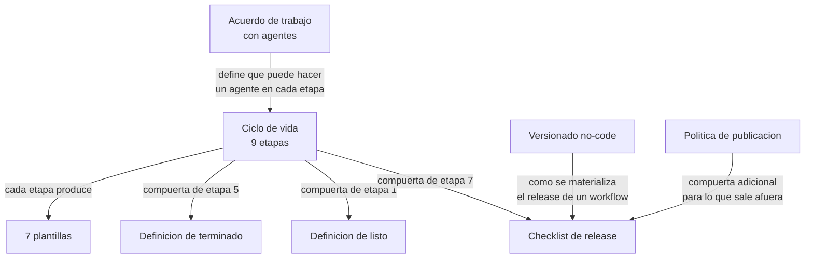

# Gobernanza

El método de trabajo con agentes de IA: cómo se decide, cómo se prueba, cómo se publica, quién aprueba y qué evidencia queda.

Ésta es la sección menos vistosa del repositorio y la más útil. El resto documenta **un** sistema; esto documenta **cómo se construye cualquier sistema** con agentes de IA adentro.

---

## Por qué el método es el activo más transferible

Un sistema es específico. Corre sobre un VPS particular, con credenciales particulares, resolviendo los problemas de una persona particular. Nada de eso se lleva a otro lado.

El método sí.

Las nueve etapas del ciclo de vida, las tres checklists, las siete plantillas y el acuerdo de trabajo con agentes se aplican igual a un agente de finanzas personales, a un pipeline de contenido o a la automatización de una pyme. Son el resultado de veintidós días de construir rápido y de descubrir, uno por uno, los agujeros que deja construir rápido: un `.env` con un token en una carpeta sincronizada, tres migraciones sin desplegar durante cinco días, 125 workflows de prueba conviviendo con producción, un componente terminado que no pasó las pruebas y no se publicó.

Cada documento de esta sección existe porque algo salió mal antes. Ése es su valor: no son buenas prácticas copiadas de un libro, son controles con una cicatriz asociada.

La frase que resume el límite de lo que un agente puede ser:

> *"Los agentes de IA pueden proponer, implementar y verificar trabajo. No se convierten en el dueño responsable del riesgo, el acceso o la decisión de release."*

---

## Índice

### Documentos centrales

| Documento | Qué resuelve |
|---|---|
| [Ciclo de vida SDLC con IA](ciclo-de-vida-sdlc-ia.md) | Las 9 etapas, sus compuertas, qué entra, qué sale, quién aprueba y qué evidencia queda |
| [Acuerdo de trabajo con agentes](acuerdo-de-trabajo-con-agentes.md) | Qué puede hacer un agente sin permiso, qué requiere permiso y qué no puede hacer nunca |
| [Versionado no-code](versionado-no-code.md) | Cómo se versiona un workflow visual que no tiene diff legible |
| [Política de publicación](politica-de-publicacion.md) | Qué se puede publicar y cómo se sanitiza |

### Checklists

| Checklist | Cuándo se usa |
|---|---|
| [Definición de listo](checklists/definicion-de-listo.md) | Antes de empezar a construir |
| [Definición de terminado](checklists/definicion-de-terminado.md) | Antes de decir que algo está hecho |
| [Checklist de release](checklists/checklist-de-release.md) | Antes de tocar producción |

### Plantillas

| Plantilla | ID | Para qué |
|---|---|---|
| [Requisito](plantillas/REQUISITO.md) | `REQ-XXXX` | Definir qué hay que hacer y cómo se sabe que está bien |
| [Plan de implementación](plantillas/PLAN_DE_IMPLEMENTACION.md) | `PLAN-XXXX` | Definir cómo se va a hacer, antes de hacerlo |
| [Decisión de arquitectura](plantillas/DECISION_DE_ARQUITECTURA.md) | `ADR-XXXX` | Registrar una decisión con su contexto y sus consecuencias |
| [Informe de pruebas](plantillas/INFORME_DE_PRUEBAS.md) | `TEST-XXXX` | Dejar la evidencia que habilita un release |
| [Release](plantillas/RELEASE.md) | `RELEASE-XXXX` | Registrar qué se puso en producción y con qué |
| [Rollback](plantillas/ROLLBACK.md) | `ROLLBACK-XXXX` | Preparar la vuelta atrás antes de necesitarla |
| [Incidente](plantillas/INCIDENTE.md) | `INC-XXXX` | Documentar qué pasó y qué se aprende |

### Versión en inglés

| Documento | |
|---|---|
| [`en/README.md`](en/README.md) | Overview of the practice guide |
| [`en/SDLC_AI.md`](en/SDLC_AI.md) | AI-assisted software development lifecycle |
| [`en/NO_CODE_VERSIONING.md`](en/NO_CODE_VERSIONING.md) | Versioning visual workflows |
| [`en/PUBLICATION_POLICY.md`](en/PUBLICATION_POLICY.md) | What can and cannot be published |

---

## El vocabulario de evidencia

Cinco etiquetas. Toda afirmación de este repositorio pertenece a una de ellas, y varias secciones cierran con una tabla que lo declara.

Esto no es prolijidad: es lo que permite que alguien lea la documentación y sepa cuánto pesa cada frase. La regla que lo justifica:

> *"Es preferible mantener un vacío explícito antes que completar la historia con una narración no demostrable."*

| Etiqueta | Significa | Cómo se obtiene |
|---|---|---|
| **Verificado** | Se inspeccionó y se vio | Consulta a la base, lectura del runtime, ejecución de tests, lectura del código |
| **Confirmado por el responsable** | Lo afirma la persona a cargo, sin artefacto que lo respalde | Declaración de Aldo sobre algo que sabe pero que no dejó rastro |
| **Inferido** | Se deduce razonablemente de lo verificado | Conclusión de ingeniería, no observación |
| **Pendiente de verificar** | Hace falta y no se comprobó | Se declara el hueco, no se rellena |
| **Historia incompleta** | El rastro existe pero está roto o es parcial | Hay evidencia de que pasó algo y no de qué exactamente |

### Un ejemplo de cada uno, del sistema real

**Verificado**

> Al 2026-08-03 el runtime tiene 217 workflows registrados, 25 activos y 25 archivados.

Salió de una inspección de solo lectura del runtime. Se puede volver a contar.

**Confirmado por el responsable**

> Ninguna prueba realizada en el runtime compartido afectó hasta hoy a un workflow productivo.

No hay log que lo demuestre —justamente porque no pasó nada—. Lo afirma quien operó el sistema. Se registra como lo que es: una declaración, no una medición. Y no se usa como control: la ausencia de incidente no es un control.

**Inferido**

> Sin backup off-site, la pérdida del VPS implica la pérdida de los datos financieros.

Nadie perdió el VPS. Se deduce de dos hechos verificados: los backups viven en el mismo servidor, y sólo la memoria se replica afuera vía rclone.

**Pendiente de verificar**

> El estado exacto de los 46 workflows de laboratorio que no entraron en la clasificación del inventario del 2026-07-25.

Se sabe que existen y no se sabe qué son. Se escribe así, con el número, en vez de decir "el resto son pruebas viejas".

**Historia incompleta**

> Producción estuvo tres migraciones atrás desde el 31/07 y se descubrió el 05/08.

Se sabe **qué** faltaba y **cuándo** se descubrió. No hay registro de qué se intentó ejecutar contra el esquema desatendido durante esos cinco días, ni de si alguna consulta falló silenciosamente. Ese pedazo del relato no existe y no se completa a mano.

### Cómo se usa en la práctica

- En prosa, cuando la afirmación es importante y no es verificada, se dice: *"inferido:"*, *"pendiente de verificar:"*.
- En documentos largos, con una tabla de nivel de evidencia al final.
- En un informe de pruebas, por caso.

Regla práctica: **si no sabés qué etiqueta ponerle a una frase, la frase todavía no está lista para escribirse.**

---

## Cómo se relacionan estos documentos entre sí

El acuerdo de trabajo es la constitución; el ciclo de vida es el procedimiento; las checklists son las compuertas; las plantillas son la evidencia.

---

## Relación con el resto del repositorio

| Sección | Relación |
|---|---|
| [Decisiones (ADR)](../04-decisiones/) | Las nueve decisiones son la salida de la etapa 3 del ciclo de vida |
| [Runbooks](../06-runbooks/) | Son la salida de las etapas 8 y 9 — operación e incidentes |
| [Arquitectura](../01-arquitectura/) | El AS-IS y el TO-BE son la salida de la etapa 2, evidencia y línea base |
| [`artifacts/workflows-n8n/`](../../artifacts/workflows-n8n/) | El manifiesto de workflow es el artefacto que exige el versionado no-code |

---

## Advertencia sobre estos documentos

Están escritos a partir de un sistema real, con un solo operador y veintidós días de historia. **No son un estándar de industria y no se presentan como tal.** Son un método que funcionó acá, con las cicatrices visibles de por qué cada regla existe.

Copiarlos sin adaptarlos sería cometer el error que el propio método señala: adoptar una forma sin el problema que la justifica. Ver [IA_KNOWLEDGE_HUB](../03-cronologia/) para el caso donde eso ya pasó — 57 carpetas vacías por haber creado la estructura antes que el material.

> Última verificación: 2026-08-05
