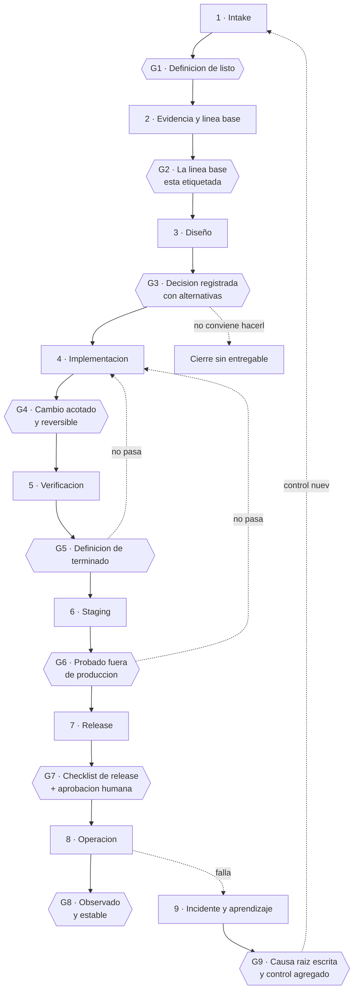

# Ciclo de vida SDLC asistido por IA

Nueve etapas, nueve compuertas. Un agente de IA puede trabajar dentro de cualquiera de ellas; ninguna se cierra sin un humano.

El cierre del ciclo, textual:

> *"Los agentes de IA pueden proponer, implementar y verificar trabajo. No se convierten en el dueño responsable del riesgo, el acceso o la decisión de release."*

---

## El flujo con sus compuertas

Dos flechas importan más que el resto:

- **G3 → cierre sin entregable.** Una decisión válida es no hacerlo. El [ADR-006](../04-decisiones/adr-006-buscador-general-no-publicado.md) es exactamente eso.
- **G9 → etapa 1.** Un incidente no termina cuando el sistema vuelve a funcionar. Termina cuando produjo un control nuevo que entra al ciclo como trabajo.

---

## Etapa 1 — Intake

**Qué es:** convertir un pedido en un requisito con criterios de aceptación.

| | |
|---|---|
| **Entra** | Una frase: "el agente debería poder buscar en la web", "hay que registrar deudas" |
| **Sale** | Un `REQ-XXXX` con objetivo, alcance, fuera de alcance, criterios de aceptación y clasificación de datos que toca |
| **Quién aprueba** | El dueño humano. Nadie más |
| **Evidencia** | El documento `REQ-XXXX` |
| **Rol del agente de IA** | Puede redactar el borrador, proponer criterios de aceptación y señalar ambigüedades. **No puede** decidir el alcance |

**Compuerta G1:** la [definición de listo](checklists/definicion-de-listo.md).

**Ejemplo real — el Buscador Web Tavily V1 (2026-07-25)**

El pedido era "que pueda buscar en internet". El intake convirtió eso en algo verificable: la salida no puede ser texto libre, tiene que ser uno de siete estados tipados (`ok`, `clarification_required`, `no_reliable_source`, `search_not_configured`, `technical_error`, `stable_knowledge_handoff`, `insufficient_evidence`). Ese requisito —definido antes de escribir un nodo— es el que hizo posible que dos días después se pudiera medir el buscador y decidir no publicar una versión posterior.

---

## Etapa 2 — Evidencia y línea base

**Qué es:** averiguar qué hay antes de tocar nada.

| | |
|---|---|
| **Entra** | El `REQ-XXXX` |
| **Sale** | Un inventario del estado actual con etiquetas del vocabulario de evidencia, y un punto de retorno identificado |
| **Quién aprueba** | El dueño humano confirma que la línea base es correcta |
| **Evidencia** | Inventario, export del estado previo, hash o tag |
| **Rol del agente de IA** | **Puede leer todo.** Es la etapa donde más útil resulta. **No puede modificar nada**, y su capacidad de leer no le da permiso de escribir |

**Compuerta G2:** existe una línea base etiquetada a la que se puede volver.

La regla que gobierna esta etapa:

> *"Inspección no equivale a autorización de cambio."*

**Ejemplo real — la inspección global del 2026-08-03**

Una inspección de solo lectura del sistema entero produjo dieciocho documentos de línea base: AS-IS, TO-BE, inventarios, riesgos, estándares y política de saneamiento. No se cambió nada durante esa inspección. Todo lo que se decidió después —incluida la existencia de este repositorio— salió de ahí.

**Contraejemplo real — el drift del 2026-08-05**

Cinco días antes se había omitido esta etapa: se miró el repositorio y no el servidor. Resultado: tres migraciones sin desplegar durante cinco días, descubiertas por casualidad. *"Nadie había mirado el servidor, solo el repositorio."* La línea base tiene que ser del sistema real, no de su representación.

---

## Etapa 3 — Diseño

**Qué es:** decidir cómo, con alternativas evaluadas.

| | |
|---|---|
| **Entra** | `REQ-XXXX` + línea base |
| **Sale** | Un `PLAN-XXXX`, y si la decisión es estructural, un `ADR-XXXX` |
| **Quién aprueba** | El dueño humano |
| **Evidencia** | El plan y el ADR, con las alternativas descartadas escritas |
| **Rol del agente de IA** | Puede proponer alternativas, estimar impacto y escribir el borrador del ADR. **No puede** elegir |

**Compuerta G3:** la decisión está registrada con al menos una alternativa evaluada y sus consecuencias. Y "no hacerlo" siempre es una alternativa válida.

**Ejemplo real — PraxIA Contable (2026-07-26)**

El pedido pedía un sistema financiero. El diseño evaluó construirlo aparte y lo descartó explícitamente:

> *"Sí tiene sentido y sí vale la pena — pero NO como sistema nuevo. […] Construir una app aparte sería tirar a la basura el Memory Core."*

Esa frase vale más que el código que vino después: es lo que evitó un segundo sistema con su propia base, su propio despliegue y su propio backup. Quedó como [ADR-005](../04-decisiones/adr-005-finanzas-como-esquema-y-no-como-app-nueva.md).

---

## Etapa 4 — Implementación

**Qué es:** construirlo.

| | |
|---|---|
| **Entra** | `PLAN-XXXX` aprobado |
| **Sale** | El artefacto: workflow, migración SQL, endpoint, prompt |
| **Quién aprueba** | Nadie todavía. Implementar no es desplegar |
| **Evidencia** | Commit, export del workflow, archivo de migración numerado |
| **Rol del agente de IA** | Puede escribir el 100% del artefacto. Es donde más produce. **No puede** activarlo, publicarlo ni aplicarlo a producción |

**Compuerta G4:** el cambio está acotado a lo que dice el plan y es reversible.

**Ejemplo real — las migraciones v4.0 a v4.8**

Nueve migraciones en nueve días, cada una numerada, en su archivo, registrada en `schema_migrations`, aplicable en transacción con `ON_ERROR_STOP=1`. Ninguna toca la anterior. La v4.0 se escribió el 2026-07-28 y **se puso en pausa** hasta que las fases previas estuvieran cerradas: escribir no obliga a desplegar.

**Contraejemplo real — el checkpoint del 2026-07-28**

> *"No hay repo git. 3275 líneas de JS + 33 migraciones SQL, sin control de versiones"*

Tres mil líneas implementadas sin ningún punto de retorno. El commit inicial se hizo ese día. La lección: la etapa 4 sin la etapa 2 produce trabajo que no se puede revertir.

---

## Etapa 5 — Verificación

**Qué es:** demostrar que hace lo que dice, con números.

| | |
|---|---|
| **Entra** | El artefacto implementado |
| **Sale** | Un `TEST-XXXX` con casos, resultados y veredicto |
| **Quién aprueba** | El dueño humano lee el informe. Un agente puede ejecutar las pruebas; no puede declarar el veredicto |
| **Evidencia** | Salida de los tests, conteo de PASS/FAIL, fixtures usados |
| **Rol del agente de IA** | Puede escribir y ejecutar las pruebas. **No puede** ajustar el umbral de aceptación para que den bien |

**Compuerta G5:** la [definición de terminado](checklists/definicion-de-terminado.md).

**Ejemplo real — 554 casos con PGlite**

27 archivos de test que corren contra el esquema real, no contra un mock. Cubren montos ambiguos, separadores decimales, fechas, tipo de cambio, sanitización, datos sensibles, transferencias, migraciones y lectura fiscal. Cuando la migración v4.7 cambió `estado_fiscal` a derivado, los tests dijeron dónde se rompía.

**El mejor ejemplo — la revalidación del Buscador General (2026-07-27)**

Exigencia declarada: 7/7. Resultado real: **2/7**. El componente estaba construido y funcionando razonablemente. **No se publicó.**

Y el análisis de los fallos no se negoció:

> *"Los cuatro FAIL no son falsos positivos del nuevo validador: son fixtures que no contienen evidencia suficiente para producir una respuesta grounded."*

Ésa es la etapa 5 funcionando: la tentación era declarar los FAIL como problema del validador. Ver [ADR-006](../04-decisiones/adr-006-buscador-general-no-publicado.md).

---

## Etapa 6 — Staging

**Qué es:** probarlo en un lugar parecido a producción, sin ser producción.

| | |
|---|---|
| **Entra** | Artefacto verificado |
| **Sale** | Confirmación de que funciona fuera del entorno de desarrollo, con credenciales y datos que no son los de producción |
| **Quién aprueba** | El dueño humano |
| **Evidencia** | Registro de la prueba en staging, importado **como inactivo** primero |
| **Rol del agente de IA** | Puede importar y ejecutar en staging. **No puede** promover a producción |

**Compuerta G6:** se probó fuera de producción y el grafo visual se revisó a ojo.

**Estado honesto de esta etapa en el sistema real: no existe.**

No hay staging. Los 125 workflows de laboratorio son la consecuencia directa: sin un lugar donde probar, se prueba donde se puede. Es la brecha 7 del [TO-BE](../01-arquitectura/estado-objetivo-to-be.md).

Lo más parecido que hubo fue el **canary de Telegram aprobado el 2026-07-27** en Finanzas: un camino real, acotado, con tráfico controlado, antes de abrir el resto. No es staging, pero es la misma idea aplicada con lo que había.

Se documenta la etapa igual, y se documenta su ausencia. Un ciclo de vida al que se le borran las etapas que todavía no se cumplen no sirve para nada.

---

## Etapa 7 — Release

**Qué es:** ponerlo en producción, a propósito, con registro.

| | |
|---|---|
| **Entra** | Artefacto probado en staging |
| **Sale** | Un `RELEASE-XXXX` con qué se desplegó, cuándo, quién aprobó, el hash del artefacto y el `ROLLBACK-XXXX` asociado |
| **Quién aprueba** | **El dueño humano, explícitamente.** Ésta es la compuerta que no se delega jamás |
| **Evidencia** | Registro de release, hash desplegado, backup previo verificado, rollback conservado |
| **Rol del agente de IA** | Puede preparar todo y esperar. **No puede** ejecutar el release |

**Compuerta G7:** el [checklist de release](checklists/checklist-de-release.md) completo + aprobación humana registrada.

**Ejemplo real — la puesta al día del 2026-08-05**

Tres migraciones atrasadas, desplegadas el mismo día con: backup verificado antes, aplicación en transacción con `ON_ERROR_STOP=1`, y verificación de no-regresión posterior contando tablas (25 → 35). Los tres pasos —respaldo, atomicidad, verificación— son el mínimo de un release.

Ver el [runbook de despliegue de una migración](../06-runbooks/despliegue-de-una-migracion.md).

---

## Etapa 8 — Operación

**Qué es:** que corra, que se vea cuando falla, y que alguien se entere.

| | |
|---|---|
| **Entra** | Artefacto en producción |
| **Sale** | Ejecuciones, métricas, errores capturados y notificados |
| **Quién aprueba** | Nadie aprueba; alguien observa |
| **Evidencia** | Historial de ejecuciones, `praxia.agent_errors`, alertas de Telegram |
| **Rol del agente de IA** | Puede monitorear, resumir y alertar. **No puede** reparar en caliente sin volver a la etapa 1 |

**Compuerta G8:** el componente está siendo observado y no degrada.

**Ejemplo real — `PraxIA — Avisador de Errores v1`**

Creado el 2026-07-22 y aprobado para producción el 2026-07-23, con `praxia.agent_errors` en cero filas y Traefik verificado. Es `errorWorkflow` global: cualquier nodo de cualquier workflow que falle termina ahí. Registra con `praxia.upsert_agent_error`, deduplica y evita el spam de alertas.

Y arrastra una deuda que ilustra la etapa: **su nombre todavía dice `[TEST]`.** Está activo, es crítico, y parece descartable. El riesgo no es cosmético: es que alguien lo borre en una limpieza.

---

## Etapa 9 — Incidente y aprendizaje

**Qué es:** cuando algo se rompe, entender por qué y agregar el control que faltaba.

| | |
|---|---|
| **Entra** | Un fallo en producción |
| **Sale** | Un `INC-XXXX` con línea de tiempo, causa raíz, impacto, corrección y **control nuevo** |
| **Quién aprueba** | El dueño humano acepta la causa raíz |
| **Evidencia** | El incidente escrito, y el requisito nuevo que genera |
| **Rol del agente de IA** | Puede reconstruir la línea de tiempo y proponer la causa raíz. **No puede** cerrar el incidente |

**Compuerta G9:** hay causa raíz escrita y hay un control nuevo que entra al ciclo como trabajo. Un incidente sin control nuevo no está cerrado: está olvidado.

**Ejemplo real — el PDF de 21,9 MB (2026-07-25 18:25 ART)**

La ejecución 1292 falló en `Telegram - Get Documento` con `Bad Request: file is too big`. La reparación se publicó el mismo día e incluyó **cuatro controles nuevos**: validación previa, límite de 20 MiB, verificación de la firma `%PDF-` y extracción real, más una máquina de estados explícita `received → validated → text_extracted → reviewed → archived | failed`. Resultado: 6/6 PASS.

El incidente no se cerró arreglando el caso. Se cerró convirtiendo un pipeline implícito en una máquina de estados.

Ver [incidente PDF Telegram](../06-runbooks/incidente-pdf-telegram.md).

**Segundo ejemplo — el drift del 2026-08-05**

Causa raíz: *"nadie había mirado el servidor, solo el repositorio"*. Control nuevo: verificación del estado desplegado como paso obligatorio del runbook de migración. Ver [post-mortem](../06-runbooks/postmortem-drift-produccion.md).

---

## Tabla resumen

| # | Etapa | Compuerta | Artefacto | Puede hacerlo un agente solo |
|---|---|---|---|---|
| 1 | Intake | Definición de listo | `REQ-XXXX` | Borrador sí, decisión no |
| 2 | Evidencia y línea base | Línea base etiquetada | Inventario | **Sí, íntegramente — sólo lectura** |
| 3 | Diseño | Decisión registrada con alternativas | `PLAN-XXXX`, `ADR-XXXX` | Propuesta sí, elección no |
| 4 | Implementación | Cambio acotado y reversible | Código, workflow, migración | **Sí, íntegramente** |
| 5 | Verificación | Definición de terminado | `TEST-XXXX` | Ejecución sí, veredicto no |
| 6 | Staging | Probado fuera de producción | Registro de staging | Ejecución sí, promoción no |
| 7 | Release | Checklist + **aprobación humana** | `RELEASE-XXXX`, `ROLLBACK-XXXX` | **No** |
| 8 | Operación | Observado y estable | Logs, alertas | Monitoreo sí, reparación no |
| 9 | Incidente | Causa raíz + control nuevo | `INC-XXXX` | Reconstrucción sí, cierre no |

Las dos etapas donde un agente rinde al máximo son la 2 y la 4: **leer todo** y **escribir todo**. Las dos donde no participa son la 7 y el cierre de la 9: **decidir el riesgo** y **declarar que se aprendió**.

---

## Nivel de evidencia de este documento

| Afirmación | Nivel |
|---|---|
| Las nueve etapas y sus nombres | Verificado (línea base de gobernanza 2026-08-03) |
| Todos los ejemplos reales citados | Verificado |
| Ausencia de staging | Verificado |
| Las compuertas G1 a G9 tal como están formuladas acá | Inferido (ampliación del marco verificado) |
| Reparto de responsabilidades agente/humano por etapa | Inferido, coherente con la cita de cierre verificada |

> Última verificación: 2026-08-05
