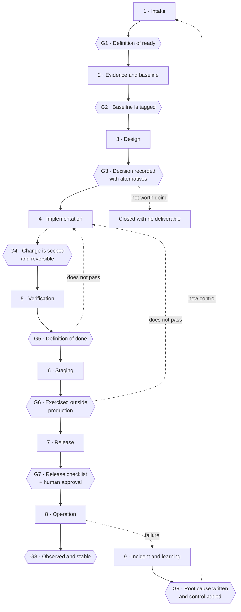

# AI-Assisted Software Development Lifecycle

Nine stages, nine gates. An AI agent may work inside any of them; none of them closes without a human.

The closing rule:

> *"AI agents can propose, implement and verify work. They do not become the accountable owner of risk, access, or the release decision."*

---

## The flow

Two edges matter more than the rest. **G3 can close with nothing shipped** — deciding not to build something is a legitimate outcome of design. And **G9 feeds back into stage 1** — an incident is not over when the system recovers; it is over when it has produced a new control that enters the backlog as work.

---

## Stage 1 — Intake

Turning a request into a requirement with acceptance criteria.

| | |
|---|---|
| **In** | A sentence: "the agent should be able to search the web" |
| **Out** | A requirement with objective, scope, explicit out-of-scope, acceptance criteria, and the data classification it touches |
| **Approver** | The human owner. Nobody else |
| **Evidence** | The requirement document |
| **Agent's role** | May draft it, propose criteria, and flag ambiguity. **May not** decide scope |

**Gate G1:** definition of ready.

**Worked example — the web search subagent (2026-07-25).** The request was "let it search the internet". Intake turned that into something measurable: the output cannot be free text, it must be one of seven typed states — `ok`, `clarification_required`, `no_reliable_source`, `search_not_configured`, `technical_error`, `stable_knowledge_handoff`, `insufficient_evidence`. Defining that contract before a single node was placed is what made it possible, two days later, to measure a successor version and decide against shipping it.

---

## Stage 2 — Evidence and baseline

Finding out what exists before touching anything.

| | |
|---|---|
| **In** | The requirement |
| **Out** | An inventory of the current state, labelled with the evidence vocabulary, plus an identified point of return |
| **Approver** | The owner confirms the baseline is accurate |
| **Evidence** | Inventory, export of the prior state, hash or tag |
| **Agent's role** | **May read everything.** This is where agents are most useful. **May not modify anything** — and being allowed to read grants no permission to write |

**Gate G2:** a tagged baseline exists and can be returned to.

The rule that governs this stage:

> *"Inspection is not authorisation to change."*

**Worked example — the global read-only inspection (2026-08-03).** A full read-only pass over the system produced eighteen baseline documents: current state, target state, inventories, risk register, standards, and a sanitisation policy. Nothing was modified during the inspection. Everything decided afterwards — including the existence of the public repository — came out of it.

**Counter-example — the production drift (2026-08-05).** Five days earlier this stage had been skipped: the repository was consulted and the server was not. Result: three migrations undeployed for five days, found by accident. *"Nobody had looked at the server, only at the repository."* A baseline must describe the real system, not its representation.

---

## Stage 3 — Design

Deciding how, with alternatives on the record.

| | |
|---|---|
| **In** | Requirement plus baseline |
| **Out** | An implementation plan, and — where the decision is structural — an architecture decision record |
| **Approver** | The human owner |
| **Evidence** | The plan and the ADR, with rejected alternatives written down |
| **Agent's role** | May propose alternatives, estimate impact, draft the ADR. **May not** choose |

**Gate G3:** the decision is recorded with at least one evaluated alternative and its consequences. "Do nothing" is always one of the alternatives.

**Worked example — the finance subsystem (2026-07-26).** The request implied a new financial application. Design evaluated that and rejected it outright: building it as a separate system would have discarded roughly 80% of already-working infrastructure, and duplicated the database, the deployment and the backup story. It became an additional schema inside the PostgreSQL instance that was already running. That paragraph of reasoning is worth more than the code that followed it.

---

## Stage 4 — Implementation

Building it.

| | |
|---|---|
| **In** | An approved plan |
| **Out** | The artefact: workflow, SQL migration, endpoint, prompt |
| **Approver** | Nobody yet. Implementing is not deploying |
| **Evidence** | Commit, workflow export, numbered migration file |
| **Agent's role** | May write the entire artefact. This is where agents produce most. **May not** activate, publish or apply it to production |

**Gate G4:** the change is confined to what the plan says, and it is reversible.

**Worked example — nine schema migrations in nine days.** Each one numbered, in its own file, recorded in a migrations table, applied inside a transaction with `ON_ERROR_STOP=1`. None edits its predecessor. The first of them was written and then deliberately paused until the preceding phases closed — writing a migration does not oblige anyone to deploy it.

**Counter-example — the version control checkpoint (2026-07-28).** Roughly 3,275 lines of JavaScript and 33 SQL migrations existed with no version control at all. No point of return for any of it. The initial commit happened that day. The lesson: stage 4 without stage 2 produces work that cannot be undone.

---

## Stage 5 — Verification

Demonstrating that it does what it claims, with numbers.

| | |
|---|---|
| **In** | The implemented artefact |
| **Out** | A test report with cases, results and a verdict |
| **Approver** | The human owner reads the report. An agent may run the tests; it may not declare the verdict |
| **Evidence** | Test output, PASS/FAIL counts, fixtures used |
| **Agent's role** | May write and execute tests. **May not** adjust the acceptance threshold so that they pass |

**Gate G5:** definition of done.

**Worked example — 554 cases against the real schema.** Twenty-seven test files running on an embedded PostgreSQL harness that executes the actual DDL rather than a mock. Coverage includes ambiguous amounts, decimal separators, date resolution, exchange rates, sanitisation, sensitive-data handling, transfer guards, and two schema migrations. When a later migration made a status column derived rather than stored, the tests said exactly where it broke.

**The best example — the general search revalidation (2026-07-27).** Declared bar: 7 out of 7. Actual result: **2 out of 7**. The component was built and behaving reasonably. It was **not shipped**.

The failure analysis was not negotiated either:

> *"The four failures are not false positives from the new validator: they are fixtures that do not contain enough evidence to produce a grounded answer."*

That is stage 5 working. The tempting move was to reclassify the failures as a validator problem.

---

## Stage 6 — Staging

Exercising it somewhere production-like that is not production.

| | |
|---|---|
| **In** | A verified artefact |
| **Out** | Confirmation that it works outside the development environment, with non-production credentials and data |
| **Approver** | The human owner |
| **Evidence** | A staging record; imported **inactive** first |
| **Agent's role** | May import and run in staging. **May not** promote to production |

**Gate G6:** exercised outside production, and the visual graph reviewed by eye.

**Honest status in the real system: this stage does not exist.**

There is no staging environment. The 125 laboratory workflows are the direct consequence — with nowhere to test, testing happens wherever it can. It is an open gap, recorded as such.

The closest thing was an approved canary path in the finance ingestion flow: one real, narrow route carrying controlled traffic before the rest was opened. Not staging, but the same idea applied with what was available.

The stage is documented anyway, and so is its absence. A lifecycle with the inconvenient stages deleted is worth nothing.

---

## Stage 7 — Release

Putting it into production, deliberately, on the record.

| | |
|---|---|
| **In** | An artefact exercised in staging |
| **Out** | A release record: what was deployed, when, who approved it, the artefact hash, and the associated rollback |
| **Approver** | **The human owner, explicitly.** This is the gate that is never delegated |
| **Evidence** | Release record, deployed hash, verified prior backup, retained rollback artefact |
| **Agent's role** | May prepare everything and wait. **May not** execute the release |

**Gate G7:** the release checklist complete, plus recorded human approval.

**Worked example — the catch-up deployment (2026-08-05).** Three overdue migrations, applied the same day with a verified backup taken first, application inside a transaction with `ON_ERROR_STOP=1`, and a post-deployment non-regression check by object count (25 tables to 35). Backup, atomicity, verification — that is the minimum shape of a release.

---

## Stage 8 — Operation

Running, visible when it breaks, and telling somebody.

| | |
|---|---|
| **In** | The artefact in production |
| **Out** | Executions, metrics, captured and notified errors |
| **Approver** | Nobody approves; somebody observes |
| **Evidence** | Execution history, error table, alerts |
| **Agent's role** | May monitor, summarise and alert. **May not** repair in place without returning to stage 1 |

**Gate G8:** the component is being observed and is not degrading.

**Worked example — the global error workflow.** Created 2026-07-22 and approved for production the following day, with the error table at zero rows and the reverse proxy verified. It is registered as the runtime-wide error handler: any failing node in any workflow lands there, gets recorded through a deduplicating upsert function, and produces a rate-limited alert.

It also carries a debt that illustrates the stage perfectly: **its name still says `[TEST]`.** It is active, it is critical, and it looks disposable. The risk is not cosmetic — it is that someone deletes it during a cleanup.

---

## Stage 9 — Incident and learning

When something breaks, understanding why and adding the control that was missing.

| | |
|---|---|
| **In** | A production failure |
| **Out** | An incident record with timeline, root cause, impact, fix, and **a new control** |
| **Approver** | The human owner accepts the root cause |
| **Evidence** | The written incident, and the requirement it generates |
| **Agent's role** | May reconstruct the timeline and propose a root cause. **May not** close the incident |

**Gate G9:** a written root cause and a new control that enters the lifecycle as work. An incident with no new control is not closed; it is forgotten.

**Worked example — the oversized PDF (2026-07-25).** An execution failed while downloading a document from the chat channel: the file exceeded the platform limit. The fix shipped the same day and added **four controls**: pre-download validation, an explicit size ceiling, a file-signature check, and real text extraction — plus an explicit state machine, `received → validated → text_extracted → reviewed → archived | failed`. Result: 6 of 6 tests passing.

The incident was not closed by fixing the case. It was closed by turning an implicit pipeline into a state machine.

**Second example — the production drift.** Root cause: the deployed state was never checked, only the repository. New control: verifying the live schema became a mandatory step of the migration runbook.

---

## Summary

| # | Stage | Gate | Artefact | Can an agent do it alone |
|---|---|---|---|---|
| 1 | Intake | Definition of ready | Requirement | Draft yes, decision no |
| 2 | Evidence and baseline | Tagged baseline | Inventory | **Yes, entirely — read only** |
| 3 | Design | Decision with alternatives | Plan, ADR | Proposal yes, choice no |
| 4 | Implementation | Scoped and reversible | Code, workflow, migration | **Yes, entirely** |
| 5 | Verification | Definition of done | Test report | Execution yes, verdict no |
| 6 | Staging | Exercised outside production | Staging record | Execution yes, promotion no |
| 7 | Release | Checklist + **human approval** | Release, rollback | **No** |
| 8 | Operation | Observed and stable | Logs, alerts | Monitoring yes, repair no |
| 9 | Incident | Root cause + new control | Incident record | Reconstruction yes, closure no |

The two stages where an agent contributes most are 2 and 4: **read everything** and **write everything**. The two where it does not participate are 7 and the closure of 9: **owning the risk** and **declaring that something was learned**.

---

## Evidence level

| Claim | Level |
|---|---|
| The nine stages and their names | Verified (governance baseline, 2026-08-03) |
| Every worked example cited | Verified |
| Absence of a staging environment | Verified |
| Gates G1–G9 as formulated here | Inferred — an extension of the verified framework |
| The agent/human split per stage | Inferred, consistent with the verified closing rule |

> Last verified: 2026-08-05
