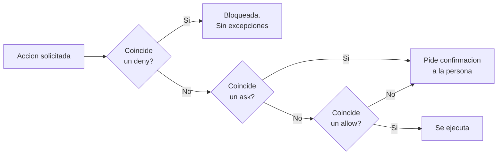

# Permisos de agente

Cómo se escribe una política de permisos que tenga piso y no sólo techo, con las trampas de sintaxis que hacen que una regla mal escrita no proteja nada.

> **In English** — A practical guide to writing agent permission policies that have a floor, not just a
> ceiling. Covers why an allow-only list is not a security policy; the `deny` → `ask` → `allow` precedence and
> the fact that a broad `deny` admits no exceptions — specificity does not rescue it; when to use `deny`
> (things never needed) versus `ask` (dangerous but sometimes legitimate); and the four syntax traps that
> matter most: a single leading slash is not an absolute path (you need two), Windows paths are normalised to
> POSIX before matching so backslash patterns never fire, a `Write(path)` rule is silently ignored and must be
> written as `Edit(path)`, and the patterns are gitignore-style rather than ordinary globs. It closes with the
> real limits — file rules cover the agent's own tools and the shell commands it recognises, **not an
> arbitrary subprocess** — plus a generic, commented `deny` + `ask` block and a review routine.

<!-- fin del resumen en inglés -->

---

## Una lista que sólo dice "sí" no es una política de seguridad

Las configuraciones de permisos de agentes crecen por acumulación. La mecánica es siempre la misma: una acción se traba, se agrega la entrada que la destraba, se sigue trabajando. Nadie vuelve a mirar la lista, porque la lista no molesta — al contrario, cuanto más larga, menos fricción.

El resultado, después de unas semanas, es una configuración con decenas o cientos de entradas `allow`, ninguna prohibición, y ninguna forma de saber qué habilita el conjunto.

El problema no es el tamaño. Es que **una lista de permisos sin prohibiciones no tiene techo**: cada entrada nueva amplía la superficie y nada la limita. Y es que el riesgo real casi nunca está en una entrada, sino en la **combinación** de dos que por separado parecen razonables — lectura de un directorio de claves y ejecución de un cliente que las use, por ejemplo. Nadie revisa combinaciones de a pares en una lista de 150 líneas.

Lo que falta en ese escenario no es podar el `allow`. Es agregar un **piso**: un conjunto de acciones que ninguna entrada del `allow` pueda habilitar, por más que la lista siga creciendo.

El caso concreto que originó esta guía está en el [control 9 de la auditoría](auditar-antes-de-publicar.md#control-9-en-detalle-los-permisos-que-nadie-revisa): 152 permisos, cero reglas de denegación, y dos entradas que juntas entregaban el acceso al servidor sin una sola confirmación.

---

## La precedencia: `deny` → `ask` → `allow`

Las reglas se evalúan en ese orden y **gana la primera que coincide**. La especificidad no cambia nada.

Dos consecuencias que conviene tener presentes desde el principio:

- **Un `deny` amplio no admite excepciones.** Si `Bash(aws *)` está denegado, un `allow` de `Bash(aws s3 ls)` **no lo rescata**. No hay forma de escribir "todo menos esto" dentro del mismo prefijo: hay que denegar lo específico, no lo general.
- **Un `deny` en cualquier nivel de configuración gana sobre un `allow` de cualquier otro nivel.** Una regla puesta en la configuración del proyecto no se puede aflojar desde la configuración local.

Eso hace que `deny` sea una herramienta contundente y poco flexible. Es la propiedad que la vuelve útil: si se pudiera puentear con una excepción, sería otra entrada más del `allow`.



Nótese la última rama: lo que no coincide con nada **también** pide confirmación. Por eso agregar un `deny` no reduce la funcionalidad del agente tanto como parece — lo que estaba fuera de la lista ya preguntaba.

---

## Cuándo va `deny` y cuándo va `ask`

El criterio es corto:

- **`deny` para lo que nunca hace falta.** Si no existe un caso legítimo en el que el agente necesite esa acción, va denegado. No hay costo: nunca se va a chocar con la regla.
- **`ask` para lo peligroso-pero-a-veces-legítimo.** Si la acción a veces se necesita, denegarla obliga a editar el archivo de configuración cada vez, y editar el archivo de configuración cada vez termina en dejar la regla afuera "por ahora".

La prueba práctica para decidir: **¿cuántas veces por mes lo vas a necesitar?** Cero veces, `deny`. Una o dos, `ask`. Todos los días, `allow` — pero acotado, y con vencimiento si es una excepción.

| Categoría | Regla | Por qué |
|---|---|---|
| Claves privadas y material criptográfico | `deny` | Un agente no necesita leer una clave privada. Nunca |
| Credenciales de servicios en la nube | `deny` | Lo mismo. Si hace falta el servicio, va por su cliente y su credencial, no leyendo el archivo |
| Archivos de entorno con secretos | `deny` | El agente necesita saber **qué** variables existen, no **qué valen**. Para eso está la plantilla |
| Borrado catastrófico | `deny` | No hay caso legítimo para `rm -rf /` |
| Borrado recursivo acotado | `ask` | Se necesita de verdad, y no es lo mismo borrar `build/` que borrar el home |
| Reescritura de historial de git | `ask` | A veces es exactamente lo que hay que hacer, y a veces destruye trabajo ajeno |
| Destrucción de volúmenes de contenedores | `ask` | Un volumen borrado es una base perdida, pero a veces es el paso correcto |
| Acceso remoto | `ask` | Un `ssh` puntual es legítimo; un comodín de `ssh` es la puerta abierta |

Y una excepción deliberada que conviene documentar: **el archivo de plantilla de entorno queda legible**. Un `.env.example` es una plantilla, no un secreto, y bloquearlo rompe una tarea legítima y frecuente sin proteger nada.

---

## Las cuatro trampas de sintaxis

Ésta es la parte más útil del documento. Una regla mal escrita **no protege y encima da la sensación de que sí**, que es peor que no tenerla: produce confianza sin cobertura.

### 1. Una sola barra no es ruta absoluta

Una barra inicial ancla la ruta **en el origen del archivo de configuración**, no en la raíz del sistema de archivos.

```
/Users/alice/file      ← relativo al directorio del archivo de settings
//Users/alice/file     ← ruta absoluta del sistema
```

Es la trampa que más silenciosamente falla: la regla se acepta, se ve bien escrita, y apunta a un lugar que no existe.

### 2. En Windows las rutas se normalizan a POSIX

Antes de comparar, la ruta se convierte: `C:\Users\<usuario>` pasa a ser `/c/Users/<usuario>`.

Un patrón escrito con contrabarras **no coincide nunca**:

```
Read(C:\Users\<usuario>\.ssh\**)     ← no matchea jamás
Read(//c/Users/<usuario>/.ssh/**)    ← correcto
```

Y la letra de unidad va en minúscula.

### 3. `Write(ruta)` se ignora en silencio

Una regla `Write(ruta)` se acepta al parsear, **no se consulta nunca** al evaluar, y lo único que la delata es una advertencia al arrancar que es fácil no ver.

La regla correcta para archivos es **`Edit(ruta)`**, que cubre todas las herramientas de escritura.

```
Write(//**/.env)    ← aceptada y nunca aplicada
Edit(//**/.env)     ← correcto
```

Si tu configuración tiene reglas `Write(...)`, están decorando el archivo.

### 4. Los patrones son de gitignore, no globs comunes

Un nombre suelto matchea **a cualquier profundidad**, no sólo en la raíz:

```
Read(.env)      ≡  Read(**/.env)      ← cualquier .env bajo el directorio de la configuración
Read(//**/.env)                        ← cualquier .env de toda la máquina
```

La diferencia importa cuando el agente trabaja fuera del proyecto. Una regla relativa protege el proyecto y deja el resto del disco descubierto.

---

## Los límites reales

Decirlos importa tanto como escribir las reglas. Una protección sobreestimada es una protección que se deja de complementar.

### Las reglas de archivo no alcanzan a un subproceso arbitrario

Las reglas de `Read` y `Edit` se aplican a **las herramientas de archivo del agente** y a **los comandos de shell que el agente reconoce** — `cat`, `head`, `tail`, `sed` y compañía.

**No se aplican a un subproceso arbitrario.** Un script de Python o de Node que abra el archivo por su cuenta pasa por al lado de la regla:

```bash
# Bloqueado por Read(//**/.ssh/**)
cat ~/.ssh/id_ed25519

# No bloqueado por la misma regla
python -c "print(open('/home/<usuario>/.ssh/id_ed25519').read())"
```

Para un bloqueo a nivel de sistema operativo hace falta un **sandbox**: permisos de archivo, un contenedor, un usuario distinto. Las reglas de permisos son control de la herramienta, no control del kernel.

### Los patrones de Bash que restringen argumentos son frágiles por diseño

Y está documentado que lo son. Un patrón como `Bash(git push *)` se evade con:

- **opciones antes del argumento** — `git --git-dir=/otro push`;
- **otro protocolo o alias** — el mismo comando por otro camino;
- **redirecciones y sustitución** — `$(...)`, backticks, pipes;
- **variables** — el argumento peligroso llega expandido en tiempo de ejecución;
- **espacios de más** — un patrón literal no tolera lo que el shell sí.

Sirven como **piso**, no como **frontera**. La lectura correcta de un patrón de Bash es "esto evita el accidente", no "esto detiene a alguien que quiere pasar".

### El `deny` pone un techo a lo peor; no reemplaza revisar el `allow`

Agregar veinte reglas `deny` a una lista de ciento cincuenta `allow` mejora mucho la situación y no la resuelve. Las entradas del `allow` con comodín siguen ahí, y las combinaciones peligrosas que no toca ningún `deny` también.

El `deny` es lo que se hace primero porque es barato y acota lo catastrófico. Podar el `allow` es lo que se hace después, y lleva más tiempo.

---

## Un bloque de ejemplo

Genérico y adaptable. Cubre las categorías de la tabla de arriba sin depender de ningún entorno concreto.

```json
{
  "permissions": {
    "deny": [
      "Read(//**/.ssh/**)",
      "Read(//**/id_rsa*)",
      "Read(//**/id_ed25519*)",
      "Read(//**/*.pem)",
      "Read(//**/*.p12)",
      "Read(//**/*.pfx)",
      "Read(//**/.gnupg/**)",
      "Read(//**/.aws/**)",
      "Read(//**/.docker/config.json)",
      "Read(//**/.pgpass)",
      "Read(//**/credentials.json)",
      "Read(//**/.env)",
      "Read(//**/.env.local)",
      "Read(//**/.env.production)",
      "Edit(//**/.ssh/**)",
      "Edit(//**/.gnupg/**)",
      "Edit(//**/.env)",
      "Bash(rm -rf /)",
      "Bash(rm -rf /*)",
      "Bash(rm -rf ~)",
      "Bash(chmod 777 *)"
    ],
    "ask": [
      "Bash(rm -rf *)",
      "Bash(git push --force*)",
      "Bash(git reset --hard*)",
      "Bash(docker volume rm *)",
      "Bash(docker compose down -v*)",
      "Bash(ssh *)"
    ]
  }
}
```

Qué cubre cada grupo, y por qué está donde está:

| Líneas | Grupo | Nivel | Razón |
|---|---|---|---|
| `.ssh`, `id_rsa*`, `id_ed25519*`, `*.pem`, `*.p12`, `*.pfx`, `.gnupg` | Material criptográfico | `deny` | No hay caso legítimo. Es el par que, combinado con un cliente remoto, entrega el servidor |
| `.aws`, `.docker/config.json`, `.pgpass`, `credentials.json` | Credenciales de servicios | `deny` | Si el agente necesita el servicio, lo usa a través de su cliente, no leyendo el archivo |
| `.env`, `.env.local`, `.env.production` | Entorno con secretos | `deny` | `.env.example` **no** está en la lista, a propósito: es una plantilla y hace falta |
| `Edit(...)` sobre las mismas rutas | Escritura | `deny` | Escrito con `Edit`, no con `Write`, por la trampa 3 |
| `rm -rf /`, `rm -rf /*`, `rm -rf ~`, `chmod 777 *` | Destrucción catastrófica | `deny` | Cero casos legítimos |
| `rm -rf *`, `git push --force*`, `git reset --hard*` | Destructivo acotado | `ask` | Se necesita de verdad, con poca frecuencia y con consecuencias |
| `docker volume rm`, `docker compose down -v` | Datos de contenedores | `ask` | Un volumen borrado es una base perdida |
| `ssh *` | Acceso remoto | `ask` | Es exactamente la entrada que, como comodín en `allow`, cerró el círculo del caso original |

Tres detalles del bloque:

- **Todas las rutas empiezan con `//`.** Trampa 1: cubren toda la máquina, no sólo el proyecto.
- **`ssh *` está en `ask`, no en `deny`.** Como `ask` gana sobre `allow`, pide confirmación aunque más abajo haya una entrada permisiva. Eso es lo que faltaba en el caso original.
- **JSON no admite comentarios.** Si copiás el bloque, va tal cual; la explicación vive en este documento, no en el archivo.

---

## Rutina de revisión

Cinco minutos, cada vez que se toca la configuración y en cada auditoría periódica.

- [ ] **Contar.** `allow`, `deny`, `ask`. Si `deny` está en cero, ése es el hallazgo, sin importar el resto.
- [ ] **Buscar comodines** en el `allow`, y en especial en comandos de acceso remoto o de ejecución (`ssh`, `scp`, `rsync`, `docker -H`, `kubectl`, intérpretes con `-c`).
- [ ] **Buscar rutas de claves y credenciales** mencionadas en cualquier regla.
- [ ] **Buscar pares peligrosos**, no sólo entradas peligrosas. Lectura de claves + cliente que las use es el par canónico.
- [ ] **Buscar reglas `Write(...)`.** Si hay, están sin efecto: reescribirlas como `Edit(...)`.
- [ ] **Buscar rutas con contrabarras.** No matchean; reescribirlas normalizadas.
- [ ] **Buscar datos dentro de la configuración.** IPs, hostnames, usuarios de conexión, rutas de clave. El archivo de permisos es también un documento con topología, y se audita como tal.
- [ ] **Poner vencimiento** a cada excepción que sobreviva: dueño, motivo y fecha.

---

## Lo que cambia, y lo que no

Después de agregar el piso, el agente sigue pudiendo hacer casi todo lo que hacía. Lo que cambió es que existe un conjunto de acciones que **ninguna entrada del `allow` puede habilitar**, por más que la lista crezca.

Eso es exactamente lo que faltaba. Y es una propiedad estructural, no una promesa de comportamiento: no depende de que nadie agregue una entrada distraída, porque una entrada distraída ya no alcanza.

---

## Cómo encaja con el resto

| Documento | Relación |
|---|---|
| [Auditar antes de publicar](auditar-antes-de-publicar.md) | El control 9 es la revisión de esta configuración. Este documento es cómo se corrige lo que ese control encuentra |
| [Acuerdo de trabajo con agentes](acuerdo-de-trabajo-con-agentes.md) | Define qué puede hacer un agente sin permiso, qué requiere permiso y qué no puede hacer nunca. Esto es su materialización en un archivo |
| [Rotar una credencial expuesta](../06-runbooks/rotar-una-credencial-expuesta.md) | Si un permiso demasiado amplio expuso una credencial, el permiso se quita **y** la credencial se rota |

---

## Nivel de evidencia de este documento

| Afirmación | Nivel |
|---|---|
| La precedencia `deny` → `ask` → `allow` y que gana la primera coincidencia | Verificado contra la documentación oficial (2026-08-06) |
| Las cuatro trampas de sintaxis | Verificado contra la documentación oficial antes de escribir el archivo de configuración real |
| Que las reglas de archivo no alcanzan a un subproceso arbitrario | Verificado — está documentado como limitación |
| Que los patrones de Bash que restringen argumentos son frágiles | Verificado — declarado como tal en la documentación |
| El caso: 152 permisos y ninguna prohibición; 21 reglas `deny` y 6 `ask` agregadas | Verificado (auditoría del 2026-08-06) |
| El criterio de "cuántas veces por mes" para elegir entre `deny` y `ask` | Inferido — heurística propia, no medida |
| Que el bloque de ejemplo sea adecuado para otro entorno | Pendiente de verificar — hay que adaptarlo, no copiarlo |

> Última verificación: 2026-08-06
