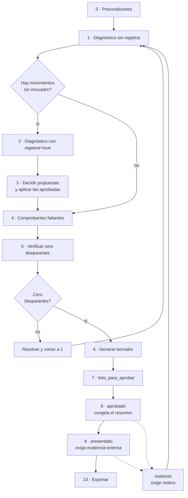

# Cierre fiscal mensual

Procedimiento paso a paso para cerrar un período fiscal: del diagnóstico a la exportación, con casillas, criterios de parada y cómo reabrir si hace falta.

Este runbook es el lado operativo de lo que el [capítulo 09 del manual](../00-manual-de-usuario/09-agente-fiscal-guia-de-uso.md) explica en prosa. Acá no se justifica nada: se hace, en orden.

## Cuándo usarlo

Una vez por mes, cuando el período anterior ya no espera movimientos nuevos. También cada vez que haya que reabrir y rehacer un cierre.

**No aplica** a la consulta cotidiana del estado de un mes. Para eso alcanza con pedir el diagnóstico sin registrar.

## Antes de empezar

Tres cosas tienen que ser ciertas. Si alguna no lo es, no arranques.

- [ ] El período está **completo**: todos los movimientos del mes ya se cargaron.
- [ ] Tenés a mano el **token general**. El token fiscal alcanza para diagnosticar y proponer, **no para decidir ni para transicionar el cierre**.
- [ ] Sabés qué **contribuyente** vas a cerrar. Si hay más de uno activo, el sistema no elige por vos.

## El recorrido completo



---

## Paso 0 — Precondiciones

- [ ] Confirmar el **período** en formato AAAAMM. `202607` es julio de 2026.
- [ ] Confirmar que no quedan **documentos sin procesar** de ese mes en la bandeja de ingesta.
- [ ] Confirmar que el **perfil fiscal** del contribuyente tiene vigencia cubriendo el período. No la condición de hoy: la de ese mes.
- [ ] Anotar en qué **estado** está hoy el cierre. Si ya está `aprobado` o `presentado`, este runbook no arranca en el paso 1: arranca en la sección de reapertura.

**Criterio de parada:** si todavía pueden entrar movimientos del período, no empieces. Cerrar un mes incompleto obliga a reabrirlo, y una reapertura queda registrada para siempre.

---

## Paso 1 — Correr el diagnóstico, sin registrar

```
GET /api/fiscal-diagnostico?periodo=AAAAMM&proposito=cierre mensual
```

Por defecto **no registra propuestas**. Eso es lo que querés en esta primera pasada: mirar sin dejar rastro operativo.

- [ ] Leer el campo `mensaje` completo, de arriba abajo.
- [ ] Anotar los **vencimientos vencidos e impagos**. Van primero por una razón: acumulan intereses todos los días.
- [ ] Anotar el **saldo impago por moneda**. No hay total combinado y no lo calcules a mano para el cierre.
- [ ] Revisar si hay **advertencia de régimen**. Si el sistema no pudo determinar la condición fiscal del período, resolvelo antes de seguir.
- [ ] Anotar la cantidad de **movimientos sin encuadre**.
- [ ] Anotar los **bloqueantes** del cierre y sus identificadores concretos.
- [ ] Revisar las **obligaciones que el régimen implica y no están cargadas**. Salen de un catálogo general: confirmalas con el contador antes de darlas por ciertas.

**Criterio de parada:** si la respuesta es `SOURCE_UNAVAILABLE`, **no interpretes nada**. No es un mes limpio: es un análisis que no se pudo completar. Reintentá; si persiste, escalá y no avances.

**Criterio de parada:** si la resolución del contribuyente devuelve error porque hay varios activos, indicá el código explícitamente. No adivines cuál.

---

## Paso 2 — Registrar las propuestas

Sólo cuando ya leíste el diagnóstico y vas a sentarte a decidir.

```
GET /api/fiscal-diagnostico?periodo=AAAAMM&registrar=true&proposito=cierre mensual
```

- [ ] Confirmar que la cantidad de `propuestas_registradas` coincide con lo esperado.
- [ ] Revisar `propuestas_no_registradas`. Lo habitual es que sean duplicados de preguntas ya decididas: el sistema no repregunta.
- [ ] Revisar la lista `necesitan_tu_criterio`. Esos movimientos **no tienen propuesta** y hay que clasificarlos a mano.

Correr esto dos veces no duplica nada. La huella de la propuesta identifica la pregunta, no la respuesta sugerida, así que el mismo análisis sobre los mismos registros es la misma pregunta.

---

## Paso 3 — Resolver movimientos sin encuadre y decidir propuestas

Son dos tareas distintas que conviene hacer en la misma sentada.

### 3a · Decidir las propuestas

Para cada propuesta pendiente:

- [ ] Leer el **criterio propuesto** y la **explicación**.
- [ ] Leer el **precedente citado**: fecha y clasificación anterior. Ése es todo el fundamento.
- [ ] Mirar el **nivel de confianza**. Por debajo de 0.70 viene con warning automático; nunca llega a 1.
- [ ] Decidir: `aprobada` o `rechazada`. No hay tercera opción — caducar lo hace el sistema.
- [ ] Escribir el **motivo**. Es obligatorio también cuando aprobás.

```
POST /api/fiscal-propuestas/decidir
```

- [ ] Verificar que ninguna decisión haya devuelto datos inconsistentes. Si una propuesta caducó al aprobarla, es porque el movimiento cambió: volvé al paso 2 para regenerarla.

### 3b · Aplicar lo aprobado y clasificar el resto

**Aprobar no aplica.** Este es el paso que se olvida y el que produce el "aprobé todo y el cierre sigue bloqueado".

- [ ] Aplicar la clasificación de cada propuesta aprobada por la ruta de clasificación: `POST /api/fiscal/movimientos/{id}/clasificar`.
- [ ] Clasificar a mano cada movimiento de la lista `necesitan_tu_criterio`.
- [ ] Para todo lo que marques como no deducible, cargar el **motivo**. Es obligatorio.

No hace falta tocar `estado_fiscal`: se deriva solo de `ambito` y `deducible`, por trigger. Esa garantía existe porque una vez no existió — ver el [post-mortem de `estado_fiscal` divergente](postmortem-estado-fiscal-divergente.md).

**Criterio de parada:** si una propuesta no se entiende, rechazala con ese motivo escrito y clasificá a mano. Aprobar algo que no entendés convierte la firma humana en un trámite.

---

## Paso 4 — Cargar los comprobantes faltantes

- [ ] Cargar los comprobantes de los **gastos deducibles** que aparecen en `gastos_sin_comprobante`.
- [ ] Cargar los comprobantes de los **ingresos** que aparecen en `ingresos_sin_comprobante`.
- [ ] Discriminar el **IVA por alícuota**. Una factura puede traer 21% y 10,5% juntos, y eso es lo que después pide el libro IVA.
- [ ] Vincular cada comprobante a su movimiento, con `importe_imputado` si es una imputación parcial.
- [ ] Revisar los `descalce_comprobante`: diferencia mayor a un centavo entre el total del comprobante y lo imputado.

**Criterio de parada:** si falta un comprobante que no vas a conseguir, la salida correcta no es forzar el cierre: es sacarle el deducible al gasto y dejar constancia. Un gasto deducible sin respaldo es un problema que se descubre tarde.

---

## Paso 5 — Verificar cero bloqueantes

```
GET /api/fiscal/cierres/{periodo}/chequeos
```

- [ ] Confirmar que la lista de bloqueantes está **vacía**.
- [ ] Revisar los avisos no bloqueantes: transferencias sin conciliar, documentos sin procesar, comprobantes observados, IVA sin desglose, períodos inconsistentes.
- [ ] Confirmar que no hay **reglas sin verificar** ni marcadas como ficticias en el período.

Los ocho bloqueantes y su remedio están en la [tabla del manual](../00-manual-de-usuario/09-agente-fiscal-guia-de-uso.md#los-bloqueantes-y-cómo-se-resuelve-cada-uno).

**Criterio de parada:** con un solo bloqueante no se avanza, y **no hay parámetro para forzarlo**. Si lo hubiera, alguien lo usaría. Volvé al paso 1.

---

## Paso 6 — Generar el borrador

```
POST /api/fiscal/cierres/{periodo}/borrador
```

- [ ] Confirmar que el borrador se guardó.
- [ ] Leer las **recomendaciones**: cada una trae qué pasa, por qué importa, cuántos casos y dónde mirar.
- [ ] Confirmar que la nota fija está: *«Borrador supervisado. No se presentó nada ante ningún organismo y ningún movimiento se modificó al generarlo.»*
- [ ] Revisar las **salidas del cierre**: resumen ejecutivo, detalle de ingresos y de gastos, comprobantes emitidos y recibidos, retenciones y percepciones, movimientos observados, documentación faltante, obligaciones estimadas y la conciliación comprobante ↔ movimientos.

---

## Paso 7 — Declarar `listo_para_aprobar`

```
POST /api/fiscal/cierres/{periodo}/estado
```

- [ ] Confirmar que el estado actual es `en_revision`. No se llega desde otro lado.
- [ ] Transicionar a `listo_para_aprobar`.
- [ ] Si la base rechaza la transición, **leé el `HINT` del error**: trae el recorrido válido.

---

## Paso 8 — Aprobar el cierre

Este paso **congela** cosas. Es el punto donde el mes deja de moverse.

- [ ] Transicionar a `aprobado`.
- [ ] Confirmar que el `resumen` quedó congelado: los totales del mes más el IVA más la marca de congelado.
- [ ] Confirmar que los movimientos pasaron de `clasificado` a `incluido_en_cierre`.
- [ ] Guardar copia del resumen congelado fuera del sistema.

Qué significa el congelamiento en la práctica: si más adelante la base devuelve totales distintos a los del resumen, es que alguien tocó un movimiento de un período cerrado. Ésa es toda la gracia de congelarlo.

A partir de acá **no se pueden clasificar movimientos del período**. El mensaje es explícito: *«Reabrí el cierre antes de modificar su clasificación fiscal»*.

---

## Paso 9 — Marcar como presentado

Solamente **después** de haber presentado de verdad, por fuera de este sistema.

> *«Esta API no presenta nada por sí misma.»*

- [ ] Hacer la presentación ante el organismo fiscal por el canal que corresponda. **El sistema no la hace.**
- [ ] Obtener la evidencia: número de acuse, comprobante o referencia.
- [ ] Transicionar a `presentado` **enviando la evidencia**. Sin ella la transición se rechaza.
- [ ] Confirmar que los movimientos pasaron de `incluido_en_cierre` a `presentado`.

**Criterio de parada:** no marques `presentado` "para dejarlo prolijo". El sistema quedaría afirmando que se presentó algo que nunca se presentó, y eso es un registro falso, no un detalle de estado.

---

## Paso 10 — Exportar

```
GET /api/fiscal/cierres/{periodo}/exportar
```

- [ ] Elegir formato: `md`, `csv`, `xlsx`, `pdf` o `zip` con los cuatro.
- [ ] Descargar y guardar fuera del servidor.
- [ ] Verificar el `sha256` de la exportación.
- [ ] Enviarle al contador lo que corresponda.

La exportación tiene caché por hash de los datos: si nada cambió, devuelve el archivo ya generado en vez de rehacerlo. Si esperabas un archivo distinto y llegó el mismo, revisá si los datos realmente cambiaron.

---

## Cómo reabrir un período

Se reabre desde `aprobado` o desde `presentado`. Es una acción registrada y visible; no es un deshacer.

- [ ] Confirmar que hace falta de verdad. Una reapertura queda en la auditoría con su motivo.
- [ ] Transicionar a `reabierto` **con el motivo escrito**. Es obligatorio.
- [ ] Transicionar a `en_revision`.
- [ ] Rehacer el recorrido desde el paso 1.

Dos cosas que no vuelven atrás solas:

- El `resumen` congelado del cierre anterior queda como estaba hasta que se apruebe de nuevo. Compararlo contra el nuevo es la mejor forma de ver qué cambió.
- Los movimientos que habían quedado en `presentado` **no** se rebajan por corregirles un campo. Ese estado es una decisión deliberada de un proceso posterior, no una consecuencia del encuadre.

---

## Criterios de parada, juntos

| Situación | Qué hacer |
|---|---|
| El diagnóstico devuelve `SOURCE_UNAVAILABLE` | Parar. No es un mes limpio: es un análisis incompleto. Reintentar y escalar |
| Hay varios contribuyentes activos y no se especificó cuál | Parar. Indicar el código. El sistema no elige |
| Queda al menos un bloqueante | Parar. No hay forma de forzar `listo_para_aprobar` |
| Una propuesta caducó al aprobarla | Parar esa propuesta. Regenerarla; cambió la evidencia |
| Una propuesta no se entiende | Rechazarla con ese motivo y clasificar a mano |
| Falta un comprobante que no se va a conseguir | Sacarle el deducible al gasto y dejar constancia |
| Todavía pueden entrar movimientos del período | No empezar el cierre |
| No hay evidencia real de presentación | No marcar `presentado` |
| El período está `aprobado` y hay que corregir | Reabrir con motivo. No buscar atajos |

---

## Qué queda registrado de todo esto

Cada transición deja una fila en `fiscal_auditoria` con la acción, el valor anterior, el valor nuevo y la metadata. La auditoría es **append-only**: no se puede actualizar ni borrar una fila, lo impide un trigger.

Cada decisión sobre una propuesta queda con aprobador, fecha y motivo, y el contenido de la propuesta se vuelve inmutable en ese momento. Lo que aprobaste es exactamente lo que se te mostró.

---

## Documentos relacionados

- [09 — El Agente Fiscal, guía de uso](../00-manual-de-usuario/09-agente-fiscal-guia-de-uso.md) — la versión en prosa, para el usuario
- [Post-mortem: `estado_fiscal` divergente](postmortem-estado-fiscal-divergente.md) — por qué el marcador se deriva solo
- [ADR-010 — El agente propone, el humano decide](../04-decisiones/adr-010-el-agente-propone-el-humano-decide.md)
- [ADR-013 — Abstenerse antes que devolver un resultado parcial](../04-decisiones/adr-013-abstenerse-antes-que-devolver-un-resultado-parcial.md)
- [El cierre fiscal por dentro](../../systems/praxia-agente-fiscal/cierre-fiscal.md)

> Última verificación: 2026-08-06
