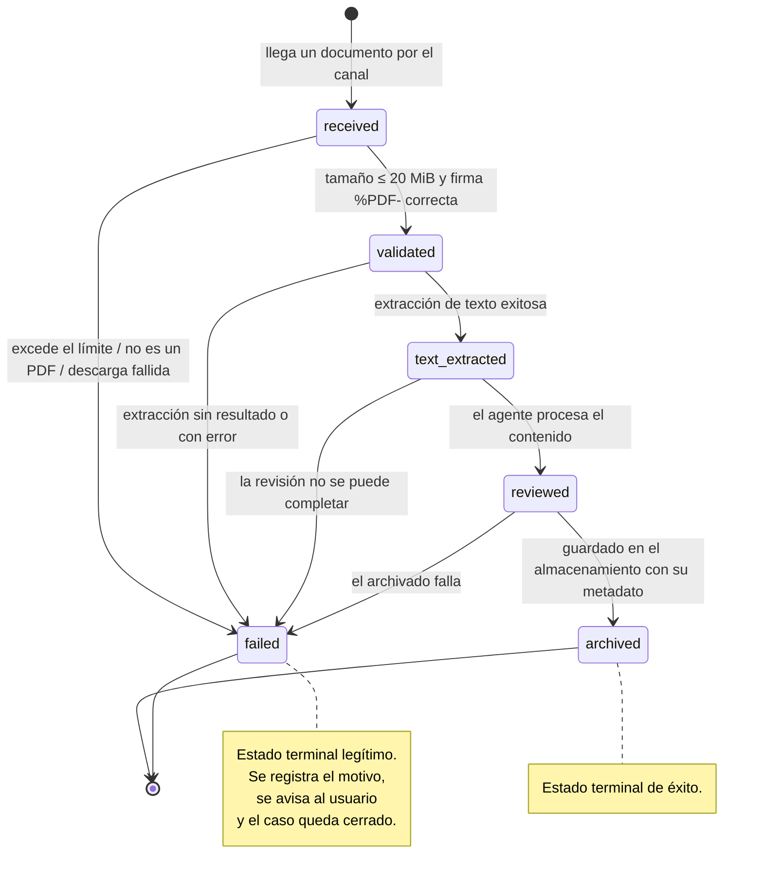

# Incidente: PDF de Telegram que rompió la ingesta

El 25 de julio de 2026 un PDF de 21,9 MB hizo fallar la descarga de documentos. El bug se arregló en horas; el hallazgo que dejó es más grande que el bug.

## Ficha del incidente

| Campo | Valor |
|---|---|
| Fecha y hora | 2026-07-25, 18:25 ART |
| Componente | Nodo de descarga de documentos de Telegram, dentro del orquestador |
| Ejecución afectada | 1292 |
| Error | `Bad Request: file is too big` |
| Disparador | Un PDF de **21,9 MB** enviado por el canal |
| Impacto | Un documento no procesado; la ejecución queda en estado de falla |
| Severidad | Baja en impacto inmediato, **alta en hallazgo estructural** |
| Resolución | Mismo día. 6/6 pruebas PASS |
| Estado | Cerrado |

## Síntoma

Se envía un PDF por el canal. El agente no responde nada útil sobre el documento. En el registro de ejecuciones, la ejecución 1292 aparece fallida en el nodo de descarga con:

```
Bad Request: file is too big
```

Visto desde afuera: el archivo se mandó y no pasó nada. Sin aviso, sin explicación, sin registro de que ese documento existiera.

## Contexto

El pipeline de PDF de Oppenheimer, antes del incidente, hacía cuatro cosas en secuencia: descargar el archivo del canal, extraer su texto, dejar que el agente lo revisara, y archivar el resultado en el almacenamiento en la nube.

Estaba diseñado sobre un supuesto tácito: **que la descarga funciona**. Es un supuesto razonable y era falso. La API de bots de Telegram tiene un límite propio para la descarga de archivos, más bajo que el límite de subida que ve el usuario. Un archivo se puede enviar y no se puede bajar por esa vía. Desde el lado del usuario es indistinguible de que todo esté bien.

Un detalle que importa para el análisis: **el avisador de errores global funcionó**. La captura centralizada estaba activa desde el 22 de julio, así que la falla quedó registrada y alertada. El sistema de observación hizo su trabajo; el que no lo hizo fue el pipeline.

## Causa raíz

Hay dos niveles y conviene no confundirlos.

**Causa inmediata.** El nodo de descarga intentaba bajar el archivo sin verificar su tamaño primero. Ante un archivo por encima del límite de la API, el nodo devuelve error y la ejecución muere ahí.

**Causa raíz.** El pipeline **no validaba nada antes de actuar**. No verificaba tamaño, no verificaba tipo, no verificaba que lo descargado fuera realmente un PDF. Cada paso asumía que el anterior había salido bien. Es la estructura clásica de un camino feliz sin ramas.

Y detrás de eso, el hallazgo que hizo que valiera la pena el incidente.

## El hallazgo estructural

Al revisar el pipeline con el error a la vista, apareció algo que el bug ocultaba:

> **No existe camino de archivado desde una descarga, extracción o revisión fallida.**

Es decir: el pipeline modelaba un solo recorrido, el exitoso. Descargar → extraer → revisar → archivar. Si cualquiera de los tres primeros pasos fallaba, **no había un cuarto paso al que ir**. El caso simplemente dejaba de existir.

Las consecuencias prácticas de eso son peores que el error original:

| Problema | Por qué importa |
|---|---|
| No queda registro del documento | No se puede consultar después qué pasó con ese archivo |
| No hay estado terminal | El caso no está ni terminado ni pendiente: no está |
| No se puede reintentar | No hay a qué volver, porque no se guardó nada |
| No se puede medir | Imposible saber cuántos documentos fallan, ni por qué |
| El usuario no se entera | El silencio es indistinguible del éxito |

El bug del tamaño fue el que hizo visible el problema. Sin ese PDF de 21,9 MB, la falla estructural seguía ahí esperando cualquier otra causa: una extracción rota, un archivo corrupto, una API caída.

**La lección general: un pipeline que sólo modela el éxito no está incompleto, está mal.** La falla no es una excepción al flujo; es una de sus salidas.

## Solución aplicada

Cinco cambios, publicados el mismo día.

### 1. Validación previa a la descarga

Se verifican los metadatos del archivo **antes** de pedirlo. Si no pasa la validación, no se intenta la descarga.

### 2. Límite explícito de 20 MiB

Se fija un tope propio, por debajo del límite de la API. Un archivo por encima de ese tope se rechaza con un mensaje claro para el usuario, en vez de producir un error de la API que nadie entiende.

Elegir un límite propio más conservador que el del proveedor es deliberado: el sistema controla su mensaje de error, y no depende de que el límite ajeno no cambie.

### 3. Verificación de firma `%PDF-`

No alcanza con que el nombre del archivo termine en `.pdf`. Se verifica que los primeros bytes del contenido sean la firma `%PDF-`.

Esto atrapa dos cosas distintas: archivos mal nombrados, y descargas truncadas o corruptas que devolvieron algo que no es un PDF. Comprobación barata, en el lugar exacto donde sirve.

### 4. Extracción real de texto

Se reemplazó la extracción por una implementación que efectivamente lee el contenido del documento. Si la extracción no produce texto, es un resultado explícito del pipeline y no un paso que se salta en silencio.

### 5. Máquina de estados con `failed` terminal

El cambio de fondo. El pipeline dejó de ser una secuencia de pasos y pasó a ser una máquina de estados explícita:



Seis estados, dos de ellos terminales:

| Estado | Significa |
|---|---|
| `received` | Llegó un documento. Todavía no se sabe nada de él |
| `validated` | Pasó tamaño y firma. Se puede seguir |
| `text_extracted` | Hay texto utilizable |
| `reviewed` | El agente lo procesó |
| `archived` | **Terminal.** Guardado con su metadato |
| `failed` | **Terminal.** Falló en algún punto, con motivo registrado |

Lo importante es la última fila. **`failed` es un estado terminal legítimo, no una ausencia de estado.** Un documento que falló está tan cerrado como uno archivado: tiene registro, tiene motivo, se puede consultar, se puede contar y se puede reintentar a mano si corresponde.

La diferencia entre "falló y quedó registrado" y "falló y desapareció" es la diferencia entre un sistema operable y uno que hay que adivinar.

## Verificación

**6/6 pruebas PASS** antes de publicar. Los casos cubrían el camino feliz y las ramas de falla:

| # | Caso | Estado esperado |
|---|---|---|
| 1 | PDF válido dentro del límite | `archived` |
| 2 | Archivo por encima de 20 MiB | `failed`, con motivo de tamaño |
| 3 | Archivo sin firma `%PDF-` | `failed`, con motivo de tipo |
| 4 | PDF válido con extracción de texto correcta | `text_extracted` → `reviewed` |
| 5 | Falla en la extracción | `failed`, con motivo de extracción |
| 6 | Archivado y registro del metadato | `archived`, verificado en destino |

El criterio fue 6/6, declarado antes de correr. Es el mismo método que dos días después llevó a **no publicar** el Buscador General con 2/7 — ver [ADR-006](../04-decisiones/adr-006-buscador-general-no-publicado.md). El mismo criterio, dos resultados opuestos: por eso el criterio sirve.

## Rollback

**Disponible al momento de publicar.** El backup del workflow previo estaba guardado antes de aplicar el cambio, siguiendo la práctica establecida el 16 de julio de nombrar los backups por el cambio que viene y no por la fecha.

No hizo falta usarlo.

## Lecciones

### 1. Un pipeline que sólo modela el éxito está mal, no incompleto

Es la lección principal. Las ramas de falla no son manejo de errores agregado después: son parte del diseño. Si al dibujar un flujo todas las flechas van hacia adelante, faltan flechas.

### 2. `failed` es un estado, no la ausencia de uno

Un caso que falló y quedó registrado se puede consultar, contar, alertar y reintentar. Un caso que falló y desapareció no se puede hacer nada. El costo de agregar el estado terminal es mínimo; el costo de no tenerlo es no saber qué está pasando.

### 3. Validar antes de actuar, siempre que la validación sea barata

Verificar el tamaño de un archivo cuesta una consulta de metadatos. Verificar la firma cuesta leer unos bytes. Las dos evitan una clase entera de fallas. Cuando la validación es órdenes de magnitud más barata que la operación, no hay discusión.

### 4. Poner límites propios, más conservadores que los del proveedor

20 MiB por debajo del límite de la API significa: mensajes de error propios, comportamiento predecible e independencia de que el límite ajeno cambie sin aviso.

### 5. No confiar en la extensión del archivo

El nombre es un dato que provee quien envía. La firma en el contenido es un hecho.

### 6. El incidente chico expone el problema grande, si se lo mira

El impacto real fue un documento sin procesar. Podría haberse arreglado subiendo un límite y listo. La decisión de revisar el pipeline entero con el error a la vista es lo que convirtió una molestia en una mejora estructural.

### 7. La captura centralizada de errores se paga sola

El avisador global existía desde tres días antes. Sin él, la ejecución 1292 habría fallado en silencio y el problema se hubiera descubierto mucho más tarde, o nunca.

## Aplicabilidad

Este patrón sirve para cualquier pipeline que reciba algo de afuera:

- **Descarga de archivos** de cualquier API con límites propios.
- **Ingesta de documentos** por correo, formulario o almacenamiento compartido.
- **Procesamiento de imágenes**, donde el tipo declarado y el contenido real difieren seguido.
- **Cualquier flujo con varias etapas** donde una etapa intermedia puede fallar.

Las tres preguntas para revisar un pipeline propio:

1. ¿Qué pasa si el paso 1 falla? ¿Y el 2? ¿Y el 3?
2. ¿Hay un estado terminal de falla, o los casos fallidos desaparecen?
3. ¿Se valida antes de actuar, o se actúa y se ve qué pasa?

Si alguna de las tres no tiene respuesta clara, el pipeline tiene el mismo problema que tenía éste el 25 de julio a las 18:24.

## Evidencia

| Afirmación | Estado |
|---|---|
| Ejecución 1292 fallida el 2026-07-25 18:25 ART con `Bad Request: file is too big` | `Verificado` |
| PDF de 21,9 MB como disparador | `Verificado` |
| Hallazgo estructural: no existía camino de archivado desde una falla | `Verificado` |
| Solución con validación previa, límite de 20 MiB, verificación de firma `%PDF-`, extracción real y máquina de estados | `Verificado` |
| Estados `received → validated → text_extracted → reviewed → archived \| failed` | `Verificado` |
| 6/6 pruebas PASS | `Verificado` |
| Rollback disponible al publicar | `Verificado` |
| Detalle caso por caso de las 6 pruebas | `Inferido` — la tabla de casos reconstruye la cobertura declarada; el detalle individual no está registrado |
| Cantidad de documentos afectados antes de la detección | `Pendiente de verificar` |

> Última verificación: 2026-08-05
