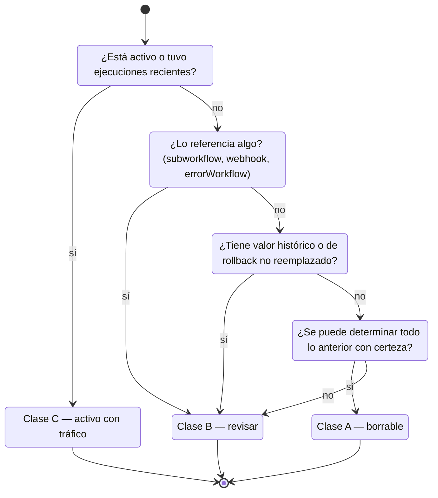

# Limpieza de runtime

Cómo se inventariaron y clasificaron 79 workflows de laboratorio antes de borrar ninguno — y por qué dos de ellos estaban activos y recibiendo tráfico.

## El problema

Un runtime que se usó también como laboratorio acumula versiones, candidatos, respaldos y pruebas. Al 25 de julio de 2026 había 79 workflows con nomenclatura de laboratorio conviviendo con producción. Al 3 de agosto, en el corte de la inspección global, eran 125 sobre 217 registrados.

El diagnóstico quedó escrito así:

> *"El entorno de producción también ha sido utilizado como laboratorio y archivo histórico, porque conserva numerosos workflows de prueba, candidatos y respaldos."*

La tentación frente a eso es evidente y es una trampa: filtrar por nombre y borrar todo lo que diga `TEST`, `copia`, `v2`, `candidato` o `backup`.

**Dos de los 79 workflows con nombre de laboratorio estaban activos y recibiendo tráfico.** Un borrado por patrón de nombre habría cortado producción.

Y no es una casualidad de este sistema: es el modo normal en que las cosas terminan mal nombradas. Un workflow nace como prueba, funciona, se lo deja andando, y nadie le cambia el nombre. Este sistema tiene el caso más claro posible: **el workflow global de captura de errores sigue llamándose `[TEST]` y está activo desde el 22 de julio**. Si alguien borra por patrón de nombre, se lleva puesto el sistema de alertas.

## La regla

**No se borra nada sin inventario previo.** El nombre de un workflow es una pista, nunca una prueba.

## Cuándo usar este procedimiento

- Cuando el runtime acumule versiones viejas y candidatos.
- Antes de cualquier borrado masivo.
- Como parte de una auditoría periódica del entorno.
- Antes de migrar a un runtime nuevo, para no arrastrar la deuda.

## Paso 1 — Inventariar todo

Antes de clasificar hay que tener la lista completa. Sin excepciones y sin filtros previos, porque el filtro es la decisión que se quiere tomar con datos.

Para cada workflow, cinco datos:

- [ ] **Nombre** tal cual figura.
- [ ] **Estado**: activo, inactivo, archivado.
- [ ] **Última ejecución**: fecha, o nunca.
- [ ] **Cantidad de ejecuciones** en la ventana de retención disponible.
- [ ] **Referencias entrantes**: ¿lo invoca otro workflow? ¿tiene un webhook publicado? ¿es el `errorWorkflow` de alguien?

Ese último punto es el que más se olvida y el que más rompe. Un workflow sin ejecuciones propias puede ser invocado como herramienta por el orquestador, o estar enlazado como manejador global de errores. Su contador de ejecuciones no cuenta esa historia.

**Criterio de parada:** si no podés determinar las referencias entrantes de un workflow, va a clase B. No a clase A.

## Paso 2 — Clasificar en tres clases

El inventario del 25 de julio usó tres clases. El resultado fue:

| Clase | Cantidad | Qué es | Qué se hace |
|---|---|---|---|
| **A — borrables** | **73** | Sin tráfico, sin referencias entrantes, reemplazados por una versión posterior | Se pueden borrar tras exportar |
| **B — revisar** | **4** | Dependencia posible, o valor histórico no descartado | No se tocan hasta resolver caso por caso |
| **C — activos con tráfico** | **2** | **Están corriendo en producción** | No se tocan. Se renombran |
| | **79** | | |

### Criterio de clasificación

Cuatro preguntas, en orden. La primera que dé "sí" define la clase.



La última pregunta es la que hace segura la clasificación: **ante la duda, clase B**. Clase A exige certeza sobre las tres preguntas anteriores; la incertidumbre nunca cae del lado de borrar.

### Qué NO es criterio

| No sirve como criterio | Por qué |
|---|---|
| El nombre dice `TEST`, `copia`, `v2` | Dos de los 79 eran activos con tráfico. El caso del `errorWorkflow` `[TEST]` lo prueba |
| Es viejo | La antigüedad no dice nada sobre el uso |
| No lo reconozco | Dice algo sobre la documentación, no sobre el workflow |
| Hay uno con nombre parecido y más nuevo | Puede ser un candidato que nunca reemplazó al original |
| Está inactivo | Puede ser invocado como subworkflow sin estar "activo" en el sentido del runtime |

Esa última fila es la trampa técnica más sutil: en n8n, un workflow invocado como herramienta desde un orquestador **no necesita estar activo** para ejecutarse. Filtrar por "inactivos" y borrar es otra forma de cortar producción.

## Paso 3 — Actuar según la clase

### Clase A — borrables

- [ ] **Exportar antes de borrar.** Todos, sin excepción.
- [ ] Guardar los exports con fecha en un lugar recuperable.
- [ ] Borrar en tandas chicas, no los 73 de una vez.
- [ ] Después de cada tanda: verificar que la captura centralizada de errores no reporte nada nuevo.
- [ ] Esperar un ciclo de ejecución antes de la tanda siguiente.

Borrar en tandas es lo que hace reversible el error. Si algo se rompe después de la tanda 1, hay 12 candidatos posibles y no 73.

**Criterio de parada:** si después de una tanda aparece cualquier error nuevo, se detiene la limpieza y se investiga. La clasificación tenía un error y probablemente no sea el único.

### Clase B — revisar

- [ ] Resolver caso por caso, no en lote.
- [ ] Buscar la referencia concreta que generó la duda.
- [ ] Si se resuelve, reclasificar a A o a C.
- [ ] Si no se resuelve, **se queda donde está**.

Cuatro workflows sin resolver no molestan a nadie. Un workflow borrado que hacía falta es un incidente.

### Clase C — activos con tráfico

- [ ] **No borrar.**
- [ ] **Renombrar** con el nombre lógico estable que les corresponde.
- [ ] Documentar qué hacen y quién es su dueño.
- [ ] Incorporarlos al pipeline de versionado ([runbook](publicar-un-workflow-n8n.md)).

Un workflow de clase C es producción mal etiquetada. El problema no es que esté ahí: es que su nombre miente. Renombrarlo resuelve el riesgo para la próxima limpieza.

## Paso 4 — Cerrar el ciclo

- [ ] Registrar la fecha del inventario y el resultado por clase.
- [ ] Anotar qué se borró y dónde quedaron los exports.
- [ ] Anotar qué quedó en clase B y por qué.
- [ ] Programar la próxima revisión.

Un inventario sin fecha caduca sin que nadie se entere. El del 25 de julio dio 79; nueve días después el corte global registraba 125 con nomenclatura de laboratorio. **El runtime se vuelve a ensuciar si no cambia el proceso que lo ensucia.**

## Checklist completa

```text
PASO 1 — INVENTARIO
[ ] Lista completa, sin filtros previos
[ ] Nombre de cada workflow
[ ] Estado: activo / inactivo / archivado
[ ] Fecha de última ejecución
[ ] Cantidad de ejecuciones en la ventana de retención
[ ] Referencias entrantes: subworkflow, webhook, errorWorkflow

PASO 2 — CLASIFICACIÓN
[ ] P1 aplicada: ¿activo o con ejecuciones recientes?
[ ] P2 aplicada: ¿lo referencia algo?
[ ] P3 aplicada: ¿valor histórico o de rollback?
[ ] P4 aplicada: ¿hay certeza sobre las tres anteriores?
[ ] Ante la duda → clase B
[ ] Conteo por clase registrado

PASO 3 — ACCIÓN
Clase A
[ ] Exportados todos antes de borrar
[ ] Exports guardados con fecha
[ ] Borrado en tandas chicas
[ ] Verificación de errores después de cada tanda
[ ] Un ciclo de espera entre tandas
Clase B
[ ] Resueltos caso por caso
[ ] Los no resueltos quedan donde están
Clase C
[ ] No borrados
[ ] Renombrados con nombre lógico estable
[ ] Documentados con dueño
[ ] Incorporados al pipeline de versionado

PASO 4 — CIERRE
[ ] Fecha y resultado registrados
[ ] Ubicación de los exports anotada
[ ] Clase B justificada
[ ] Próxima revisión programada
```

## Por qué no se borró nada sin inventario previo

La respuesta corta está en los números: **73 de 79 resultaron borrables, y 2 estaban en producción**. La tasa de acierto de un borrado por patrón de nombre habría sido del 92%, y el 8% restante era el sistema andando.

La respuesta larga tiene tres partes.

**Un borrado es irreversible en la práctica.** Aunque exista un backup del runtime, restaurar un workflow puntual desde un respaldo global es incómodo, y el momento en que se descubre que hacía falta suele ser el peor momento posible.

**El nombre es la propiedad menos confiable de un workflow.** Es la única que cambia sin que cambie el comportamiento, y la única que nadie actualiza. El `errorWorkflow` global de este sistema lleva `[TEST]` en el nombre desde el 22 de julio y es el componente del que depende toda la observabilidad.

**El inventario tiene valor más allá del borrado.** Al hacerlo aparecieron las referencias entrantes, los candidatos que nunca reemplazaron al original y los workflows activos mal nombrados. Nada de eso se ve sin recorrer la lista, y todo eso es información sobre el sistema que no estaba escrita en ningún lado.

La forma general de la regla, que sirve para cualquier limpieza de infraestructura: **el costo de inventariar es lineal y conocido; el costo de borrar algo que hacía falta es desconocido y se paga en el peor momento.** Cuando la asimetría es de esa forma, se inventaría.

## Lo que este runbook no resuelve

Limpiar es tratar el síntoma. La causa es que **el runtime se usa como laboratorio porque no hay otro lado donde experimentar**.

Mientras no haya ambientes separados, el runtime se va a volver a llenar. El inventario del 25 de julio dio 79; nueve días después había 125 con nomenclatura de laboratorio. La limpieza es mantenimiento, no solución.

La solución es la del [ADR-008](../04-decisiones/adr-008-el-repositorio-como-fuente-de-verdad.md): repositorio como fuente de verdad, ambientes separados, y workflows versionados con el [pipeline de 10 pasos](publicar-un-workflow-n8n.md). Al 2026-08-05 nada de eso está implementado, y por eso este runbook va a seguir haciendo falta.

## Evidencia

| Afirmación | Estado |
|---|---|
| Inventario del 2026-07-25 con 79 workflows de laboratorio | `Verificado` |
| Clasificación: clase A = 73, clase B = 4, clase C = 2 activos con tráfico | `Verificado` |
| Estado del runtime al 2026-08-03: 217 registrados, 25 activos, 25 archivados, 125 con nomenclatura de laboratorio | `Verificado` |
| Cita textual sobre producción usada como laboratorio y archivo histórico | `Verificado` |
| El `errorWorkflow` global sigue llamándose `[TEST]` estando activo desde el 2026-07-22 | `Verificado` |
| Ventana de retención de ejecuciones de 7 días, 377 conservadas al corte | `Verificado` |
| **Que los 73 de clase A se hayan borrado efectivamente** | `Pendiente de verificar` — el inventario y la clasificación están; la ejecución del borrado no está registrada |
| Detalle de los 4 workflows de clase B y su resolución | `Historia incompleta` |
| Identidad de los 2 workflows de clase C | `Historia incompleta` — se registra el conteo, no cuáles |

> Última verificación: 2026-08-05
