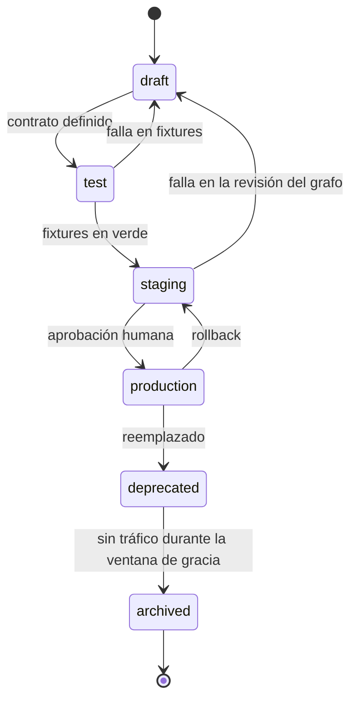

# Publicar un workflow de n8n

Pipeline de 10 pasos para llevar un workflow desde el editor visual hasta producción, con manifiesto, evidencia de prueba y rollback.

Es el procedimiento que convierte un workflow —que por default es un objeto vivo dentro de un runtime— en un artefacto versionado con dueño, contrato y forma de volver atrás.

## El problema que resuelve

Un workflow de n8n editado en la interfaz visual no tiene nada de lo que tiene un cambio de código normal: no hay diff revisable, no hay historial, no hay revisión de otro, no hay pruebas atadas al cambio, y la única copia vive en el runtime que está ejecutándolo.

Las consecuencias se midieron en este sistema el 3 de agosto:

| Estado del runtime | Cantidad |
|---|---|
| Workflows registrados | 217 |
| Activos | 25 |
| **Con nomenclatura de laboratorio** | **125** |

Y el diagnóstico textual: *"El entorno de producción también ha sido utilizado como laboratorio y archivo histórico, porque conserva numerosos workflows de prueba, candidatos y respaldos."*

Con el 58% de los workflows siendo de laboratorio, la pregunta "¿cuál es la versión buena de esto?" se responde mirando cuál está activo. Eso no es un sistema de versionado: es arqueología.

## Cuándo usarlo

- Antes de **activar** un workflow nuevo en producción.
- Antes de **modificar** uno activo.
- Antes de **promover** un candidato que venía probándose.

**No aplica** a experimentos que van a quedar inactivos. Sí aplica en el momento en que ese experimento va a recibir tráfico real.

## Advertencia de estado

Al 2026-08-05 **los workflows de n8n de este sistema todavía no están versionados**. El pipeline está definido, el manifiesto está definido, y la adopción está pendiente. Es el hueco más grande del [ADR-008](../04-decisiones/adr-008-el-repositorio-como-fuente-de-verdad.md) y se declara acá para no afirmar una práctica que no está en uso.

Lo que sigue es el procedimiento tal como está especificado, no un relato de lo que ya se hizo.

## El manifiesto mínimo: 11 campos

Un JSON exportado no es un artefacto versionado: es un volcado. Le faltan todas las respuestas que hacen falta seis meses después. Estos once campos son las que faltan.

| # | Campo | Qué responde | Ejemplo sintético |
|---|---|---|---|
| 1 | **Nombre lógico estable** | ¿Qué es esto, independientemente de cómo se llame hoy en la interfaz? | `agente-ejemplo-notificaciones` |
| 2 | **Owner** | ¿Quién decide sobre esto y a quién se le pregunta? | `equipo-ejemplo` |
| 3 | **Entorno** | ¿Dónde corre esta versión? | `production` |
| 4 | **Estado de ciclo de vida** | ¿En qué punto de su vida está? | `production` |
| 5 | **Contrato de entrada y salida** | ¿Qué recibe y qué devuelve, con qué estados posibles? | Entrada: `{ consulta: string }` · Salida: `{ estado: 'ok' \| 'sin_datos' \| 'error' }` |
| 6 | **Dependencias** | ¿Qué otros workflows, servicios o tablas necesita? | `subagente-ejemplo-lectura`, tabla `esquema_ejemplo.tabla_ejemplo` |
| 7 | **Credenciales por referencia simbólica** | ¿Qué credenciales usa, **sin incluirlas**? | `CRED_SERVICIO_EJEMPLO` |
| 8 | **Clasificación de datos** | ¿Qué sensibilidad tiene lo que pasa por acá? | `personal-sensible` |
| 9 | **Revisión de origen** | ¿De dónde salió y quién lo revisó? | Adaptado de una plantilla propia; revisado el AAAA-MM-DD |
| 10 | **Evidencia de test** | ¿Con qué se probó y con qué resultado? | `6/6 PASS` sobre la matriz de casos v1 |
| 11 | **Artefacto de rollback** | ¿A qué se vuelve si esto sale mal? | Export previo `nombre-ejemplo-v3.json`, hash registrado |

El campo 7 merece énfasis. **Las credenciales van por referencia simbólica, nunca embebidas.** Es lo que hace que el artefacto se pueda versionar y, eventualmente, publicar. Es también la razón por la que versionar sin disciplina de secretos empeora las cosas: un token dentro de un JSON versionado queda en el historial para siempre.

### Ciclo de vida



Estados: `draft → test → staging → production → deprecated → archived`.

Un workflow que no declara su estado de ciclo de vida es, por default, uno de los 125 con nomenclatura de laboratorio.

## Los 10 pasos

### 1. Exportar

- [ ] Exportar el workflow desde el runtime a JSON.
- [ ] Guardarlo con el nombre lógico estable, no con el nombre de la interfaz.

**Criterio de parada:** si el nombre de la interfaz incluye `[TEST]`, `copia`, `v2 final` o similar, resolvé el nombre lógico antes de seguir. Un artefacto mal nombrado nace como deuda. Este sistema tiene un caso vivo: el workflow global de captura de errores **sigue llamándose `[TEST]` aunque está activo desde el 22 de julio**.

### 2. Normalizar

- [ ] Quitar el ruido volátil del export: posiciones de nodos, identificadores de ejecución, marcas de tiempo.
- [ ] Ordenar de forma determinística lo que se pueda.
- [ ] Confirmar que dos exports del mismo workflow sin cambios producen el mismo archivo.

Sin normalización, cada export produce un diff enorme y la revisión se vuelve imposible. **Un diff ilegible es un diff que nadie lee.**

### 3. Escanear secretos

- [ ] Buscar tokens, claves, cadenas de conexión y contraseñas.
- [ ] Buscar datos personales: correos, identificadores de canal, nombres, teléfonos.
- [ ] Buscar direcciones IP y nombres de host.
- [ ] Confirmar que las credenciales aparecen sólo como referencia simbólica.

**Criterio de parada:** un hallazgo detiene el pipeline. Y si el artefacto ya se guardó en un repositorio, **el secreto se rota**, no se borra y se sigue. Un secreto en el historial de un repositorio sigue expuesto aunque el archivo actual esté limpio.

Este control existe porque hace falta: en este sistema un archivo de configuración con un token real quedó dentro de una carpeta sincronizada a la nube, y requiere rotación.

### 4. Validar la estructura

- [ ] El JSON es válido y el runtime lo puede importar.
- [ ] Todos los nodos referenciados existen y las conexiones están completas.
- [ ] No hay nodos huérfanos ni ramas sin salida.
- [ ] Hay manejo de error, o el workflow está enlazado a la captura global.

### 5. Probar contratos con fixtures ficticios

- [ ] Definir la matriz de casos **antes** de correr.
- [ ] Declarar el umbral de aceptación **antes** de correr.
- [ ] Usar **fixtures ficticios**, nunca datos reales.
- [ ] Cubrir el camino feliz y **cada rama de falla**.
- [ ] Registrar el resultado como evidencia de test.

Dos puntos de método que no son negociables:

**El umbral se declara antes.** Si se fija después de ver los resultados, siempre se cumple.

**Un fixture que falla no es un fixture malo por default.** La tentación es ajustar el caso. A veces corresponde; casi siempre el caso está bien y la respuesta no alcanza. El precedente del proyecto: el Buscador General dio 2/7 contra una exigencia de 7/7, no se ajustaron los fixtures y **no se publicó** ([ADR-006](../04-decisiones/adr-006-buscador-general-no-publicado.md)).

**Criterio de parada:** por debajo del umbral, el pipeline se detiene. Sin excepciones y sin renegociar el umbral.

### 6. Importar en staging aislado, inactivo

- [ ] Importar en un entorno separado.
- [ ] Importar **como inactivo**.
- [ ] Verificar que las credenciales resuelven a las del entorno, no a las de producción.
- [ ] Ejecutar a mano con datos ficticios.

**Estado en este sistema:** `Pendiente de verificar`. **No hay ambiente de staging.** Es una deuda declarada. Hasta que exista, la mitigación es un canary acotado en producción, con tráfico limitado y observación directa — que es lo que se hizo con el canary de Telegram del 27 de julio.

### 7. Revisar el grafo visual

- [ ] Abrir el workflow importado y mirarlo.
- [ ] Confirmar que el flujo es el que se pretendía.
- [ ] Verificar que las ramas de falla van a algún lado.
- [ ] Confirmar que no hay caminos que escriban sin pasar por el gate de aprobación correspondiente.

Este paso parece blando y no lo es. **El diff textual de un JSON de workflow no muestra la topología.** Una conexión mal puesta se ve en el grafo y no se ve en el texto. Es el equivalente visual de leer el código antes de mezclarlo.

### 8. Publicar tras aprobación

- [ ] Aprobación humana explícita, registrada.
- [ ] Activar en producción.
- [ ] Anotar fecha y hora de activación.

Coherente con el [ADR-004](../04-decisiones/adr-004-aprobacion-humana-en-acciones-consecuentes.md): publicar es una de las cuatro acciones que requieren una persona. Y con el principio de la línea base: *"Los agentes de IA pueden proponer, implementar y verificar trabajo. No se convierten en el dueño responsable del riesgo, el acceso o la decisión de release."*

### 9. Registrar el hash desplegado

- [ ] Calcular el hash del artefacto normalizado.
- [ ] Registrarlo junto a la fecha de despliegue y el manifiesto.

Es lo que hace **detectable el drift**. Sin hash registrado no hay forma de saber si el workflow que está corriendo es el que se aprobó. Es el equivalente, para workflows, de la tabla `schema_migrations` para el esquema — y la ausencia de ese equivalente es exactamente lo que permitió el [drift de cinco días](postmortem-drift-produccion.md) en la base.

### 10. Verificar y conservar el rollback

- [ ] Verificar en producción: una ejecución real observada de punta a punta.
- [ ] Confirmar que la captura centralizada de errores no reporta nada nuevo.
- [ ] Confirmar que el export previo está guardado y accesible.
- [ ] Confirmar que el artefacto de rollback se puede importar de verdad.

**Un rollback que no se verificó es una intención, no un plan.** Guardar el JSON viejo no alcanza: hay que saber que se puede importar y que las credenciales resuelven.

## Checklist completa

```text
MANIFIESTO (11 campos)
[ ] 1. Nombre lógico estable
[ ] 2. Owner
[ ] 3. Entorno
[ ] 4. Estado de ciclo de vida
[ ] 5. Contrato de entrada y salida
[ ] 6. Dependencias
[ ] 7. Credenciales por referencia simbólica
[ ] 8. Clasificación de datos
[ ] 9. Revisión de origen
[ ] 10. Evidencia de test
[ ] 11. Artefacto de rollback

PIPELINE (10 pasos)
[ ] 1. Exportado, con nombre lógico
[ ] 2. Normalizado, export determinístico
[ ] 3. Escaneado: sin secretos, sin datos personales, sin topología
[ ] 4. Estructura válida, sin nodos huérfanos, con manejo de error
[ ] 5. Matriz y umbral declarados ANTES; fixtures ficticios; resultado registrado
[ ] 6. Importado en staging aislado como inactivo
[ ] 7. Grafo visual revisado
[ ] 8. Aprobación humana registrada; activado
[ ] 9. Hash del artefacto registrado con la fecha
[ ] 10. Verificado en producción; rollback conservado y probado
```

## Criterios de parada

| Paso | Situación | Acción |
|---|---|---|
| 1 | El nombre delata un artefacto de laboratorio | Resolver el nombre lógico antes de seguir |
| 3 | Cualquier hallazgo de secreto o dato personal | **Parar.** Rotar si ya se publicó |
| 4 | Ramas sin salida o sin manejo de error | Volver al diseño |
| 5 | Resultado por debajo del umbral | **Parar.** No ajustar fixtures ni umbral |
| 6 | Las credenciales resuelven a producción desde staging | **Parar.** Riesgo de escritura real |
| 7 | El grafo no coincide con lo pretendido | Volver al diseño |
| 8 | Sin aprobación humana registrada | No se publica |
| 10 | El rollback no se puede importar | Revertir el despliegue |

## Por qué diez pasos y no tres

Es mucho procedimiento para un cambio que en la interfaz se hace arrastrando un nodo. Ésa es exactamente la asimetría que el pipeline corrige.

Un cambio de código pasa por un editor, un diff, una revisión, tests y un despliegue: cinco oportunidades de que alguien note algo. Un cambio en la interfaz visual pasa por cero. La facilidad de edición es la ventaja principal del no-code, y sin un pipeline es también su riesgo principal.

Los diez pasos no compensan una debilidad de la herramienta: **le devuelven al no-code las garantías que el código tiene gratis.**

## Evidencia

| Afirmación | Estado |
|---|---|
| Pipeline de 10 pasos definido en la línea base de gobernanza del 2026-08-03 | `Verificado` |
| Manifiesto mínimo de 11 campos | `Verificado` |
| Ciclo de vida `draft → test → staging → production → deprecated → archived` | `Verificado` |
| Estado del runtime al 2026-08-03: 217 registrados, 25 activos, 125 con nomenclatura de laboratorio | `Verificado` |
| Cita textual sobre producción usada como laboratorio y archivo histórico | `Verificado` |
| El `errorWorkflow` global sigue llamándose `[TEST]` estando activo | `Verificado` |
| Canary de Telegram aprobado el 2026-07-27 | `Verificado` |
| **Que los workflows estén versionados con este pipeline** | **No.** `Verificado` como pendiente |
| Existencia de un ambiente de staging | **No.** `Verificado` como pendiente |
| Herramienta concreta de normalización de exports | `Pendiente de verificar` — no está definida |

> Última verificación: 2026-08-05
