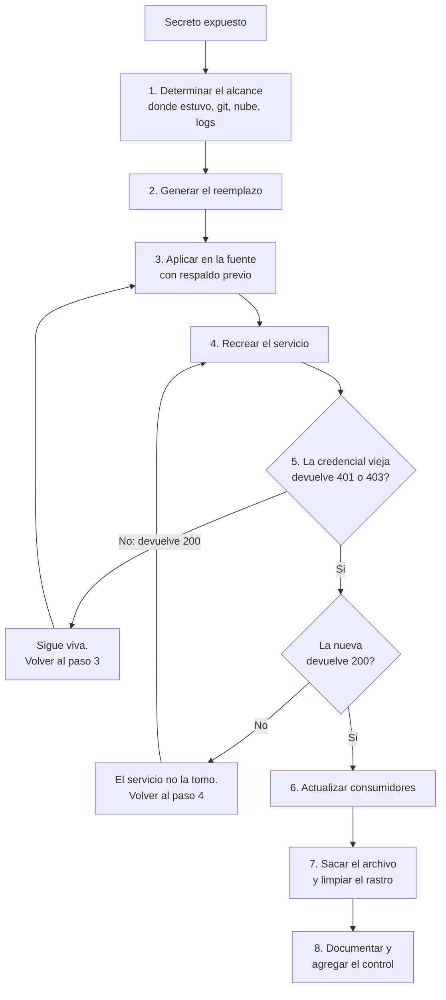

# Rotar una credencial expuesta

Procedimiento para invalidar un secreto que estuvo donde no tenía que estar, con un criterio de éxito que se comprueba y no se supone.

> **In English** — An actionable runbook for invalidating a secret that ended up somewhere it should not have
> been: a cloud-synced folder, a git history, a log, a chat transcript. The governing rule is that exposure is
> irreversible — moving, renaming or deleting the file hides the secret without disabling it, so rotation
> comes first and file cleanup last. The steps: establish the blast radius, generate the replacement, apply it
> at the source, recreate the service so it picks up the new value, **verify the old credential is dead**, and
> only then update consumers and remove the file. The success criterion is explicit and testable: the previous
> credential must return 401 or 403. A 200 means the rotation achieved nothing, regardless of how many steps
> ran. Includes a "what is not enough" section, guidance for credentials that cannot be rotated, and a
> rollback path.

<!-- fin del resumen en inglés -->

---

## Cuándo usarlo

Siempre que un secreto haya estado, aunque sea un rato, en alguno de estos lugares:

- una carpeta que se sincroniza a un servicio en la nube;
- el historial de un repositorio git, aunque el archivo ya esté borrado y aunque el repositorio sea privado;
- un log, una salida de terminal, una captura de pantalla;
- un mensaje de chat, un correo, un ticket;
- una transcripción de conversación con un agente;
- el portapapeles de una máquina compartida;
- cualquier lugar del que no puedas afirmar con certeza quién tuvo acceso.

**También aplica cuando no hay evidencia de que alguien lo haya visto.** La ausencia de evidencia de acceso no es evidencia de ausencia, y verificarlo cuesta más que rotar.

**No aplica** a un secreto que sólo existió en un gestor de credenciales, en una variable de entorno del servidor, o en el almacén de credenciales de la herramienta de automatización. Ésos son los lugares donde tiene que vivir.

---

## La regla que gobierna todo el procedimiento

> **Expuesto es quemado. Rotar, no borrar.**

Un secreto que estuvo sincronizado o versionado ya se fue. Moverlo de carpeta, renombrarlo, borrarlo o hacer un commit que lo quite **lo esconde**, no lo desactiva. El valor sigue siendo válido en el servicio que lo acepta.

De ahí que el orden de este runbook sea el inverso del intuitivo: **primero se invalida el valor, al final se limpia el archivo**. Si se hace al revés, en el intervalo entre el borrado y la rotación el secreto sigue vivo y ya nadie sabe dónde estaba.

---

## Antes de empezar

Tres cosas tienen que ser ciertas. Si alguna no lo es, no se avanza.

- [ ] Sabés **dónde se configura** el valor nuevo y **cómo se recarga** el servicio que lo consume.
- [ ] Tenés una **forma de verificar** que una credencial funciona o no funciona: un endpoint de salud, una operación de lectura barata, un comando que devuelva un código de estado.
- [ ] Tenés **acceso de recuperación** por un camino que no dependa de la credencial que vas a rotar. Rotar la única llave que tenés para entrar es cómo se pierde el acceso a un sistema.

Si el secreto expuesto es lo único que te da acceso, invertí el orden: conseguí primero un segundo camino de acceso, después rotá.

---

## Paso 1 — Determinar el alcance

No se trata de reconstruir la historia completa: se trata de saber **qué hay que rotar además de esto** y **a quién hay que avisar**.

- [ ] **¿Dónde estuvo el archivo?** Ruta, y desde cuándo. Si no se sabe desde cuándo, se asume "desde siempre".
- [ ] **¿Estuvo en una carpeta sincronizada?** Si sí, existe en al menos tres lugares: el disco, los servidores del proveedor, y cualquier otro dispositivo con esa cuenta. Sumá las versiones anteriores del archivo que el proveedor conserva.
- [ ] **¿Estuvo en git?** Verificalo contra la historia, no contra el árbol de trabajo.

```bash
# ¿Aparece el nombre del archivo en algún commit, aunque hoy no exista?
git log --all --oneline --name-only -- '<ruta-del-archivo>'

# ¿Aparece el valor en algún blob de cualquier revisión? (lento; corré una vez)
git grep -nI '<fragmento-del-valor>' $(git rev-list --all) 2>/dev/null | head
```

- [ ] **¿El repositorio fue público alguna vez?** Si sí, **asumí que fue visto**. Un repositorio público es indexable, clonable y archivable por terceros en minutos.
- [ ] **¿Apareció en logs?** Buscá en los logs del servicio y del proxy. Los tokens que viajan en query string terminan en el log de acceso.
- [ ] **¿Apareció en transcripciones o mensajes?** Conversaciones con agentes, chats, correos, tickets.
- [ ] **¿Hay otras credenciales en el mismo archivo?** Si el archivo tenía tres valores, se rotan los tres. No hay forma de saber cuál se leyó.
- [ ] **¿Hay datos de terceros involucrados?** Si sí, hay una notificación pendiente, y posiblemente una obligación legal.

Anotá el resultado antes de seguir. El alcance define cuántas rotaciones hay, no sólo una.

---

## Paso 2 — Generar el reemplazo

- [ ] Generar el valor nuevo con una fuente de aleatoriedad adecuada. Un token que se elige a mano no es un token.

```bash
# Ejemplo sintético y genérico.
NUEVO=$(openssl rand -hex 32)
```

- [ ] Verificar que cumple los requisitos del servicio: longitud mínima, alfabeto permitido, y que sea **distinto** de los otros tokens del mismo sistema.
- [ ] **No escribirlo en ningún archivo dentro de una carpeta sincronizada.** Ni el valor nuevo, ni "provisoriamente", ni "para no perderlo".
- [ ] Si el servicio permite tener dos credenciales válidas a la vez, usalo: creá la nueva sin revocar la vieja todavía. Eso convierte el paso 6 en algo que se puede hacer sin apuro.

**Criterio de parada:** si el servicio no permite verificar que el valor nuevo funciona antes de invalidar el viejo, y no tenés otro camino de acceso, volvé a "Antes de empezar".

---

## Paso 3 — Aplicar el valor nuevo en la fuente

"La fuente" es el único lugar donde el valor tiene que vivir: el archivo de entorno **del servidor**, el gestor de secretos, el almacén de credenciales de la plataforma.

- [ ] **Respaldar la configuración actual antes de tocarla.**

```bash
# Ejemplo sintético y genérico.
cp <ruta-de-despliegue>/.env <ruta-de-despliegue>/.env.bak.$(date +%Y%m%d%H%M)
```

- [ ] Reemplazar el valor.

```bash
# Ejemplo sintético y genérico.
sed -i "s|^<NOMBRE_DE_LA_VARIABLE>=.*|<NOMBRE_DE_LA_VARIABLE>=$NUEVO|" <ruta-de-despliegue>/.env
```

- [ ] Verificar que quedó **una sola** línea con esa variable y que no hay una definición duplicada más abajo que la pise.

```bash
grep -c '^<NOMBRE_DE_LA_VARIABLE>=' <ruta-de-despliegue>/.env   # tiene que devolver 1
```

- [ ] Confirmar los permisos del archivo: legible sólo por el usuario del servicio.

---

## Paso 4 — Recrear el servicio

Escribir el valor nuevo no alcanza. Un proceso que ya está corriendo tiene el valor viejo cargado en memoria.

- [ ] Recrear el proceso o el contenedor para que lea el archivo de nuevo.

```bash
# Ejemplo sintético y genérico.
docker compose -f <ruta-de-despliegue>/<archivo-compose>.yml up -d --force-recreate <nombre-del-servicio>
```

- [ ] Confirmar que el servicio **arrancó** y está sano. Un servicio que no levanta con la credencial nueva es un problema distinto y hay que resolverlo antes de seguir.
- [ ] Revisar los logs de arranque por errores de autenticación.

**Criterio de parada:** si el servicio no arranca, restaurá el respaldo del paso 3, recreá, y volvé a intentar. No dejes el servicio caído mientras investigás.

---

## Paso 5 — Verificar que la credencial vieja ya no funciona

**Es el paso que define si la rotación sirvió.** Todos los anteriores son preparación.

- [ ] Probar la credencial **vieja** contra el servicio.

```bash
# Ejemplo sintético y genérico. Tiene que devolver 401 o 403.
curl -s -o /dev/null -w '%{http_code}\n' \
  -H "Authorization: Bearer <CREDENCIAL-VIEJA>" \
  https://<host>/<ruta-de-salud>
```

- [ ] Probar la credencial **nueva** contra el mismo servicio.

```bash
# Ejemplo sintético y genérico. Tiene que devolver 200.
curl -s -o /dev/null -w '%{http_code}\n' \
  -H "Authorization: Bearer $NUEVO" \
  https://<host>/<ruta-de-salud>
```

### Criterio de éxito

| Credencial | Código esperado | Si no |
|---|---|---|
| **Vieja** | **401 o 403** | Si devuelve 200, **la rotación no sirvió de nada**. El valor viejo sigue vivo. Volvé al paso 3: probablemente el servicio no releyó la configuración, o hay una definición duplicada, o el valor está cacheado en otro lado |
| **Nueva** | **200** | Si falla, el servicio no tomó el valor nuevo. Revisá el paso 4 antes de seguir |

Éste es el único punto del runbook donde el resultado se mide en vez de suponerse. **Si la vieja devuelve 200, no avances.** Cerrar el procedimiento acá con el archivo borrado y el token vivo es el peor final posible: se pierde el rastro y se gana la sensación de haberlo resuelto.

- [ ] Anotar los dos códigos obtenidos, con la fecha y la hora. Es la evidencia de la rotación.

---

## Paso 6 — Actualizar los consumidores

Ahora, y no antes, se actualiza todo lo que usaba el valor viejo.

- [ ] Listar los consumidores **antes** de tocar ninguno: la credencial en la herramienta de automatización, los clientes que la usan, los trabajos programados, el entorno de desarrollo local, los pipelines de CI.
- [ ] Actualizar uno por uno, verificando cada uno.
- [ ] Confirmar que ninguno quedó fallando en silencio. Un trabajo programado que se autentica una vez por día tarda un día en avisar que se rompió.
- [ ] Si un consumidor no se puede actualizar hoy, anotarlo con dueño y fecha. No es motivo para revertir la rotación.

**Nota de secuencia.** Si el servicio permite dos credenciales válidas a la vez, este paso va **entre** el 4 y el 5: se actualizan los consumidores con la nueva, y recién después se revoca la vieja y se verifica el 401. Si no lo permite, hay una ventana de indisponibilidad y conviene elegir el horario.

---

## Paso 7 — Recién ahora, sacar el archivo

- [ ] Mover el archivo con el valor viejo **fuera de la carpeta sincronizada**, a una carpeta local de cuarentena. Moverlo, no borrarlo: si algo salió mal, el respaldo del paso 3 y este archivo son lo que te queda.
- [ ] Agregar el patrón al `.gitignore` correspondiente, para que no vuelva.
- [ ] Si el valor estuvo en el historial de git y el repositorio es público o compartido, reescribir el historial. **Después** de rotar, no en lugar de rotar, y sabiendo que un fork o un clon ajeno no se puede limpiar.
- [ ] Pedir la eliminación de cachés donde sea posible.
- [ ] Verificar que la versión limpia es efectivamente la única disponible.

---

## Paso 8 — Cerrar

- [ ] Documentar el incidente con la [plantilla de incidente](../05-gobernanza/plantillas/INCIDENTE.md): línea de tiempo, alcance, acciones y los dos códigos de estado del paso 5.
- [ ] **Agregar el control que evita la repetición.** Un incidente sin control nuevo se repite. Ejemplos concretos: el patrón agregado al escaneo previo a publicar, el archivo agregado al `.gitignore`, la regla `deny` agregada a los [permisos del agente](../05-gobernanza/permisos-de-agente.md), la fecha de vencimiento puesta a la excepción que originó todo.
- [ ] Notificar: al dueño del sistema siempre; a los terceros si hay datos de terceros.

---

## Qué NO alcanza

Cuatro acciones que se sienten como una solución y no lo son.

| Acción | Qué hace en realidad |
|---|---|
| **Borrar el archivo** | Saca el valor de la vista. El servicio lo sigue aceptando |
| **Hacer un commit que lo quite** | Deja el valor en el historial, disponible con un `git show` de cualquier clon |
| **Renombrar o mover el archivo** | Cambia la ruta. No cambia el valor |
| **Sacar la carpeta de la sincronización** | Detiene la replicación hacia adelante. No revoca lo que ya se replicó ni lo que el proveedor conserva como versión anterior |

Las cuatro son pasos válidos **después** de la rotación. Ninguna la reemplaza.

Y una quinta, más sutil: **verificar que el valor nuevo funciona no prueba que el viejo dejó de funcionar.** Son dos comprobaciones distintas y hacen falta las dos. Muchos servicios aceptan varias credenciales a la vez, y ése es justamente el modo de falla: la nueva anda, la vieja también, y nadie lo notó porque sólo se probó la nueva.

---

## Si la credencial no se puede rotar

Existen: una clave incrustada en un dispositivo, un token de un proveedor que no ofrece rotación, un identificador que no es rotable por diseño.

En ese caso:

- [ ] Tratala como **comprometida de forma permanente** y escribilo así, con esas palabras.
- [ ] Compensá con otra capa: restricción por IP de origen, alcance reducido de permisos, límite de tasa, alerta ante uso anómalo, o rotación del recurso completo en vez de la credencial.
- [ ] Ponele fecha de reemplazo al componente. Una credencial no rotable es deuda técnica con nombre.

---

## Rollback

La rotación en sí no se revierte: el valor viejo ya está expuesto y volver a él sería volver al problema.

Lo que sí se revierte es un **despliegue fallido**:

- [ ] Restaurar el archivo de configuración desde el respaldo del paso 3.
- [ ] Recrear el servicio.
- [ ] Verificar que vuelve a estar sano.
- [ ] **Volver a intentar la rotación el mismo día.** Un rollback de la rotación deja el secreto expuesto y vivo: es un estado transitorio, no un final aceptable.

---

## El flujo completo



---

## Cómo encaja con el resto

| Documento | Relación |
|---|---|
| [Auditar antes de publicar](../05-gobernanza/auditar-antes-de-publicar.md) | Los controles 1, 3 y 4 son los que encuentran lo que este runbook remedia |
| [Permisos de agente](../05-gobernanza/permisos-de-agente.md) | Si la exposición vino de un permiso demasiado amplio, se quita el permiso **y** se rota la credencial |
| [Política de publicación](../05-gobernanza/politica-de-publicacion.md) | Su procedimiento de corrección en siete pasos; este runbook es el detalle operativo de su paso 3 |
| [Plantilla de incidente](../05-gobernanza/plantillas/INCIDENTE.md) | El registro que cierra el procedimiento |

---

## Nivel de evidencia de este documento

| Afirmación | Nivel |
|---|---|
| La secuencia de ocho pasos y el criterio de éxito 401/403 | Verificado — ejecutado sobre una rotación real el 2026-08-06 |
| Que borrar, renombrar o mover el archivo no invalida el secreto | Verificado — propiedad del modelo de autenticación, no una opinión |
| Que verificar la credencial nueva no prueba nada sobre la vieja | Verificado |
| La variante con dos credenciales válidas simultáneas | Inferido — depende del servicio; no se probó en este caso |
| Las compensaciones para una credencial no rotable | Inferido — no se ejecutó |

> Última verificación: 2026-08-06
