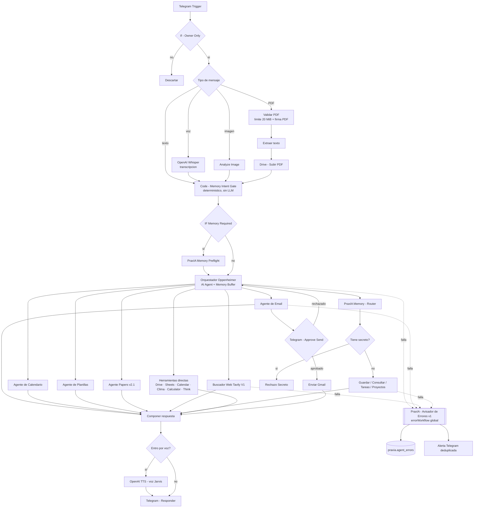

# Oppenheimer — agente personal 24/7

Oppenheimer es el asistente personal de Aldo: un agente n8n autohospedado con canal Telegram, un orquestador central y subagentes especializados que hacen el trabajo real contra Gmail, Calendar, Drive, Sheets, la web y la memoria en PostgreSQL.

**Estado:** producción · **Corte de esta ficha:** 2026-08-05

---

## Objetivo

Que una sola conversación de Telegram alcance para operar el día: leer y redactar mail con aprobación previa, mover la agenda, cargar y consultar planillas, buscar papers, buscar en la web con evidencia, recordar decisiones y avisar cuando algo se rompe.

No es un chatbot de preguntas y respuestas. Es un orquestador con herramientas, permisos y trazabilidad.

---

## Usuario y canal

| Ítem | Valor |
|---|---|
| Usuario | Aldo Cáceres Ruiz Díaz (usuario único) |
| Canal | Telegram, canal único |
| Control de acceso | `Telegram Trigger` → filtro `If - Owner Only` (identidad por `chat_id`, decisión **D-6**) |
| Aislamiento | El bot de la segunda persona es un agente separado, con datos separados. No hay memoria compartida |

El `chat_id` real no se publica. La regla de diseño sí: **la identidad se resuelve en el primer nodo, antes de gastar un token de modelo.**

---

## Capacidades multimodales

| Modo | Cómo funciona |
|---|---|
| **Texto** | Camino base: `Telegram Trigger` → gate de memoria → orquestador → respuesta |
| **Voz (entrada)** | Transcripción con OpenAI Whisper; el texto transcripto entra al mismo camino que un mensaje escrito |
| **Voz (salida)** | Respuesta hablada con TTS de OpenAI, voz configurada como "Jarvis" (2026-07-17) |
| **Imagen** | Nodo `Analyze Image` sobre el archivo recibido por Telegram |
| **PDF** | Descarga → validación → extracción de texto → archivado en Google Drive, con máquina de estados explícita |

### Máquina de estados del pipeline PDF

Nació de un incidente real: el 2026-07-25 18:25 ART la ejecución 1292 falló en `Telegram - Get Documento` con `Bad Request: file is too big` frente a un PDF de 21,9 MB. La reparación publicada ese mismo día agregó validación previa, límite de 20 MiB, verificación de la firma `%PDF-` y extracción real.

```
received → validated → text_extracted → reviewed → archived
                    ↘ failed
```

Resultado de la reparación: **6/6 pruebas PASS**.

---

## Herramientas conectadas al orquestador

| Familia | Herramientas |
|---|---|
| Mensajería | Telegram |
| Modelos | OpenAI — chat, Whisper (STT), TTS |
| Google | Drive (`Buscar en Drive`, `Drive - Subir PDF`), Calendar, Gmail, Sheets |
| Web | Tavily (búsqueda con contrato de evidencia) |
| Datos abiertos | Open-Meteo (`HTTP CLIMA`), Europe PMC, OpenAlex |
| Memoria | PostgreSQL (esquema `praxia`), vía los workflows de PraxIA Memory |
| Utilidades | Webhook de recordatorios, nodos `Calculator` y `Think`, `Memory Buffer` (memoria corta de conversación) |

---

## Subagentes

Todos se invocan como `toolWorkflow` / `executeWorkflow` desde el orquestador. Cada uno es un workflow independiente, con su propio contrato de entrada y salida.

| Subagente | Rol |
|---|---|
| **Oppenheimer - Agente de Email** | Buscar, leer y redactar en Gmail. El **envío pasa por aprobación humana** en Telegram: `Telegram - Approve Send` → `If - Approved` |
| **Oppenheimer - Agente de Calendario** | Get / Create / Update / Delete de eventos en Google Calendar |
| **Oppenheimer - Agente de Planillas** | Google Sheets. Clasifica la intención en `GUARDAR:` vs `CONSULTA:` y deriva las consultas a un `Consulta Sub-Agent` separado |
| **Oppenheimer — Agente Papers Científicos v2.1** | Cadena query-builder → Europe PMC + OpenAlex → ranker → writer → Google Sheets |
| **Oppenheimer — Buscador Web Tavily V1** | Búsqueda web con contrato de evidencia. 9 nodos, 7 estados de salida tipados |
| **PraxIA Memory — Router** | Despacho de operaciones de memoria. Incluye el gate "¿Tiene secreto?" → `Rechazo Secreto` |
| **PraxIA Memory — Guardar / Consultar / Tareas / Proyectos** | CRUD sobre PostgreSQL `praxia.*`, con verificación posterior a la escritura |
| **PraxIA Sync — Export MD** | Export nocturno 23:30 ART de la memoria a Markdown → OneDrive / Obsidian |
| **Oppenheimer - Briefing Diario** | 07:00 — agenda + tareas + mails + clima |
| **Oppenheimer — Briefing Noticias** | 06:30 — RSS (Infobae, Clarín, Olé, BBC) → síntesis con OpenAI → Telegram |
| **Oppenheimer - Recordatorios** | Webhook + `Wait` + Telegram |
| **Oppenheimer - Enviar Gmail** | Envío simple, disparado sólo tras confirmación |
| **Oppenheimer - Alertas TradingView** | Webhook → Telegram |
| **PraxIA — Avisador de Errores v1** | `errorWorkflow` global. Registra en `praxia.agent_errors` y alerta por Telegram. Deduplicación y anti-spam validados |

---

## Diagrama del orquestador



---

## Memory Intent Gate

Tres piezas: `Code - Memory Intent Gate` + `IF Memory Required` + `PraxIA Memory Preflight`.

La decisión de **si hay que consultar la memoria antes de que el modelo responda se toma en código, no con un LLM**. Es determinística, barata y auditable: la misma entrada produce siempre la misma decisión, y no consume tokens.

La regla dura vive en el prompt de sistema del orquestador:

> *"Está prohibido responder 'no tengo registrado' sin haber llamado primero a PraxIA_Memory con `action=consultar` y haber recibido `facts=[]`."*

El patrón general — gate determinístico antes del LLM — está descripto en [`artifacts/prompts/patrones-de-prompt.md`](../../artifacts/prompts/patrones-de-prompt.md).

Se incorporó al orquestador el 2026-07-20, con rollback previo guardado.

---

## Buscador Web Tavily V1

Nueve nodos, publicado y verificado el 2026-07-25 23:18.

```
Validar consulta web
  → IF Consulta válida
    → Preparar búsqueda
      → HTTP Request - Tavily Search   (Header Auth · neverError=true · timeout 20 s · salida en `tavily_response`)
        → Validar fuentes y salida
          → Conservar contexto / Envolver respuesta / Merge
```

Detalles que importan:

- `neverError=true` deja que el fallo HTTP entre al flujo como dato, en vez de matar la ejecución. El error se convierte en un estado de salida, no en una excepción.
- La respuesta cruda se conserva en `tavily_response` — corrección estructural del contexto del 2026-07-26, 8/8 pruebas.
- La auditoría correctiva de fechas (hoy / ayer / temporada, `target_date`, `date_scope`) del 2026-07-26 cerró 8/8.
- La corrección de cobertura temática (etiquetas por resultado, fallback de 72 h) es del 2026-07-26/27.

### Los 7 estados de salida

| Estado | Cuándo se emite |
|---|---|
| `ok` | Hay evidencia suficiente y fuentes válidas para responder |
| `clarification_required` | La consulta es ambigua; hace falta que el usuario precise antes de gastar una búsqueda |
| `no_reliable_source` | Hubo resultados, pero ninguno pasa el validador de fuentes |
| `search_not_configured` | Falta configuración del proveedor de búsqueda |
| `technical_error` | Falla técnica capturada (timeout, error HTTP, respuesta malformada) |
| `stable_knowledge_handoff` | La pregunta no requiere web: es conocimiento estable, se devuelve al orquestador |
| `insufficient_evidence` | Hay fuentes, pero la evidencia no alcanza para una respuesta fundada |

Ningún estado es "respondé igual". Ese es el punto: **la ausencia de evidencia se declara, no se rellena**.

### Lo que no se publicó

El "Buscador General" (fases 3B→3E1: relevancia, validador consolidado, métrica de alcance, fallback) llegó a revalidación real acotada el 2026-07-27 con **2/7 PASS frente a una exigencia de 7/7 → NO PUBLICADO**. La lectura del cierre fue explícita:

> *"Los cuatro FAIL no son falsos positivos del nuevo validador: son fixtures que no contienen evidencia suficiente para producir una respuesta grounded."*

Ver [ADR-006](../../docs/04-decisiones/adr-006-buscador-general-no-publicado.md).

---

## Manejo global de errores

**PraxIA — Avisador de Errores v1**, creado el 2026-07-22 y enlazado como `errorWorkflow` global. Integración productiva aprobada el 2026-07-23.

Qué hace:

1. Captura la falla de cualquier workflow que lo tenga configurado como `errorWorkflow`.
2. Registra el error en `praxia.agent_errors` mediante la función `praxia.upsert_agent_error`.
3. Deduplica: errores equivalentes incrementan un contador en vez de crear filas nuevas.
4. Reserva la alerta con anti-spam: una notificación por ventana, no una por ejecución fallida.
5. Alerta por Telegram.

Estado del 2026-07-23 en la aprobación: 44 workflows, orquestador con 37 nodos, `praxia.agent_errors` en 0 filas, Traefik OK, SSH cerrado.

**Deuda conocida:** el workflow **todavía se llama `[TEST]` aunque está activo y es el manejador global**. Está listado como deuda técnica y no se renombró para no romper referencias sin una ventana de cambio.

La implementación SQL de la deduplicación está en [`artifacts/sql/01-esquema-praxia-memoria.sql`](../../artifacts/sql/01-esquema-praxia-memoria.sql).

---

## Métricas del runtime (corte 2026-08-03)

| Métrica | Valor |
|---|---|
| Workflows registrados | 217 |
| Workflows activos | 25 |
| Workflows archivados | 25 |
| Workflows con nomenclatura de laboratorio | 125 |
| Ejecuciones conservadas | 377 |
| Ejecuciones en 7 días | 343 exitosas / 19 fallidas |
| Nodos del orquestador | 51 (eran 47 en el backup del 2026-07-27; 37 el 2026-07-23) |
| Nacimiento del orquestador | 2026-07-14 23:05 |

El crecimiento de nodos del orquestador —37 → 47 → 51 en veinte días— es un dato de gobernanza, no de marketing: **un orquestador que crece linealmente es un orquestador que en algún momento hay que partir.**

---

## Límites conocidos y deuda técnica

1. **Producción se usó también como laboratorio.** 125 workflows con nomenclatura de laboratorio conviven con 25 activos. El inventario del 2026-07-25 clasificó 79 de laboratorio: clase A = 73 (borrables), clase B = 4, clase C = 2 activos con tráfico. Ver [runbook de limpieza](../../docs/06-runbooks/limpieza-de-runtime.md).
2. **No hay separación de ambientes.** No existe dev / staging / prod. El TO-BE lo pide; hoy no está.
3. **El `errorWorkflow` global sigue llamándose `[TEST]`.**
4. **El orquestador crece.** 51 nodos en un solo workflow es el techo práctico de lo legible.
5. **Buscador General no publicado.** El buscador Tavily V1 cubre el caso; la versión general quedó afuera por no alcanzar el umbral.
6. **Backups sin off-site ni ensayo de restauración demostrado.** Riesgo abierto y documentado.
7. **Sin integración continua.** Las pruebas se corren a mano antes de publicar.
8. **Usuario único.** El diseño contempla multiusuario (identidad por `chat_id`, datos separados), pero sólo Oppenheimer está en producción.
9. **`[PENDIENTE DE VERIFICAR]`** — no hay medición publicada de latencia extremo a extremo, ni de costo por conversación, ni de tasa de acierto del Memory Intent Gate.

---

## Criterios de aceptación

Un cambio en Oppenheimer se considera aceptable cuando:

1. **Identidad primero.** Ningún mensaje de un remitente no autorizado llega al modelo. El filtro corta antes del primer nodo de IA.
2. **Ninguna acción consecuente sin aprobación humana.** Enviar mail, borrar, gastar y publicar pasan por una confirmación explícita en Telegram (decisión **D-7**).
3. **Ninguna respuesta de "no tengo registrado" sin haber consultado la memoria** y recibido `facts=[]`.
4. **Todo estado de salida es tipado.** Ninguna herramienta devuelve texto libre donde el orquestador espera un estado.
5. **La ausencia de evidencia se declara.** El buscador nunca responde sin fuente válida: emite el estado que corresponda.
6. **Toda falla queda registrada** en `praxia.agent_errors` y genera a lo sumo una alerta por ventana.
7. **Existe rollback.** Backup del workflow anterior guardado antes de publicar, con su hash.
8. **Los secretos no entran a la memoria.** El gate del Router rechaza contraseñas, tokens, claves y datos bancarios completos.
9. **No se publica nada sin evidencia.** Si un número no se midió, se escribe `[PENDIENTE DE VERIFICAR]`.

---

## Pruebas mínimas

Antes de publicar cualquier cambio del orquestador o de un subagente:

| # | Prueba | Resultado esperado |
|---|---|---|
| 1 | Mensaje de texto desde un remitente no autorizado | Descartado en `If - Owner Only`. Cero llamadas al modelo |
| 2 | Mensaje de texto simple ("hola") | Respuesta en Telegram; el Memory Intent Gate no dispara consulta |
| 3 | Pregunta sobre un dato guardado ("¿qué decidí sobre X?") | El gate dispara `IF Memory Required`; se llama a `PraxIA_Memory action=consultar`; la respuesta cita el hecho |
| 4 | Pregunta sobre un dato inexistente | Se consulta memoria, se recibe `facts=[]`, y recién ahí se dice que no hay registro |
| 5 | Nota de voz | Whisper transcribe; la respuesta vuelve hablada con la voz configurada |
| 6 | Imagen | `Analyze Image` produce descripción; no se cae si el archivo no es imagen |
| 7 | PDF de 1 MB válido | `received → validated → text_extracted → reviewed → archived`; queda en Drive |
| 8 | PDF de más de 20 MiB | Estado `failed` con mensaje claro. **No** debe aparecer `Bad Request: file is too big` sin manejar |
| 9 | Archivo con extensión `.pdf` sin firma `%PDF-` | Rechazado en validación |
| 10 | Redacción de mail | Se muestra el borrador y se pide aprobación. **Sin aprobación no se envía** |
| 11 | Rechazo de la aprobación de mail | No se envía nada; el flujo vuelve al orquestador |
| 12 | Búsqueda web con consulta clara y actual | Estado `ok` con fuentes |
| 13 | Búsqueda web con consulta ambigua | Estado `clarification_required`, sin inventar |
| 14 | Búsqueda web con el proveedor caído | Estado `technical_error`; la ejecución **no** aborta (`neverError=true`) |
| 15 | Búsqueda web sobre conocimiento estable | Estado `stable_knowledge_handoff` |
| 16 | Intento de guardar "mi token es abc123" (valor sintético) | Gate de secretos → `Rechazo Secreto`. No se escribe en la base |
| 17 | Falla forzada en un subagente | Fila en `praxia.agent_errors` + una sola alerta en Telegram |
| 18 | Repetir la misma falla tres veces seguidas | Una sola fila deduplicada, contador en 3, una sola alerta |
| 19 | Consulta de agenda / creación de evento | Evento creado y confirmado con datos verificables |
| 20 | Rollback | Reimportar el backup previo restaura el comportamiento anterior |

Las pruebas 8, 9 y 17-18 son regresiones de incidentes reales. No se sacan de la batería.

---

## Documentos relacionados

- [Manual de uso de Oppenheimer](../../docs/00-manual-de-usuario/02-oppenheimer-guia-de-uso.md)
- [Subagentes, explicados](../../docs/00-manual-de-usuario/03-subagentes.md)
- [Cuándo construyo un subagente](../../docs/02-desglose-tecnico/03-cuando-construyo-un-subagente.md)
- [ADR-004 — Aprobación humana en acciones consecuentes](../../docs/04-decisiones/adr-004-aprobacion-humana-en-acciones-consecuentes.md)
- [ADR-006 — El Buscador General que no se publicó](../../docs/04-decisiones/adr-006-buscador-general-no-publicado.md)
- [Incidente PDF Telegram](../../docs/06-runbooks/incidente-pdf-telegram.md)
- [Estructura del orquestador, nodo por nodo](../../artifacts/workflows-n8n/estructura-orquestador.md)

> Última verificación: 2026-08-05
