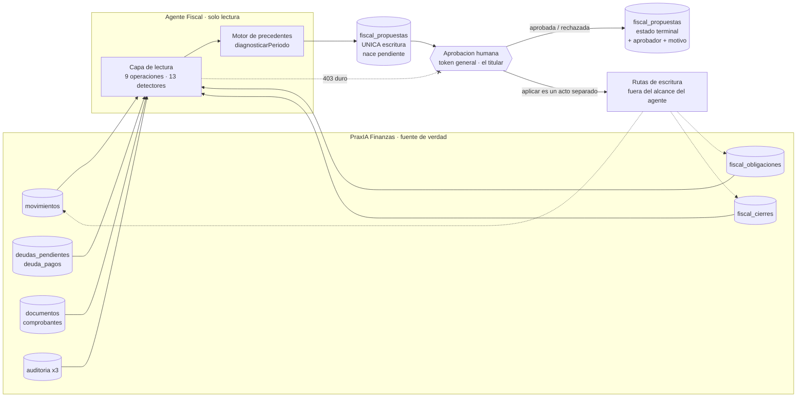

# PraxIA Agente Fiscal — el agente que propone y nunca aplica

El Agente Fiscal es la capa de interpretación fiscal que se apoya sobre [PraxIA Finanzas](../praxia-finanzas/README.md): lee evidencia financiera ya registrada, la contrasta contra el régimen y el calendario del contribuyente, y produce diagnósticos y propuestas. No corrige, no imputa, no paga y no presenta: escribe en una sola tabla que no mueve un peso. Todo lo que tenga consecuencia lo decide una persona, y la separación no es una promesa de comportamiento sino una credencial que el agente no tiene.

**Estado:** producción · **Corte de esta ficha:** 2026-08-06

> **In English** — Reference sheet for the fiscal subsystem: a read-only interpretation layer over PraxIA
> Finanzas that reads already-recorded financial evidence, checks it against the taxpayer's regime and
> calendar, and produces diagnoses and proposals. It never corrects, imputes, pays or files. Its only write
> target is `fiscal_propuestas`, and the separation from approval is a credential it does not hold — a hard
> 403 on the decision route, verified by a script that aborts the deployment if it is missing. Proposals cite
> verifiable precedents from the owner's own earlier decisions instead of inferring intent; two separate
> hashes stop the agent from re-asking a settled question or approving against evidence that has since
> changed; and when a detector fails the answer is a coded abstention rather than a partial result. Current
> state: schema v4.13, 39 tables, 606 passing tests, 9 read operations, 13 detectors, monthly trigger a stub.

<!-- fin del resumen en inglés -->

---

## Qué decide y qué NO decide

**Qué decide:** nada con efecto. Lee, diagnostica, detecta discrepancias y **propone**. Su única escritura es en `praxia_finanzas.fiscal_propuestas`.

**Qué NO decide** (contrato §2 y §17):

- No modifica movimientos originales, no crea pagos confirmados, no cambia saldos, no borra ni anula registros financieros y no reclasifica movimientos directamente.
- No decide si conviene pasar a monotributo ni en qué categoría. Eso es del contador.
- No decide si una obligación del catálogo realmente aplica al caso concreto. El catálogo es *«una AYUDA PARA NO OLVIDARSE, no una determinación fiscal»*.
- No presenta ni paga nada ante ARCA. Está fuera de alcance por contrato.

> *«Este contrato no autoriza correcciones automáticas, la generación de asientos ni alteraciones de ningún tipo sobre el núcleo de PraxIA Finanzas.»*
> — Contrato Finanzas↔Fiscal v1.0, §1

**Responsable humano:** **el titular**. Figura en el contrato como *Autoridad de aprobación* y *Aprobador Humano* (encabezado y §3), es quien aprueba o rechaza cada propuesta con justificación escrita, y es el dueño de las once decisiones abiertas del §19. Cuando el sistema habla de "precedentes", habla de decisiones anteriores del titular: de ningún otro lado.

---

## Estado del subsistema

| Dimensión | Valor | Evidencia |
|---|---|---|
| Versión de esquema en producción | **v4.13** | Verificado (2026-08-06) |
| Tablas del esquema `praxia_finanzas` | **39** | Verificado |
| Tests verdes | **606**, 0 salteados | Verificado (2026-08-05) |
| Casos de test directamente fiscales | **~196** en 11 archivos | Verificado |
| Operaciones de la capa de lectura | **9** | Verificado |
| Detectores de discrepancias | **13** | Verificado |
| Códigos de abstención | **9** | Contrato §15 |
| Herramientas MCP | **22** en 4 scopes; **10** fiscales, de las cuales 9 son las operaciones de lectura bajo `praxia.fiscal.read` | Verificado |
| Contrato Finanzas↔Fiscal | **v1.0**, aprobado 2026-08-04 · 21 secciones + Anexo A | Verificado |
| Tokens de API independientes | **3**, mínimo 24 caracteres, mutuamente distintos | Verificado |
| Tablas que el agente puede escribir | **1** (`fiscal_propuestas`) | Verificado |
| Disparo mensual automático en n8n | **Pendiente** — el workflow sigue siendo un stub con trigger manual | Verificado |

Migraciones relevantes: **v4.0** núcleo fiscal (2026-07-28) · **v4.2** exportaciones · **v4.6** obligaciones fase 1A · **v4.7** `estado_fiscal` derivado y máquina de estados del cierre · **v4.8** propuestas fiscales y motor · **v4.9** a **v4.13** contribuyentes, plantillas recurrentes, catálogo de obligaciones, días no hábiles y régimen histórico válido.

---

## La frontera

El diagrama muestra lo único que importa entender del sistema: el agente lee muchas cosas y escribe una sola, y entre la propuesta y cualquier efecto hay una persona.

La flecha punteada tachada es literal: el token fiscal recibe **403** en `POST /api/fiscal-propuestas/decidir`, comprobado primero y por igualdad exacta. Ver [seguridad-y-permisos.md](seguridad-y-permisos.md).

---

## Las cinco garantías del diseño

### 1. Propone, nunca aplica — y no tiene la credencial para aplicar

La regla está en el contrato, repetida en la migración y en el código:

> *«**REGLA:** La aprobación no ejecuta nada financieramente.»*
> — Contrato §10; repetida en `45_Migration_v4_8_propuestas_fiscales.sql` y en `api/fiscal_propuestas.mjs`

Y no descansa en la buena conducta del agente:

> *«un agente que puede aprobar sus propias propuestas no está pidiendo permiso: está avisando. […] La separación no descansa en que el agente se porte bien, descansa en que no tenga la credencial.»*
> — `api/auth.mjs`

### 2. Se abstiene cuando no sabe, y la abstención está codificada

Nueve códigos de abstención del §15, más la regla de que un resultado parcial nunca se devuelve como resultado.

> *«La ausencia de datos no debe convertirse en un dato inventado.»*
> — Contrato §2

> *«Una lista vacía significa únicamente que no existen discrepancias abiertas registradas o detectadas según las fuentes, reglas y alcance consultados. No demuestra por sí sola la ausencia de errores, omisiones o discrepancias no detectadas.»*
> — Contrato §7, `ConsultarDiscrepanciasAbiertas`

### 3. No infiere: cita precedentes verificables del propio humano

> *«Mirando "cafe con un colega" no hay forma honesta de saber si fue una reunión de trabajo o una salida con un amigo. […] Lo que sí se puede afirmar: "el 12/07 clasificaste un movimiento con esta misma descripción como profesional deducible". Eso es verificable, se puede citar, y el humano puede desmentirlo en un segundo.»*
> — `api/fiscal_motor.mjs`

### 4. No repregunta lo ya decidido, y no deja aprobar contra evidencia vencida

Dos hashes distintos protegen dos cosas distintas: `huella` la pregunta, `huella_evidencia` la realidad sobre la que se responde.

> *«Un agente que puede repreguntar sin límite termina consiguiendo el "sí" por cansancio.»*
> — `45_Migration_v4_8_propuestas_fiscales.sql`, garantía 1

> *«Aprobar un texto que ya no describe la realidad es peor que no tener propuesta.»*
> — `45_Migration_v4_8_propuestas_fiscales.sql`, `COMMENT ON COLUMN ... huella_evidencia`

### 5. Las invariantes viven en la base, porque el código ya falló una vez

El 2026-08-05 se verificó que una ruta HTTP aceptaba marcar como `presentado` un período recién abierto: la función `puedeTransicionar()` existía en el código y nunca se ejecutaba.

> *«Porque la regla ya estaba escrita en el código y no alcanzó. […] La base es el único lugar por donde pasan todos los caminos.»*
> — `44_Migration_v4_7_estado_fiscal_derivado.sql`, Parte 2

---

## Índice de esta carpeta

| Documento | De qué va |
|---|---|
| [contrato-finanzas-fiscal.md](contrato-finanzas-fiscal.md) | El contrato v1.0: 21 secciones, principios no negociables, envelope, códigos de abstención, matriz de permisos y el Anexo A que verificó el contrato contra la base real |
| [capa-de-lectura.md](capa-de-lectura.md) | Las 9 operaciones, el guardia de solo lectura, los 13 detectores, la paginación por cursor y la auditoría de consulta |
| [motor-de-precedentes.md](motor-de-precedentes.md) | Qué es un precedente, por qué coincidencia exacta, los umbrales, la abstención y el orden de la redacción del diagnóstico |
| [propuestas-y-huellas.md](propuestas-y-huellas.md) | `fiscal_propuestas` completa: columnas, constraints, índices, los tres triggers, las dos huellas y la máquina de estados |
| [cierre-fiscal.md](cierre-fiscal.md) | El ciclo de un cierre en 7 pasos, los 13 chequeos, qué bloquea cada transición y las exportaciones |
| [seguridad-y-permisos.md](seguridad-y-permisos.md) | Los tres tokens, el 403 duro, la verificación operativa que aborta el despliegue y las tres formas verificables en que la aprobación no ejecuta nada |
| [limites-y-deudas.md](limites-y-deudas.md) | Todo lo que no está: fuera de alcance, no implementado, bugs conocidos y decisiones abiertas |

---

## Criterios de aceptación

Estos son los criterios que la suite verifica hoy. El contrato §18 define además "criterios de aceptación futura" cuyo texto completo no fue transcripto en la auditoría: `[PENDIENTE DE VERIFICAR]`.

| # | Criterio | Cómo se verifica | Estado |
|---|---|---|---|
| 1 | Desde la capa de lectura no sale una escritura | Guardia que rechaza todo lo que no empiece con `SELECT`/`WITH` y prohíbe el `;` | Verificado |
| 2 | El módulo de propuestas no escribe en ninguna tabla financiera | Test que **lee el propio fuente** y falla si aparece un INSERT/UPDATE sobre una tabla financiera | Verificado |
| 3 | Aprobar no modifica el movimiento de origen | Test `aprobar no cambió el movimiento de origen` | Verificado |
| 4 | El diagnóstico no clasifica nada por su cuenta | Test `el diagnóstico no clasificó ningún movimiento por su cuenta` | Verificado |
| 5 | Toda propuesta nace `pendiente` | Trigger `trg_propuesta_nace_pendiente` + test | Verificado |
| 6 | El contenido de una propuesta decidida es inmutable | Trigger `trg_propuesta_inmutable` sobre 14 columnas + test | Verificado |
| 7 | Los tres estados finales son terminales | Trigger `trg_propuesta_transicion` + test que compara el grafo de la base con el de JS | Verificado |
| 8 | No se puede aprobar contra evidencia cambiada | Relectura en `decidirPropuesta` → `caducada` + `CORRUPT_DATA` | Verificado |
| 9 | La confianza nunca llega a 1 | Test sobre `confianzaPorPrecedentes()` | Verificado |
| 10 | Precedentes contradictorios producen abstención, no mayoría | Test de precedentes contradictorios | Verificado |
| 11 | Ningún movimiento sin encuadre queda sin mencionar | Test `todo movimiento mencionado` | Verificado |
| 12 | Los chequeos del cierre los calcula la base, no el motor | Test `los chequeos los calcula la base, no el motor` | Verificado |
| 13 | El cierre no salta etapas | Trigger `trg_cierre_transicion_valida` + test `salto abierto→presentado rechazado` | Verificado |
| 14 | `documentos.ruta` nunca sale del API | Test `ruta nunca expuesta` en el suite SQL | Verificado |
| 15 | El token fiscal recibe 403 al intentar decidir | `ops/verificar_alcances.sh`; el script de despliegue **aborta** si no aparece el 403 | Verificado |
| 16 | Un fallo de cualquier detector produce abstención total | `SOURCE_UNAVAILABLE` en lugar de resultado parcial + test de abstención ante base caída | Verificado |

### Pruebas mínimas antes de tocar nada

1. `node --test "tests/*.mjs"` sobre PGlite con el DDL consolidado + las 16 migraciones en el orden real de producción. Debe dar 606 en verde, 0 salteados.
2. `ops/verificar_alcances.sh` contra el entorno desplegado: 200 en las cuatro lecturas permitidas, 403 en aprobar y en las rutas de escritura, y **422** al decidir con el token general.
3. Comparar `schema_migrations` del servidor contra el repositorio. Esta es la prueba que faltó el 2026-08-05 y por la que existe el [post-mortem de drift](../../docs/06-runbooks/postmortem-drift-produccion.md).

---

## Límites conocidos

Hay bastante que este subsistema **no** hace, y está escrito con nombre y apellido en [limites-y-deudas.md](limites-y-deudas.md): el rol de PostgreSQL de solo lectura sigue siendo tarea de despliegue, la auditoría de consultas no se persiste, el disparo mensual en n8n es un stub, hay un bug de `cierre_chequeos()` que **no se corrige a propósito**, y quedan once decisiones abiertas del §19.

El patrón de riesgo que gobierna todo el diseño:

> *«Un sistema fiscal falla de dos maneras muy distintas: ruidosamente […] y en silencio: devuelve algo plausible y equivocado. La segunda es la peligrosa.»*

---

## Documentos relacionados

- [PraxIA Finanzas — el sistema sobre el que corre](../praxia-finanzas/README.md)
- [Modelo de permisos](../../docs/01-arquitectura/modelo-de-permisos.md)
- [Modelo de datos](../../docs/01-arquitectura/modelo-de-datos.md)
- [ADR-004 — Aprobación humana en acciones consecuentes](../../docs/04-decisiones/adr-004-aprobacion-humana-en-acciones-consecuentes.md)
- [ADR-007 — Sin borrado físico](../../docs/04-decisiones/adr-007-sin-borrado-fisico.md)
- [Cuándo construyo un subagente](../../docs/02-desglose-tecnico/03-cuando-construyo-un-subagente.md)
- [Testing y evidencia](../../docs/02-desglose-tecnico/09-testing-y-evidencia.md)
- [Runbook: despliegue de una migración](../../docs/06-runbooks/despliegue-de-una-migracion.md)

> Última verificación: 2026-08-06
