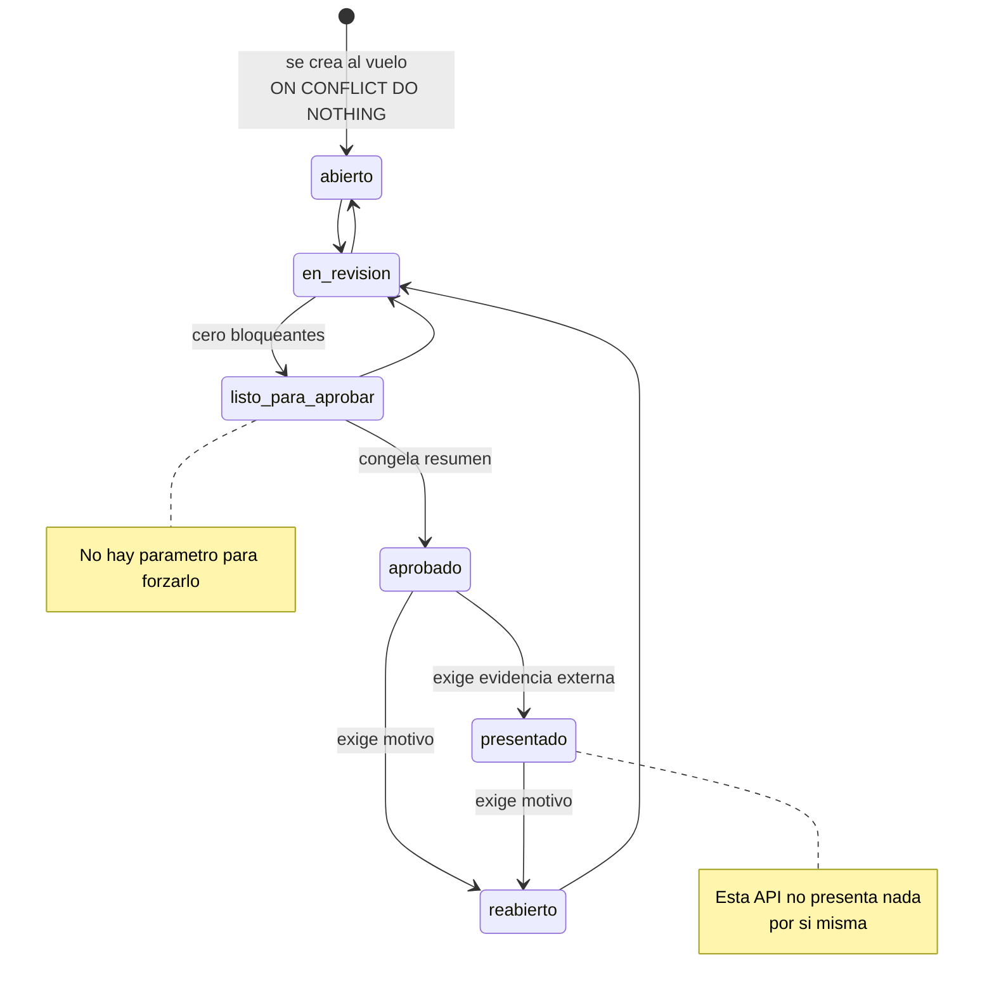

# El cierre fiscal — de la ingesta a la exportación

Un cierre fiscal es el acto de declarar que un mes está terminado: que todo lo que entró está clasificado, respaldado y conciliado, y que los totales de ese mes ya no se mueven. En PraxIA Finanzas el cierre es una máquina de estados con transiciones validadas en la base, trece chequeos calculados por una función SQL, y un requisito de evidencia externa para el último paso. El Agente Fiscal participa de todo el recorrido salvo del único momento que importa: no cierra nada.

---

## El ciclo completo, en siete pasos

### 1 · Ingesta

El movimiento entra por el contrato universal de PraxIA Finanzas. Al llegar:

- Un trigger de la v4.0 (`completar_periodo_fiscal()`) deriva `periodo_fiscal` en formato AAAAMM a partir de la fecha. Es editable a mano después, porque la fecha de imputación no siempre coincide con la del hecho.
- `estado_fiscal` nace en `'sin_clasificar'` (NOT NULL DEFAULT).
- Desde la v4.9, `contribuyente_id` es obligatorio: si falta, la ingesta falla.

### 2 · Clasificación

```
POST /api/fiscal/movimientos/{id}/clasificar
```

Delega en `fiscal.mjs::clasificarMovimiento()`, que valida `ambito`, exige `motivo_no_deducible` cuando `deducible = false`, y **bloquea si el cierre del período está `aprobado` o `presentado`**, con el mensaje *«Reabrí el cierre antes de modificar su clasificación fiscal»*. Audita campo por campo en `fiscal_auditoria`.

El trigger de la v4.7 (`trg_mov_estado_fiscal_derivado`) sincroniza `estado_fiscal` automáticamente:

- `ambito` y `deducible` no nulos y `estado_fiscal = 'sin_clasificar'` → pasa a `'clasificado'`.
- `ambito` o `deducible` nulos y `estado_fiscal = 'clasificado'` → vuelve a `'sin_clasificar'`.

**No toca** `observado`, `incluido_en_cierre` ni `presentado`:

> *«Esos tres son decisiones deliberadas de un proceso posterior, no consecuencias del encuadre. Un movimiento ya presentado ante ARCA no puede volver atrás porque alguien le corrija un campo.»*

Este trigger existe porque el 2026-08-05 se clasificaron 22 movimientos que quedaron con `ambito` y `deducible` correctos y `estado_fiscal = 'sin_clasificar'`: el Agente Fiscal los veía clasificados y el cierre los seguía marcando como bloqueantes. *«Dos partes del sistema, dos respuestas distintas a la misma pregunta, sin que nada avisara de la contradicción.»* Y la razón de resolverlo en la base y no en el código: *«el día que alguien escriba `ambito` por otra vía —una importación, un flujo de n8n, un psql suelto— vuelven a divergir. Lo que hace falta es que no puedan.»*

### 3 · Comprobantes

Se cargan como entidad propia (`comprobantes`), se les discrimina el IVA **por alícuota** en `comprobante_iva` —*«una factura puede traer 21% y 10,5% juntos […] es justamente la que pide el libro IVA»*— y se vinculan a movimientos N:N en `comprobante_movimientos` con `importe_imputado`. Un `importe_imputado` en NULL significa el total del movimiento.

### 4 · Diagnóstico

```
GET /api/fiscal-diagnostico?periodo=AAAAMM
```

Corre `cierre_chequeos()`, detecta movimientos sin encuadre y arma propuestas de precedente. Ver [motor-de-precedentes.md](motor-de-precedentes.md).

### 5 · Propuestas y decisión humana

El aprobador acepta o rechaza cada propuesta con justificación. **Aprobar no aplica nada**: aplicar es un acto separado, por las rutas de escritura, con el token general. Ver [propuestas-y-huellas.md](propuestas-y-huellas.md).

### 6 · Borrador

```
POST /api/fiscal/cierres/{periodo}/borrador
```

`generarBorrador()` calcula `salidasCierre()` desde la base, deriva las recomendaciones a partir de los chequeos —cada una con `que_pasa`, `por_que_importa`, `cuantos`, `donde_mirar` y `requiere_decision_humana: true`— y las guarda en `fiscal_borradores`. Lleva una nota fija:

> *«Borrador supervisado. No se presentó nada ante ningún organismo y ningún movimiento se modificó al generarlo.»*

### 7 · Transiciones

`transicionCierre()` es el único camino. Crea el cierre al vuelo con `ON CONFLICT DO NOTHING`, toma `FOR UPDATE` sobre la fila y valida contra `TRANSICIONES_CIERRE`.

---

## La máquina de estados del cierre



El grafo vive **dos veces**: en `fiscal.mjs`, para dar un mensaje claro antes de intentar la operación, y en el trigger `trg_cierre_transicion_valida` de la base, que es la garantía real. Un test compara ambos y falla si divergen.

### Por qué la garantía terminó en la base

Porque el código no alcanzó. `fiscal.mjs` definía `puedeTransicionar()` y **nunca se ejecutaba**: la ruta HTTP hacía un `UPDATE` directo, y el CHECK de la tabla solo verificaba que el valor fuera uno de los seis estados válidos. **Verificado el 2026-08-05**: un pedido con `estado = 'presentado'` sobre un período recién abierto se aceptaba sin protestar.

> *«El sistema quedaría afirmando que se presentó ante ARCA algo que nunca se presentó.»*

> *«Porque la regla ya estaba escrita en el código y no alcanzó. […] La base es el único lugar por donde pasan todos los caminos.»*
> — `44_Migration_v4_7_estado_fiscal_derivado.sql`, Parte 2

El error del trigger incluye un `HINT` con el recorrido correcto, para que el operador no tenga que ir a buscar el grafo. Se agregó además `chk_cierre_nace_abierto`: `CHECK (estado <> 'presentado' OR presentado_en IS NOT NULL) NOT VALID` — `NOT VALID` porque no revisa las filas viejas.

El rollback de esa migración advierte que las filas corregidas en la Parte 1 **no** se revierten: *«volverlas atrás sería reintroducir el error»*.

---

## Qué bloquea cada transición

| Destino | Requisito | Efecto lateral |
|---|---|---|
| `en_revision` | Ninguno específico | — |
| `listo_para_aprobar` | **Cero bloqueantes** en `cierre_chequeos()` | — |
| `aprobado` | Venir de `listo_para_aprobar` | **Congela** `resumen` y marca los movimientos `clasificado` → `incluido_en_cierre` |
| `presentado` | **`body.evidencia`** obligatoria: número de acuse, comprobante o referencia | Marca los movimientos `incluido_en_cierre` → `presentado` |
| `reabierto` | **`body.motivo`** obligatorio | — |

Sobre `listo_para_aprobar`:

> *«no hay parámetro para forzarlo — si lo hubiera, alguien lo usaría»*

Es la línea que resume la diferencia entre una validación y una garantía. Un `?force=true` documentado como "solo para casos excepcionales" se convierte, en seis meses, en el camino normal.

Todas las transiciones dejan una fila en `fiscal_auditoria` con `accion: cierre_<destino>`, valor anterior, valor nuevo y metadata.

### Qué congela `aprobado`

El campo `resumen` (jsonb) guarda una foto de los totales del período más el IVA más `congelado_en`. El comentario del esquema explica para qué:

> *«los totales congelados al aprobar. Si la base devuelve otra cosa después, es que alguien tocó un movimiento de un período cerrado — y eso se ve»*

No es un caché de performance: es un testigo. El sistema **sí** admite modificar un movimiento de un período cerrado por vía auditada —reabriendo el cierre—, y el resumen congelado es lo que permite detectar que se hizo, incluso si alguien se saltó el procedimiento.

### Por qué `presentado` exige evidencia

Porque el sistema no presenta nada:

> *«Esta API no presenta nada por sí misma.»*
> — `api/fiscal.mjs`, `transicionCierre()`

Marcar un cierre como `presentado` no es una acción, es la **anotación de un hecho ocurrido afuera**: alguien entró al sitio del organismo y presentó. Pedir el número de acuse o la referencia convierte esa anotación en algo verificable. Sin el requisito, `presentado` sería una casilla que alguien tilda, y el sistema afirmaría con total confianza algo que nunca pasó — el caso canónico de "falla en silencio".

---

## Los trece chequeos de `cierre_chequeos()`

```sql
cierre_chequeos(p_periodo integer, p_actor text)
  RETURNS TABLE(codigo, severidad, bloqueante, titulo, detalle, cantidad, referencia jsonb)
```

Trece ramas `UNION ALL`. `bloqueante = true` impide declarar `listo_para_aprobar`. Cada chequeo devuelve los IDs concretos en `referencia`:

> *«decir "hay 3 problemas" sin decir cuáles no sirve de nada.»*

### Bloqueantes (8)

| Código | Qué detecta |
|---|---|
| `movimientos_pendientes` | Movimientos del período sin confirmar |
| `posibles_duplicados` | `posible_duplicado_de IS NOT NULL` |
| `gastos_sin_comprobante` | Gasto marcado deducible y sin comprobante |
| `ingresos_sin_comprobante` | Ingreso sin comprobante |
| `sin_clasificar` | `estado_fiscal = 'sin_clasificar'` |
| `descalce_comprobante` | `abs(total − total_imputado) > 0.01` |
| `reglas_sin_verificar` | Regla con `es_ficticia` o `verificado_en IS NULL` |
| `sin_perfil_fiscal` | No hay condición fiscal vigente en el período |

`reglas_sin_verificar` es la que sostiene el principio de las reglas parametrizables: *«NADA de esto se hardcodea […] una regla sin verificar no sirve para determinar un importe, y el cierre la marca.»* Una regla con `es_ficticia = true` bloquea el cierre si aparece en un período productivo.

`sin_perfil_fiscal` es también donde vive el bug conocido que **no se corrige a propósito**. Ver [limites-y-deudas.md](limites-y-deudas.md).

### Advertencias (5)

| Código | Qué detecta |
|---|---|
| `transferencias_sin_conciliar` | Transferencias sin su contraparte |
| `documentos_sin_procesar` | Documentos cargados y no procesados |
| `comprobantes_observados` | Comprobantes en `estado_validacion = 'observado'` |
| `iva_sin_desglose` | Comprobante sin IVA discriminado por alícuota |
| `periodos_inconsistentes` | Imputaciones a períodos que no cierran |

Nota de auditoría: la fuente rotula el grupo bloqueante como "7" pero enumera 8 códigos; 8 + 5 = 13 coincide con las trece ramas `UNION ALL` declaradas, así que el rótulo es un error de conteo de la fuente. `Inferido`.

---

## Las salidas del cierre

`salidasCierre()` produce, todo reproducible desde la base:

- Resumen ejecutivo
- Detalle de ingresos
- Detalle de gastos
- Comprobantes emitidos
- Comprobantes recibidos
- Retenciones y percepciones
- Movimientos observados
- Documentación faltante
- Obligaciones estimadas
- Conciliación comprobante ↔ movimientos
- Chequeos

Se apoyan en cuatro vistas fiscales: `v_comprobantes` (con `numero_completo`, `fecha_computo`, `movimientos_vinculados`, `total_imputado` e `iva_por_alicuota` agregado en jsonb — *«La diferencia entre `total` y `total_imputado` es lo que el cierre reporta como descalce»*), `v_movimientos_fiscal` (con `monto_deducible` calculado y el canal de ingesta), `v_fiscal_periodo` (totales por período, excluyendo anulados y transferencias) y `v_fiscal_iva_periodo` (IVA por período, sentido y alícuota, separando crédito de débito).

---

## Exportaciones

Migración `38_Migration_v4_2_exportaciones_fiscales.sql` — 746 bytes, la más pequeña del proyecto — más `api/exportaciones.mjs`.

### La tabla

`praxia_finanzas.fiscal_exportaciones`: `id bigserial PK` · `cierre_id bigint NOT NULL REFERENCES fiscal_cierres(id) ON DELETE CASCADE` · `formato text NOT NULL CHECK IN ('md','csv','xlsx','pdf','zip')` · `ruta text NOT NULL` · `mime text NOT NULL` · `tamano bigint NOT NULL` · `sha256 text NOT NULL` · `generado_en timestamptz DEFAULT now()` · `generado_por text NOT NULL` · `metadata jsonb DEFAULT '{}'`.

Índices: `idx_fiscal_export_sha` (**único** sobre `sha256`) e `idx_fiscal_export_cierre`.

### Los cinco formatos

| Formato | Contenido | Notas |
|---|---|---|
| `md` | Informe completo: resumen, detalle de ingresos y gastos, obligaciones, bloqueantes | El más completo |
| `csv` | Solo `detalle_gastos` | «Por simplicidad de CSV». Separador `;` |
| `xlsx` | Vía ExcelJS | |
| `pdf` | Vía PDFKit | |
| `zip` | Los cuatro juntos | Archiver nivel 9 |

Que el CSV lleve **solo** el detalle de gastos es una decisión declarada, no un recorte accidental: un CSV con secciones heterogéneas deja de ser un CSV.

### El escape anti-fórmula

Las celdas del CSV que empiezan con `=`, `+`, `-` o `@` se escapan. Es la mitigación de la inyección de fórmulas: una descripción de movimiento que empiece con `=` se ejecuta como fórmula al abrir el archivo en una planilla. En un sistema donde las descripciones vienen de PDFs, mails y mensajes de Telegram, el contenido de una celda es entrada no confiable.

### Caché por hash de datos

`getOrGenerateExport()` calcula `dataHash = sha256(JSON.stringify(salidas))`. Si ya existe una exportación con el mismo `cierre_id` + `formato` + `metadata->>'dataHash'` **y el archivo sigue en disco**, la devuelve sin regenerar.

La clave es que el caché se invalida por **contenido**, no por tiempo. Si los datos del cierre cambiaron, el hash cambia y se regenera; si no cambiaron, el archivo entregado es bit a bit el mismo, y el `sha256` que lo identifica también. Dos personas que exporten el mismo cierre obtienen el mismo archivo, con el mismo hash, y pueden compararlo.

Los archivos viven en `<ruta-de-despliegue>/documentos/cierres` y se nombran `cierre_{periodo}_{dataHash[0:8]}.{ext}`. La inserción usa `ON CONFLICT (sha256) DO NOTHING`. Si no hay cierre para el período pedido, la ruta devuelve **404**.

```
GET /api/fiscal/cierres/{periodo}/exportar
```

Cubierto por `tests/test_dashboard_exportar.mjs` (11 casos).

---

## Documentos relacionados

- [Ficha del subsistema](README.md)
- [Motor de precedentes](motor-de-precedentes.md)
- [Propuestas y huellas](propuestas-y-huellas.md)
- [Límites y deudas](limites-y-deudas.md)
- [PraxIA Finanzas](../praxia-finanzas/README.md)
- [Runbook: despliegue de una migración](../../docs/06-runbooks/despliegue-de-una-migracion.md)
- [Artefactos SQL](../../artifacts/sql/)

> Última verificación: 2026-08-06
