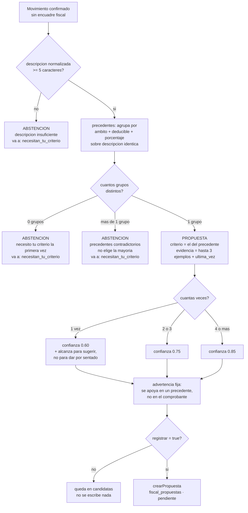

# El motor de precedentes

El motor es lo que convierte una biblioteca de consultas en un agente: decide qué preguntar, en qué orden, y qué hacer con la respuesta. Su regla central es que no infiere nada — cuando propone una clasificación fiscal, la propone citando una decisión anterior del propio titular sobre una descripción idéntica, y cuando no tiene esa decisión, se abstiene y lo dice.

Implementación: `api/fiscal_motor.mjs` (~23,5 KB). Punto de entrada: `diagnosticarPeriodo()`.

> *«Las nueve operaciones de lectura y las propuestas del §10 ya existían: alguien tenía que decidir qué consultar, en qué orden, y qué hacer con el resultado. Ese alguien era yo, a mano, en una conversación. Esto lo hace solo.»*
> — cabecera de `api/fiscal_motor.mjs`

---

## Qué es un precedente

Un precedente es **una decisión anterior del titular sobre un movimiento con la misma descripción normalizada**.

La normalización es explícita y modesta: minúsculas, `btrim`, y espacios colapsados con `regexp_replace(..., '\s+', ' ', 'g')`. Nada más. Se buscan solo movimientos `confirmado`, no transferencia, con `ambito` y `deducible` **no nulos**, excluyendo el propio id del movimiento que se está analizando.

### Por qué coincidencia exacta y no por parecido

> *«"parecido" es un umbral elegido a dedo que produce precedentes que el humano no reconoce como tales, y un precedente que no se reconoce no sirve para decidir.»*

El razonamiento de fondo, y la mejor explicación de todo el subsistema:

> *«Mirando "cafe con un colega" no hay forma honesta de saber si fue una reunión de trabajo o una salida con un amigo. […] Lo que sí se puede afirmar: "el 12/07 clasificaste un movimiento con esta misma descripción como profesional deducible". Eso es verificable, se puede citar, y el humano puede desmentirlo en un segundo.»*

Hay una diferencia de naturaleza entre las dos afirmaciones. La primera es una inferencia sobre la intención de una persona a partir de siete caracteres de texto. La segunda es un hecho registrado con fecha, que el humano puede confirmar o desmentir en el acto. Un sistema fiscal puede permitirse la segunda; la primera es cómo se produce algo plausible y equivocado.

La búsqueda por similitud —trigramas, embeddings, distancia de edición— habría dado más cobertura. Habría dado también propuestas que el aprobador no puede auditar de un vistazo, y un aprobador que no puede auditar termina aprobando por defecto.

---

## Las funciones del motor

| Función | Exportada | Qué hace |
|---|---|---|
| `confianzaPorPrecedentes(n)` | vía `MOTOR` | ≥4 → **0.85** · ≥2 → **0.75** · resto → **0.60**. Nunca 1 |
| `estadoDelCierre(pool, periodo)` | no | Última fila de `fiscal_cierres`; si no hay ninguna, `{estado: 'sin_abrir'}` |
| `chequeosDeCierre(pool, periodo, actor)` | no | Llama a `praxia_finanzas.cierre_chequeos($1,$2)`. **No reimplementa la lista** |
| `movimientosSinEncuadre(pool, periodo, contribuyenteId)` | no | Confirmados, no transferencia, con `ambito IS NULL OR deducible IS NULL` |
| `resolverContribuyente(pool, codigo)` | no | Si hay uno solo activo, ése; si hay varios y no vino código, **error**: no elige |
| `regimenDelPeriodo(pool, contribuyenteId, periodo)` | no | Usa `regimen_vigente()`. Con 0 filas o más de 1 → `condicion: null` más advertencia |
| `precedentes(pool, descripcion, excluirId)` | no | Agrupa por `(ambito, deducible, deducible_porcentaje)` con `veces`, `ultima_vez` y 3 `ejemplos` |
| `candidataParaMovimiento(pool, mov)` | no | Devuelve una propuesta o un motivo de abstención. **Siempre devuelve algo** |
| `diagnosticarPeriodo(pool, periodo, opciones)` | **sí** | Punto de entrada |
| `redactar({...})` | no | El diagnóstico en castellano, para Telegram o mail |
| `MOTOR` | **sí** | `Object.freeze({ MINIMO_DESCRIPCION, confianzaPorPrecedentes })` |

Dos decisiones estructurales se leen en esta tabla. `chequeosDeCierre` **delega en la base** en vez de reimplementar las trece ramas del chequeo: hay un test llamado *«los chequeos los calcula la base, no el motor»* que lo verifica. Y `resolverContribuyente` **falla en lugar de elegir** cuando hay ambigüedad:

> *«un diagnóstico atribuido a la persona equivocada es peor que ninguno, porque parece correcto»*

---

## El flujo de `diagnosticarPeriodo`

1. **Valida el período** contra `/^\d{4}(0[1-9]|1[0-2])$/`. Si no matchea → `AMBIGUOUS_PERIOD`. No intenta interpretar "julio" ni "el mes pasado".
2. **Resuelve el contribuyente.** Uno solo activo → ése. Varios y sin código → error.
3. **`Promise.all` de cinco lecturas**, todas en paralelo porque son independientes: estado del cierre · `cierre_chequeos()` · movimientos sin encuadre · régimen del período · obligaciones fiscales del período.
4. **Después**, y solo después, porque depende del régimen: `obligacionesFaltantes()` — contrasta el catálogo del régimen contra las plantillas activas.
5. **Cualquier excepción → `SOURCE_UNAVAILABLE`.** No hay diagnóstico parcial: *«Un diagnóstico parcial se leería como "no falta nada más". Abstención.»*
6. **Arma las candidatas** movimiento por movimiento con `candidataParaMovimiento()`.
7. **Solo si `registrar === true`**, llama a `crearPropuesta()` por cada candidata que tenga propuesta.

### La salida

`periodo` · `contribuyente` · `regimen_del_periodo` · `obligaciones_del_periodo` · `obligaciones_no_cargadas` · `estado_del_cierre` · `puede_cerrarse` · `bloqueantes` · `avisos` · `movimientos_sin_encuadre` · `propuestas_posibles` · `necesitan_tu_criterio` · `candidatas` · `propuestas_registradas` · `propuestas_no_registradas` · `mensaje`.

### Advertencias fijas

Van siempre, tenga o no hallazgos el período:

- La cobertura de los chequeos es limitada.
- *«Ninguna propuesta aplica nada.»*
- El diagnóstico es de **un solo contribuyente**.
- La advertencia del régimen, si la hay.
- Si no se registró nada, lo dice explícitamente.

### El endpoint

```
GET /api/fiscal-diagnostico?periodo=AAAAMM&registrar=true|false&proposito=...
```

Es **GET** a propósito:

> *«leer el estado de un mes no debería tener efectos, y por eso registrar hay que pedirlo aparte y a propósito»*

`registrar=true` es la única forma de que la llamada produzca escrituras, y las escrituras que produce son filas `pendiente` en `fiscal_propuestas`. Nada más.

---

## Umbrales y reglas de abstención

| Regla | Valor / comportamiento |
|---|---|
| `MINIMO_DESCRIPCION` | **5 caracteres**. *«"nafta" (5) sirve; "pago" (4) coincide con medio mes»* |
| Sin precedente | Abstención: *«necesito tu criterio la primera vez»* |
| Precedentes contradictorios (`prev.length > 1`) | Abstención. **No elige la mayoría**: *«la contradicción es el dato interesante»* |
| Nivel de confianza | 1 precedente → **0.60** · 2–3 → **0.75** · ≥4 → **0.85**. Nunca 1 |
| Ventana temporal | **Ninguna.** El precedente no caduca por antigüedad; se informa `ultima_vez` |
| Con 1 solo precedente | Advertencia extra: *«alcanza para sugerir, no para dar por sentado»* |
| Advertencia siempre presente | *«La propuesta se apoya en un precedente, no en el comprobante de este gasto»* |

### Por qué el mínimo de descripción es 5

No es un número mágico: es el corte donde una descripción deja de ser una etiqueta genérica del canal de ingesta. `"pago"` coincide con medio mes de movimientos y produciría precedentes que no significan nada. `"nafta"` ya identifica un concepto.

### Por qué no elige la mayoría

> *«No elijo la mayoría: la contradicción es el dato interesante.»*
> — `api/fiscal_motor.mjs`, `candidataParaMovimiento()`

Si la misma descripción fue clasificada tres veces como profesional y una como personal, el sistema **no** propone "profesional con 75% de confianza". Se abstiene y le muestra al humano las dos ramas. La razón es que el caso minoritario suele ser el interesante: o la descripción es ambigua y hay que cambiarla, o hubo un error de clasificación anterior que conviene revisar. Promediar borra las dos posibilidades.

### Por qué la confianza nunca llega a 1

Porque el precedente es evidencia sobre lo que el humano decidió antes, no sobre lo que este gasto fue. Aun con cuarenta precedentes concordantes, la afirmación sigue siendo "clasificaste así antes", no "esto es así". Un 1.0 en pantalla le diría al aprobador que no hace falta mirar, y es exactamente lo contrario de lo que el número debería comunicar. Hay un test dedicado a que el techo se mantenga en 0.85.

Del lado de las propuestas, además, se agrega un warning automático cuando la confianza es menor a 0.7 — es decir, **siempre que haya un solo precedente**.

### Por qué no hay ventana temporal

Una clasificación de hace dos años sigue siendo una decisión del titular sobre esa descripción. Hacerla caducar por calendario introduciría un umbral arbitrario más. En vez de eso, el motor informa `ultima_vez` y deja que el humano juzgue si el criterio cambió.

### Por qué el primer mes propone poco

> *«el agente mejora a medida que [el titular] decide, sin que nadie lo reentrene. Y el primer mes propone poco, que es lo correcto — todavía no sabe nada.»*
> — cabecera de `api/fiscal_motor.mjs`

Sin historial no hay precedentes, y sin precedentes el motor se abstiene por diseño. Es la propiedad más contraintuitiva del sistema y la más deseable: un agente que el primer mes propone mucho está inventando, porque no hay de dónde sacarlo.

### Ningún movimiento queda sin mencionar

> *«el silencio sobre un movimiento que falta clasificar sería peor que decir "este no lo sé"»*

`candidataParaMovimiento()` **siempre devuelve algo**: una propuesta o un motivo de abstención. Todo movimiento sin encuadre aparece en la salida, en `propuestas_posibles` o en `necesitan_tu_criterio`. Hay un test llamado `todo movimiento mencionado`.

---

## La decisión, movimiento por movimiento



---

## La redacción del diagnóstico

`redactar()` arma el texto en castellano que sale por Telegram o mail. El orden **no es cronológico ni por severidad genérica**: está pensado para que lo primero que se lea sea lo que cuesta dinero si no se lee.

| # | Bloque | Por qué está ahí |
|---|---|---|
| 1 | Encabezado: período, contribuyente, estado | Ubicar de qué se está hablando antes de cualquier afirmación |
| 2 | Régimen y su advertencia | Arriba de todo: si el régimen está mal resuelto, todo lo que sigue está mal |
| 3 | **Obligaciones VENCIDAS impagas** | *«un vencimiento impago acumula intereses todos los días y no espera a que alguien lea hasta el final»* |
| 4 | Las que vencen en el período | Lo próximo, todavía a tiempo |
| 5 | Las que no tienen importe determinado | Se sabe que hay que pagar, no cuánto |
| 6 | Saldo impago **por moneda** | *«pesos y dólares no se suman nunca»* |
| 7 | Obligaciones que el régimen implica y no están cargadas | Con la aclaración: *«Esto sale de un catálogo general […] Confirmalo con tu contador»* |
| 8 | Bloqueantes del cierre | Lo que impide avanzar de estado |
| 9 | Propuestas | Lo que el agente sí puede sugerir |
| 10 | Las que necesitan criterio humano | Lo último, porque no urge pero no puede faltar |

Hay un test que verifica el **orden del mensaje**. No es cosmética: el orden es la única herramienta que tiene un mensaje de Telegram para priorizar, porque nadie llega al final.

### Cuando no hay nada

> *«No encontré nada pendiente. Eso significa que los chequeos y detectores que existen no ven nada, no que el período esté necesariamente perfecto.»*

Es la misma abstención de `ConsultarDiscrepanciasAbiertas`, escrita en castellano para un humano. Un "todo bien" a secas sería la afirmación más peligrosa que el sistema puede emitir.

---

## Qué cubren los tests

`tests/test_fiscal_motor.mjs` — **23 casos**: precedentes concordantes, contradictorios y ausentes · confianza que nunca llega a 1 · descripción corta · todo movimiento mencionado · orden del mensaje · `registrar` on/off · idempotencia · *«no hay UPDATE ni INSERT sobre tablas financieras»* · *«los chequeos los calcula la base, no el motor»*.

---

## Documentos relacionados

- [Ficha del subsistema](README.md)
- [La capa de lectura](capa-de-lectura.md)
- [Propuestas y huellas](propuestas-y-huellas.md)
- [Cierre fiscal](cierre-fiscal.md)
- [ADR-001 — Un agente excelente antes que muchos](../../docs/04-decisiones/adr-001-un-agente-excelente-antes-que-muchos.md)
- [ADR-003 — Memoria en capas sin RAG vectorial](../../docs/04-decisiones/adr-003-memoria-en-capas-sin-rag-vectorial.md)
- [Cuándo construyo un subagente](../../docs/02-desglose-tecnico/03-cuando-construyo-un-subagente.md)

> Última verificación: 2026-08-06
