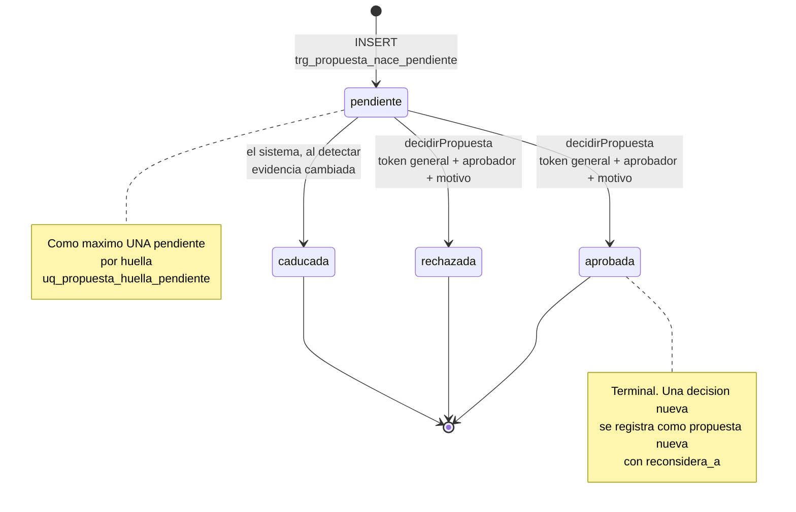

# Propuestas fiscales y huellas

`fiscal_propuestas` es la única tabla en la que el Agente Fiscal puede escribir. No participa de ningún saldo, no dispara ningún asiento y no tiene forma de aplicar nada: es el registro de una pregunta hecha a una persona y de la respuesta que esa persona dio. Toda la ingeniería de esta tabla apunta a dos cosas — que la pregunta no se repita hasta obtener un sí, y que la respuesta no se pueda dar sobre evidencia que ya cambió.

Implementación: `45_Migration_v4_8_propuestas_fiscales.sql` (~15,7 KB) y `api/fiscal_propuestas.mjs` (~22,6 KB). Registro de migración: `v4_8_2026-08-05`.

> *«Esta tabla no toca ningún saldo, ninguna deuda y ningún movimiento: no tiene forma de hacerlo, y eso es a propósito.»*
> — `45_Migration_v4_8_propuestas_fiscales.sql`

---

## Modelo de datos: `praxia_finanzas.fiscal_propuestas`

| Columna | Tipo | Constraint |
|---|---|---|
| `id` | `bigserial` | PK |
| `proposal_id` | `uuid` | NOT NULL DEFAULT `gen_random_uuid()`; índice único `uq_propuesta_proposal_id` |
| `tipo` | `text` | NOT NULL; CHECK IN (`clasificacion_fiscal`, `imputacion_periodo`, `liquidacion`, `rectificativa`, `ajuste`, `cierre_periodo`) |
| `periodo` | `integer` | Nullable; CHECK `periodo IS NULL OR (periodo >= 200001 AND periodo % 100 BETWEEN 1 AND 12)` |
| `version_contrato` | `text` | NOT NULL DEFAULT `'1.0-draft'` |
| `huella` | `char(64)` | NOT NULL |
| `registros_origen` | `jsonb` | NOT NULL; CHECK array no vacío |
| `huella_evidencia` | `char(64)` | NOT NULL |
| `criterio_propuesto` | `text` | NOT NULL; CHECK `btrim() <> ''` |
| `explicacion` | `text` | NOT NULL; CHECK `btrim() <> ''` |
| `nivel_de_confianza` | `numeric(4,3)` | NOT NULL; CHECK entre 0 y 1 |
| `evidencia` | `jsonb` | NOT NULL DEFAULT `'[]'`; CHECK es array |
| `impacto_esperado` | `jsonb` | NOT NULL; CHECK es object |
| `advertencias` | `jsonb` | NOT NULL DEFAULT `'[]'`; CHECK es array |
| `estado_aprobacion` | `text` | NOT NULL DEFAULT `'pendiente'`; CHECK IN (`pendiente`, `aprobada`, `rechazada`, `caducada`) |
| `aprobador` | `text` | Nullable |
| `fecha_creacion` | `timestamptz` | NOT NULL DEFAULT `now()` |
| `fecha_decision` | `timestamptz` | Nullable |
| `motivo_decision` | `text` | Nullable |
| `actor` | `text` | NOT NULL; CHECK `btrim() <> ''` (§11) |
| `proposito` | `text` | NOT NULL; CHECK `btrim() <> ''` (§11) |
| `reconsidera_a` | `bigint` | FK autorreferencial a `fiscal_propuestas(id)` |
| `motivo_reconsideracion` | `text` | Nullable |

Detalles que no son accidentales:

- **`nivel_de_confianza` es `numeric(4,3)`**, no `float`. Tres decimales exactos, sin sorpresas de coma flotante en un campo que después se compara contra 0.7.
- **`impacto_esperado` es un objeto obligatorio**, no un texto libre. Toda propuesta tiene que declarar qué pasaría si se aplicara — aunque nada se aplique.
- **`actor` y `proposito` son NOT NULL con `btrim() <> ''`**: el §11 pide trazabilidad, y una cadena de espacios no es trazabilidad.
- **`registros_origen` no puede ser un array vacío.** Una propuesta sin evidencia de origen no es una propuesta.

---

## Los tres constraints de tabla

### `chk_prop_decision_completa`

- Si `estado_aprobacion = 'pendiente'` → `aprobador`, `fecha_decision` y `motivo_decision` **todos null**.
- Si `caducada` → `fecha_decision` NOT NULL.
- Si `aprobada` o `rechazada` → `aprobador` y `motivo_decision` no vacíos, más `fecha_decision`.

> *«Una decisión sin quién ni por qué no es una decisión, es un cambio de estado.»*
> — `45_Migration_v4_8_propuestas_fiscales.sql`

La asimetría con `caducada` es correcta: la caducidad la produce el sistema, no una persona, así que tiene fecha pero no firma.

### `chk_prop_reconsideracion`

`reconsidera_a` no nulo exige `motivo_reconsideracion` no vacío. Volver a preguntar algo ya decidido es legítimo, pero hay que decir por qué. Es el mecanismo que distingue una reconsideración fundada de un reintento.

### `chk_prop_no_se_reconsidera_a_si_misma`

`reconsidera_a <> id`. Cierra el ciclo trivial de un grafo de reconsideraciones.

---

## Índices

| Índice | Definición | Para qué |
|---|---|---|
| `uq_propuesta_proposal_id` | ÚNICO sobre `proposal_id` | Identidad pública estable, sin exponer el `id` interno |
| **`uq_propuesta_huella_pendiente`** | **ÚNICO PARCIAL: `ON (huella) WHERE estado_aprobacion = 'pendiente'`** | La garantía anti-repregunta, grabada en la base |
| `idx_propuesta_estado` | `(estado_aprobacion, fecha_creacion DESC)` | La bandeja de pendientes |
| `idx_propuesta_periodo` | `(periodo, tipo)` | Todo lo de un mes, por tipo |
| `idx_propuesta_huella` | `(huella)` | Buscar decisiones anteriores sobre la misma pregunta |

El índice único **parcial** es la pieza más elegante del diseño. Permite que existan muchas propuestas históricas con la misma huella —una aprobada en marzo, una rechazada en mayo, una reconsiderada en julio— pero **como máximo una pendiente a la vez**. La cola de decisiones del humano nunca puede tener dos veces la misma pregunta, y no hace falta lógica de aplicación para garantizarlo: si el código falla, la base rechaza el INSERT.

---

## Los tres triggers

| Trigger | Función | Momento | Invariante |
|---|---|---|---|
| `trg_propuesta_nace_pendiente` | `propuesta_nace_pendiente()` | BEFORE INSERT | Toda propuesta nace `pendiente` |
| `trg_propuesta_inmutable` | `propuesta_contenido_inmutable()` | BEFORE UPDATE | Si el estado ya no es `pendiente`, 14 columnas quedan congeladas |
| `trg_propuesta_transicion` | `propuesta_transicion_valida()` | BEFORE UPDATE | La máquina de estados |

### `trg_propuesta_nace_pendiente`

> *«Insertar directamente en 'aprobada' saltearía el recorrido entero: el humano nunca la vio.»*

El mensaje de error del trigger es la doctrina en una línea: *«Aprobar es un acto humano posterior, no un valor inicial.»*

Sin este trigger, cualquier proceso con permiso de INSERT podría fabricar aprobaciones. El `DEFAULT 'pendiente'` de la columna **no alcanza**, porque un INSERT explícito lo pisa.

### `trg_propuesta_inmutable`

Si `OLD.estado_aprobacion <> 'pendiente'`, estas **14 columnas** no se pueden modificar: `tipo`, `periodo`, `huella`, `huella_evidencia`, `registros_origen`, `criterio_propuesto`, `explicacion`, `impacto_esperado`, `nivel_de_confianza`, `evidencia`, `advertencias`, `aprobador`, `fecha_decision`, `motivo_decision`.

> *«Si el texto se puede editar después, la firma no vale nada: sería posible aprobar "clasificar el movimiento 41 como personal" y que mañana el registro diga "como profesional", con la misma aprobación adosada.»*

El ejemplo es concreto porque el riesgo es concreto. Una aprobación es una firma sobre un texto; si el texto muta, la firma pasa a avalar algo que nadie leyó. Notar que `aprobador`, `fecha_decision` y `motivo_decision` también están congeladas: no se puede reescribir *quién* decidió ni *por qué*.

### `trg_propuesta_transicion`

Si el estado no cambia, el UPDATE pasa. Si cambia y el destino no está permitido, lanza `check_violation` con un mensaje distinto según se trate de un estado terminal o de una transición inválida. La distinción del mensaje importa para el operador: "esto ya se decidió" y "ese camino no existe" son dos problemas diferentes.

---

## Las dos huellas

Son dos hashes SHA-256 que protegen dos cosas que se confunden fácil: la **identidad de la pregunta** y la **vigencia de la respuesta**.

### `huella` — impide repreguntar

```js
export function calcularHuella({ tipo, periodo, registrosOrigen, versionContrato = CONTRACT_VERSION }) {
  const partes = [tipo, periodo ?? 'sin_periodo', canonizarOrigenes(registrosOrigen), versionContrato];
  return createHash('sha256').update(partes.join('|'), 'utf8').digest('hex');
}
```

`canonizarOrigenes` mapea cada origen a `tipo:id`, ordena y une con comas: **el orden en que llegan los orígenes no altera la huella**. Hay un test específico para eso.

Lo importante es lo que **deliberadamente no incluye**: el contenido de la propuesta. Ni el criterio, ni la explicación, ni el nivel de confianza.

> *«dos análisis distintos sobre los mismos registros y el mismo período son la misma pregunta hecha al humano dos veces, aunque la respuesta sugerida difiera.»*

Si el contenido entrara en la huella, bastaría con reformular el criterio para generar una propuesta "nueva" sobre el mismo hecho. Ahí muere la garantía:

> *«Un agente que puede repreguntar sin límite termina consiguiendo el "sí" por cansancio.»*
> — garantía 1 de la migración

### `huella_evidencia` — impide aprobar contra evidencia vencida

`huellaDeFilas()` hashea las filas **releídas** de los registros de origen: canoniza `clave=valor` por fila, ordena las claves y ordena las filas. `valorCanonico` mapea `null` y `undefined` a `' '` —para que null y cadena vacía no colisionen—, `Date` a ISO y objetos a JSON.

> *«Aprobar un texto que ya no describe la realidad es peor que no tener propuesta.»*
> — `COMMENT ON COLUMN ... huella_evidencia`

### `ORIGENES` — la lista cerrada

Cinco tipos de origen releíbles. Para cada uno, las columnas cuyo cambio invalida la propuesta:

| Origen | Tabla | Columnas que invalidan |
|---|---|---|
| `movimiento` | `praxia_finanzas.movimientos` | id, fecha, monto_original, moneda, direccion, descripcion, cuenta_id, categoria_id, ambito, deducible, estado, periodo_fiscal |
| `obligacion` | `deudas_pendientes` | id, organismo, concepto, periodo, vencimiento, monto_original, saldo_pendiente, moneda, estado |
| `obligacion_fiscal` | `fiscal_obligaciones` | id, organismo, impuesto, jurisdiccion, periodo, vencimiento, estado, importe_estimado, importe_determinado |
| `comprobante` | `comprobantes` | id, tipo, fecha_emision, total, moneda, periodo_fiscal, estado_validacion, sha256 |
| `cierre` | `fiscal_cierres` | periodo, estado (clave: `periodo`) |

Lo que **no** está en esas listas es tan deliberado como lo que sí:

> *«Deliberadamente NO incluye `actualizado_en` ni nada que se mueva solo: una propuesta que caduca sin que nadie haya cambiado nada enseña a la gente a ignorar el aviso.»*

Es diseño de fatiga de alertas aplicado a la integridad de datos. Un mecanismo de caducidad que dispara por ruido se desactiva mentalmente en dos semanas.

Y sobre por qué la lista es **cerrada**:

> *«un origen que no está acá no se puede verificar, y una propuesta cuya evidencia no se puede releer no se puede hacer caducar. Sin caducidad, la garantía 2 no existe.»*

No se puede proponer sobre algo que el sistema no sabe releer. La restricción es incómoda a propósito: agregar un tipo de origen obliga a declarar sus columnas relevantes.

---

## La máquina de estados



### Por qué los tres estados finales son terminales

> *«Una decisión humana registrada es evidencia: si después hay que cambiar de idea, se crea una propuesta nueva que apunta a esta. Reescribir la vieja borraría el hecho de que se decidió distinto, que suele ser el dato más importante de los dos.»*

Que alguien rechazó algo en mayo y aprobó lo contrario en julio **es información**. Un modelo de datos que permite editar el estado la destruye y deja solo el resultado final, que es la parte menos interesante. Por eso existen `reconsidera_a` y `motivo_reconsideracion`: la cadena de reconsideraciones es un historial de criterio, no un log de correcciones.

El grafo está espejado en JavaScript por `TRANSICIONES_PROPUESTA` y `puedeTransicionar()`, y **hay un test que compara los dos grafos** y falla si divergen. Es el mismo patrón que se aplica a la máquina de estados del cierre, y por la misma razón: la del código da mensajes claros, la de la base es la garantía real, y la única forma de que no se separen con el tiempo es una prueba que las compare.

---

## `crearPropuesta(pool, entrada)`

### Validación, en orden

`tipo` → `periodo` → `actor` → `proposito` → `criterio` → `explicacion` → `confianza` numérica entre 0 y 1 → `impacto` objeto → orígenes (sin repetidos, ids enteros positivos).

### Después, lee la evidencia ANTES de decidir nada

Si falta alguno de los registros de origen → `RECORD_NOT_FOUND`, con el argumento explícito: *«proponer sobre un registro ausente es proponer sobre nada»*.

### Calcula la huella y consulta las previas

| Situación | Resultado |
|---|---|
| Hay una **pendiente** con la misma huella | Error `DUPLICADO`, con la propuesta existente adjunta. **No crea una segunda** |
| Hay una **decidida** con la misma huella y `reconsiderar !== true` | `DUPLICADO`: *«Repreguntar lo ya decidido, sin motivo, es desgastar al aprobador hasta obtener un sí.»* |
| `reconsiderar = true` sin `motivo_reconsideracion` | `INSUFFICIENT_EVIDENCE` |
| `reconsiderar = true` con motivo | Inserta, con `reconsidera_a` apuntando a la decisión anterior |

Que el error de duplicado **devuelva la propuesta existente** en lugar de un mensaje seco es lo que hace usable el mecanismo: el llamador puede mostrarle al humano la decisión que ya se tomó, en vez de un fallo opaco.

### Warning automático

Si `confianza < 0.7`, la propuesta nace con una advertencia. Dado el escalón de confianza del motor (0.60 / 0.75 / 0.85), eso significa: **toda propuesta apoyada en un solo precedente llega marcada**.

---

## `decidirPropuesta(pool, proposalId, { estado, aprobador, motivo })`

### Qué acepta

Solo `aprobada` o `rechazada`. *«Caducar lo hace el sistema»* — no es una opción del aprobador.

Exige `aprobador`: *«una decisión sin firma humana no es una decisión»*.
Exige `motivo`: *«el §10 pide el registro humano en texto libre, también cuando se aprueba»*. Aprobar sin justificar no está permitido, y esa simetría con el rechazo es deliberada: la aprobación es la decisión que más se toma por inercia.

Si la propuesta no está `pendiente` → `UNAUTHORIZED_ACCESS`.

### La caducidad al aprobar

**Al aprobar** se releen los registros de origen. Si falta alguno o la `huella_evidencia` cambió:

```sql
UPDATE ... SET estado_aprobacion = 'caducada', fecha_decision = now()
```

y devuelve `CORRUPT_DATA`. La propuesta queda cerrada, no en un limbo, y el aprobador se entera de que la realidad se movió mientras la propuesta esperaba.

### Por qué rechazar no revalida

> *«decir "no" a algo que ya no aplica sigue siendo una respuesta válida»*

Es una asimetría correcta y fácil de pasar por alto. La revalidación existe para que nadie **autorice** algo que ya no describe la realidad. Un rechazo no autoriza nada: bloquear un "no" porque la evidencia cambió solo dejaría la propuesta en la cola, ocupando el único cupo pendiente de esa huella.

### Qué escribe el UPDATE

Cuatro campos, y ninguno más: `estado_aprobacion`, `aprobador`, `motivo_decision`, `fecha_decision`. La respuesta trae el warning fijo:

> *«Aprobada. Esto NO ejecutó ningún cambio financiero: queda registrada la decisión. Aplicarla es un acto separado.»*

---

## `consultarPropuestas` y `presentar()`

`consultarPropuestas` filtra por estado, tipo y período, con límite acotado entre 1 y 200.

`presentar()` traduce la fila al objeto del §10 y **omite** dos cosas: el `id` interno —la identidad pública es `proposal_id`— y la `huella_evidencia`, que es un mecanismo interno y no aporta nada a quien lee la propuesta.

---

## Rutas HTTP

| Ruta | Método | Códigos |
|---|---|---|
| `/api/fiscal-propuestas` | POST | 201 · **409** si `DUPLICADO` · 422 |
| `/api/fiscal-propuestas/decidir` | POST | **403 con token fiscal** (ver [seguridad-y-permisos.md](seguridad-y-permisos.md)) |
| `/api/fiscal-propuestas` | GET | 200 |

El `actor` de una propuesta lo pone el servidor **después** de procesar el body:

> *«quién pidió el análisis sale de la credencial, no de lo que el cliente diga que es»*

---

## Qué cubren los tests

`tests/test_fiscal_propuestas.mjs` — **39 casos**, el archivo más grande del subsistema: no escritura en tablas financieras · duplicados · reconsideración · caducidad por evidencia cambiada · aprobador y motivo obligatorios · terminalidad · inmutabilidad · huellas, incluido que el orden de los orígenes sea irrelevante y que null y cadena vacía no colisionen · validación de orígenes · forma del objeto del §10.

El primero de esa lista es el más inusual: **lee el propio archivo fuente** y falla si aparece un INSERT o UPDATE sobre una tabla financiera. *«si mañana alguien agrega el atajo de "aplicar al aprobar", falla.»*

---

## Documentos relacionados

- [Ficha del subsistema](README.md)
- [El contrato v1.0](contrato-finanzas-fiscal.md) — §10, §11 y §12
- [Motor de precedentes](motor-de-precedentes.md)
- [Seguridad y permisos](seguridad-y-permisos.md)
- [Modelo de datos](../../docs/01-arquitectura/modelo-de-datos.md)
- [ADR-004 — Aprobación humana en acciones consecuentes](../../docs/04-decisiones/adr-004-aprobacion-humana-en-acciones-consecuentes.md)
- [ADR-007 — Sin borrado físico](../../docs/04-decisiones/adr-007-sin-borrado-fisico.md)
- [Artefactos SQL](../../artifacts/sql/)

> Última verificación: 2026-08-06
