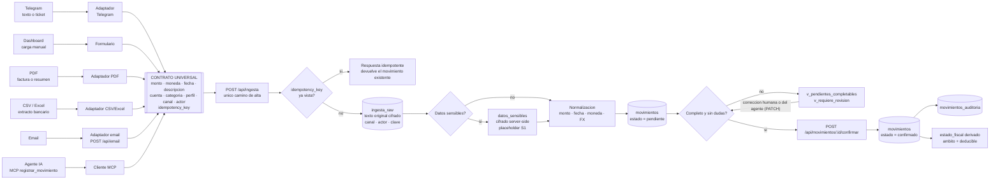

# PraxIA Finanzas — contrato universal, invariantes en la base y núcleo fiscal

PraxIA Finanzas es el sistema financiero y fiscal de PraxIA Ops: un esquema PostgreSQL con las reglas grabadas como triggers, una API sin framework, un dashboard de un solo archivo, un servidor MCP con scopes y 554 tests. No se borra nada, no se inventa nada, y todo entra por la misma puerta.

**Estado:** producción · **Corte de esta ficha:** 2026-08-05

---

## Objetivo

Registrar, clasificar, confirmar y auditar la vida financiera y fiscal de una persona con dos perfiles (personal y profesional) y varios proyectos, con una sola fuente de verdad y sin que un agente de IA pueda romper nada por su cuenta.

La decisión fundacional del 2026-07-26 fue no construir un sistema nuevo:

> *"Sí tiene sentido y sí vale la pena — pero NO como sistema nuevo. PraxIA Contable debe construirse como un esquema adicional (`praxia_finanzas`) dentro del PostgreSQL que ya corre en el VPS. Reutiliza ~80% de infraestructura existente. Construir una app aparte sería tirar a la basura el Memory Core."*

Ver [ADR-005](../../docs/04-decisiones/adr-005-finanzas-como-esquema-y-no-como-app-nueva.md).

---

## El principio del contrato universal

> *"Toda entrada — Telegram, dashboard, PDF, CSV, email o un agente — produce el mismo contrato universal y termina en la misma base (`praxia_finanzas`)."*

En la práctica: **`POST /api/ingesta` es el único camino de alta.** Los adaptadores de PDF, CSV, Excel y correo no escriben en tablas: normalizan hacia el contrato y lo entregan a la misma puerta. El bot de Telegram tampoco escribe: arma el contrato y llama a la misma puerta. Un agente vía MCP tampoco: arma el contrato y llama a la misma puerta.

La consecuencia práctica es que **hay un solo lugar donde validar, un solo lugar donde deduplicar y un solo lugar donde auditar**. Agregar un canal nuevo es escribir un adaptador, no tocar el núcleo.

### Diagrama de ingesta

Y la contracara del contrato, igual de importante:

> **Nunca se borra físicamente.** Trigger `prohibir_delete_fisico`, baja lógica y auditoría. **No existe ningún endpoint `DELETE`.**

Ver [ADR-007](../../docs/04-decisiones/adr-007-sin-borrado-fisico.md).

---

## Stack real

Verificado en código, no aspiracional.

| Capa | Elección |
|---|---|
| Backend | **Node.js ESM sin framework**, `node:http` puro, router por regex en `api/server.mjs` (~70 KB) |
| Dependencia de runtime | Una: `pg`. Extras de generación: `exceljs`, `pdfkit`, `archiver` |
| Base | PostgreSQL 16 en Docker, base `praxia_memory`, esquema `praxia_finanzas` |
| Rol de aplicación | `praxia_finanzas_rw` — **sin permiso `DELETE`** |
| Frontend | **HTML/JS vanilla en un solo archivo**: `api/public/index.html`, 1.911 líneas. Sin React, sin Vue, sin Tailwind |
| Orquestación | n8n, 9 workflows. Telegram como canal principal |
| Despliegue | Docker Compose + Traefik con TLS. **Sin puertos publicados al host** |
| MCP | Servidor aparte en TypeScript: Express + `@modelcontextprotocol/sdk` + SSE + OAuth/JWT/PKCE |
| Tests | `node --test`, 27 archivos, **554 casos**, harness con **PGlite** que replica el esquema real |

### Versiones al corte

| Componente | Versión |
|---|---|
| Paquete | `praxia-contable@0.2.0` |
| OpenAPI declarado | PraxIA Finanzas 3.6.0 |
| Esquema de base | **v4.8** |
| Contrato Finanzas↔Fiscal | v1.0, aprobado 2026-08-04 |
| Servidor MCP | `praxia-finanzas-mcp@1.0.0` |

La divergencia entre la versión que declara OpenAPI (3.6.0) y la del esquema (4.8) es real y está anotada como deuda más abajo.

---

## Esquema `praxia_finanzas`, por versión de migración

### v3.1 — DDL base (2026-07-27)

Aplicada al VPS con backups y SHA-256 verificados.

| Tabla | Para qué |
|---|---|
| `perfiles` | Separación contable: `ALDO_PERSONAL`, `ALDO_PROFESIONAL` y proyectos |
| `proyectos` | Agrupación por emprendimiento o iniciativa |
| `cuentas` | Cuentas bancarias, efectivo, billeteras, tarjetas. Cada una con su moneda |
| `categorias` | Taxonomía de gasto e ingreso |
| `fx_rates` + `fx_vigente()` | Cotizaciones con vigencia. La función devuelve la cotización aplicable a una fecha |
| `movimientos` | La tabla central: ingresos, gastos, con estado y ámbito |
| `transferencias` | Dos patas unidas por `transfer_id`. **No cuentan como gasto** |
| `valuaciones` | Valuación de activos a una fecha |
| `cuotas_movimientos` | Compras en cuotas |
| `ingesta_raw` | Texto original **cifrado** + canal + actor + `idempotency_key` |
| `datos_sensibles` | Cifrado server-side con `placeholder_token` tipo `⟦S1⟧`, sustituido **antes** de mandar nada al modelo |
| `movimientos_auditoria` | Todo cambio sobre un movimiento queda registrado |
| `schema_migrations` | Control de versión del esquema en la propia base |

**Vistas base:** `v_saldos_por_moneda`, `v_patrimonio_usd`, `v_gasto_mensual_usd`, `v_flujo_perfil`, `v_flujo_proyecto`, `v_pendientes_completables`, `v_requiere_revision`, `v_transferencias_invalidas`, `v_eventos_a_movimientos`.

Las migraciones v3.2 a v3.6 del mismo día cubrieron cifrado server-side, contrato universal, clave fuera del volumen y cierre de seguridad.

### v3.6 — Documentos

| Tabla | Para qué |
|---|---|
| `documentos` | Archivos con `sha256`, `mime` y `bucket_url`, más deduplicación por hash |

El `sha256` es lo que hace que subir dos veces el mismo resumen bancario no genere dos importaciones.

### v4.0 — Núcleo fiscal

Escrita el 2026-07-28 y puesta en pausa; incorporada después.

| Tabla | Para qué |
|---|---|
| `comprobantes` | Facturas y comprobantes fiscales |
| `comprobante_iva` | Desglose de IVA por alícuota |
| `comprobante_movimientos` | Vínculo comprobante ↔ movimiento |
| `fiscal_perfiles` | Configuración fiscal por perfil |
| `fiscal_reglas` | Reglas de clasificación fiscal |
| `fiscal_obligaciones` | Obligaciones y vencimientos |
| `fiscal_cierres` | Cierres de período con máquina de estados |
| `fiscal_borradores` | Borradores previos al cierre |
| `fiscal_auditoria` | **Inmutable** |

**Vistas:** `v_comprobantes`, `v_fiscal_periodo`, `v_fiscal_iva_periodo`, `v_movimientos_fiscal`. **Función:** `cierre_chequeos()`.

### v4.2 — Exportaciones fiscales (2026-07-29/30)

| Tabla | Para qué |
|---|---|
| `fiscal_exportaciones` | Registro de exportaciones generadas, con su período y su alcance |

### v4.3 — Deudas (2026-07-29/30)

| Tabla | Para qué |
|---|---|
| `deudas_pendientes` | Deudas y gastos esperados. **Registrarlos no mueve saldos** |

### v4.4 — Deudas administrables (2026-07-31)

| Tabla / vista | Para qué |
|---|---|
| `deuda_auditoria` | Trazabilidad de cambios sobre deudas |
| `v_deudas` | Lectura consolidada |
| `v_deuda_resumen` | Resumen por estado y moneda |

### v4.5 — Pagos de deuda (2026-08-01)

| Objeto | Para qué |
|---|---|
| `deuda_pagos` | Pagos totales y parciales, **sin duplicar movimientos** |
| Guard `deuda_pago_validar` | Un pago debe estar en la **misma moneda** que la deuda |
| Guard `recalcular_saldo_deuda` | El saldo de la deuda se recalcula solo; no se escribe a mano |
| Guard `movimiento_respaldo_deuda_guard` | Un movimiento que respalda un pago no puede usarse dos veces |
| Vistas | `v_deuda_pagos`, `v_movimientos_elegibles_pago` |

### v4.6 — Obligaciones recurrentes (2026-08-02/03)

| Tabla | Para qué |
|---|---|
| `plantillas_recurrentes` | Definición de un cargo que se repite |
| `plantilla_precios` | Precios vigentes por plantilla |
| `planes_pago` | Planes de pago en cuotas |
| `plan_pago_origenes` | Origen de cada plan |
| `plan_pago_documentos` | Documentos asociados al plan |
| `obligacion_documentos` | Documentos asociados a una obligación |
| `obligacion_cargos` | Cargos generados por obligación |
| `generacion_ejecuciones` | Registro de cada corrida del generador |

**Identidad de ocurrencia: `(plantilla_id, occurrence_key)`.** Esa clave es lo que impide que el generador cree dos veces el alquiler de agosto si se lo corre dos veces.

### v4.7 — Estado fiscal derivado (2026-08-05)

| Función | Para qué |
|---|---|
| `movimiento_estado_fiscal_derivado` | `estado_fiscal` **ya no puede divergir** de `ambito` + `deducible`: se deriva, no se declara |
| `cierre_transicion_valida` | Un cierre sólo puede pasar por transiciones legales de su máquina de estados |

Es la clase de bug que aparece a los tres meses: alguien cambia `ambito` y se olvida de `estado_fiscal`. Con la derivación, no hay dos fuentes que sincronizar.

### v4.8 — Propuestas fiscales (2026-08-05)

| Objeto | Para qué |
|---|---|
| `fiscal_propuestas` | Propuestas de clasificación que el agente eleva a decisión humana |
| Trigger `propuesta_nace_pendiente` | Ninguna propuesta nace aprobada |
| Trigger `propuesta_contenido_inmutable` | El contenido propuesto no se puede editar después de creado |
| Trigger `propuesta_transicion_valida` | Sólo transiciones legales de estado |
| Campos `huella`, `huella_evidencia` | No insistir con lo mismo; no aprobar algo caducado |

`fiscal_motor.mjs` (2026-08-05) define de dónde aprende el agente:

> *"De las decisiones anteriores de Aldo. De ningún otro lado. El agente mejora a medida que Aldo decide, sin que nadie lo reentrene. Y el primer mes propone poco, que es lo correcto — todavía no sabe nada."*

Y el campo `huella` responde a un riesgo escrito con todas las letras:

> *"Un agente que puede repreguntar sin límite termina consiguiendo el 'sí' por cansancio."*

---

## Guards y triggers — las reglas viven en la base

No en el prompt, no en el cliente, no en la buena voluntad del agente. En la base, donde no se pueden esquivar.

| Guard | Invariante que protege |
|---|---|
| `prohibir_delete_fisico` | Nada se borra. La historia financiera es append-only con baja lógica |
| `deuda_pago_validar` | Un pago está en la misma moneda que la deuda que cancela |
| `recalcular_saldo_deuda` | El saldo de una deuda es una consecuencia de sus pagos, nunca un valor escrito a mano |
| `movimiento_respaldo_deuda_guard` | Un movimiento respalda a lo sumo un pago: **un pago se contabiliza exactamente una vez** |
| `propuesta_nace_pendiente` | Ninguna propuesta del agente nace aprobada |
| `propuesta_contenido_inmutable` | Lo que se aprueba es exactamente lo que se propuso |
| `propuesta_transicion_valida` | Los estados de una propuesta siguen su máquina, sin atajos |
| `movimiento_estado_fiscal_derivado` | `estado_fiscal` se deriva de `ambito` + `deducible`; no puede divergir |
| `cierre_transicion_valida` | Un cierre fiscal no salta etapas |

Escritos como código didáctico en [`artifacts/sql/04-invariantes-y-triggers.sql`](../../artifacts/sql/04-invariantes-y-triggers.sql).

---

## API — más de 60 endpoints, agrupados por familia

Todos exigen token. **Ninguno es `DELETE`.**

| Familia | Alcance | Endpoints representativos |
|---|---|---|
| **Salud y contrato** | Diagnóstico y descubrimiento | `GET /api/salud` · `GET /api/openapi.yaml` |
| **Lectura agregada** | Los números que se miran todos los días | `GET /api/resumen` · `GET /api/reporte-mensual` · `GET /api/saldos` · `GET /api/catalogos` · `GET /api/duplicados` |
| **Ingesta y alta** | Único camino de entrada + altas especializadas | **`POST /api/ingesta`** · `POST /api/transferencia` · `POST /api/valuacion` · `POST /api/email` |
| **Movimientos** | Ciclo de vida de un movimiento | `GET /api/movimientos` · `GET /api/pendientes` · `PATCH /api/movimientos/{id}` · `POST /api/movimientos/{id}/confirmar` · `POST /api/movimientos/{id}/anular` · `GET /api/movimientos/{id}/auditoria` |
| **Documentos** | Archivos, análisis e importación | `GET\|POST /api/documentos` · `POST /api/documentos/{id}/analizar` · `POST /api/documentos/{id}/importar` |
| **Deudas y pagos** | Deudas, estados, elegibles y pagos | `GET\|POST /api/deudas` · `GET /api/deudas/resumen` · `GET /api/deudas/exportar` · `GET\|PATCH /api/deudas/{id}` · `POST /api/deudas/{id}/estado` · `GET /api/deudas/{id}/elegibles` · `GET\|POST /api/deudas/{id}/pagos` · `POST /api/deudas/{id}/pagos/{pagoId}/anular` |
| **Fiscal operativo** | Perfiles, comprobantes, clasificación y cierres | `GET /api/fiscal/perfiles\|comprobantes\|movimientos\|cierres` · `POST /api/fiscal/movimientos/{id}/clasificar` · `GET /api/fiscal/cierres/{periodo}/chequeos` · `POST /api/fiscal/cierres/{periodo}/borrador\|estado` · `GET /api/fiscal/cierres/{periodo}/exportar` |
| **Capa de lectura fiscal** | **Solo GET**, 9 operaciones. Contrato Finanzas↔Fiscal v1.0 | `GET /api/fiscal-lectura/{movimientos-confirmados \| movimientos-pendientes \| deuda \| deuda-pagos \| obligaciones-fiscales \| documentos \| cambios-historicos \| resumen-periodo \| discrepancias}` |
| **Propuestas fiscales** | El agente propone, la persona decide | `POST\|GET /api/fiscal-propuestas` · `POST /api/fiscal-propuestas/decidir` |
| **Diagnóstico fiscal** | Consistencia del subsistema | `GET /api/fiscal-diagnostico` |

La **capa de lectura fiscal** merece una nota: son nueve operaciones exclusivamente de lectura, con su contrato aprobado el 2026-08-04. Es la superficie que consume el motor fiscal. Que sea solo-GET es el aislamiento: el subsistema que propone no puede escribir.

Descripción del contrato y fragmento OpenAPI sintético en [`artifacts/openapi/README.md`](../../artifacts/openapi/README.md).

---

## Herramientas MCP — 22, en 4 scopes OAuth

Servidor aparte en TypeScript, con SSE y OAuth/JWT/PKCE. El scope no es decorativo: es lo que separa "el agente puede mirar" de "el agente puede cambiar".

### `praxia.read` — 8 herramientas

`salud` · `consultar_catalogos` · `consultar_saldos` · `consultar_movimientos` · `consultar_pendientes` · `consultar_resumen` · `consultar_auditoria` · `consultar_duplicados`

### `praxia.fiscal.read` — 10 herramientas

`consultar_cierre_fiscal` · `fiscal_movimientos_confirmados` · `fiscal_movimientos_pendientes` · `fiscal_deuda` · `fiscal_deuda_pagos` · `fiscal_obligaciones` · `fiscal_documentos` · `fiscal_cambios_historicos` · `fiscal_resumen_periodo` · `fiscal_discrepancias`

### `praxia.write` — 1 herramienta

`registrar_movimiento` — y entra por `POST /api/ingesta` como cualquier otro canal. El movimiento nace **pendiente**.

### `praxia.modify` — 4 herramientas

Marcadas en su propia descripción como **"¡REQUIERE CONFIRMACIÓN EXPLÍCITA!"**:

`corregir_movimiento` · `confirmar_movimiento` · `anular_movimiento` · `importar_documento`

La proporción cuenta la filosofía: **18 de 22 herramientas son de lectura.** Un agente financiero útil es, sobre todo, un agente que sabe mirar.

---

## Dashboard

SPA de un solo archivo (`api/public/index.html`, 1.911 líneas, HTML/JS vanilla), con 7 secciones:

| Sección | Qué permite |
|---|---|
| `inicio` | Resumen, saldos, patrimonio |
| `movs` | Listado y búsqueda de movimientos |
| `pend` | Pendientes, corrección y confirmación |
| `carga` | Carga manual (que también pasa por `POST /api/ingesta`) |
| `deudas` | Deudas, estados, elegibles y vinculación de pagos |
| `importar` | Subida de documentos, análisis e importación |
| `fiscal` | Comprobantes, clasificación, cierres y exportación |

Existe además un **prototipo Dashboard UI v3** —obligaciones recurrentes, 17 estados, tema claro/oscuro con contraste AA— revisado el 2026-08-03 y **aprobado en diseño, no migrado**. Es la Fase 6 del ADR.

---

## Tests — 554 casos en 27 archivos

`node --test` con un harness de **PGlite que replica el esquema real**. No son mocks de una base imaginaria: es el DDL versionado corriendo en memoria.

Cobertura declarada:

- Ingesta y contrato universal.
- Normalización de montos, incluyendo casos ambiguos y separador decimal.
- Fechas y resolución de "mes pedido".
- Tipo de cambio.
- Sanitización y datos sensibles.
- Transferencias y su guard.
- Adaptadores PDF, CSV, Excel y email.
- Deudas: cálculos, API y pagos.
- Auto-confirmación.
- Reporte mensual.
- Exportación del dashboard.
- Migraciones v4.6 y v4.7.
- Lectura fiscal (en JS y en SQL).
- Propuestas fiscales.
- Delegación de rutas fiscales.
- Herramientas MCP.
- Integración Oppenheimer ↔ finanzas.

Hito intermedio verificado: **141/141** al cerrar la Fase 3 el 2026-07-28.

---

## Las reglas del contrato, citadas

Estas frases están en el contrato y en el ADR, y explican más del diseño que cualquier diagrama:

> *"PraxIA Finanzas es la única fuente de verdad financiera. No existen sistemas paralelos. La ausencia de datos no debe convertirse en un dato inventado."*

> *"La aprobación no ejecuta nada financieramente."*

> *"Un agente que puede repreguntar sin límite termina consiguiendo el 'sí' por cansancio."*

> *"Ninguna cotización se inventa. Ausencia de dato es ausencia de fila, nunca un cero."*

> *"Registrar una deuda, una cuota, un vencimiento o un gasto esperado no modifica saldos. El impacto financiero ocurre únicamente al registrar o vincular un pago real, y un pago se contabiliza exactamente una vez."*

> *"El agente aprende de las decisiones anteriores de Aldo. De ningún otro lado. El agente mejora a medida que Aldo decide, sin que nadie lo reentrene. Y el primer mes propone poco, que es lo correcto — todavía no sabe nada."*

Cada una tiene su contraparte técnica: la primera es el esquema único; la segunda separa aprobación de asiento; la tercera es el campo `huella`; la cuarta es `fx_vigente()` devolviendo cero filas en vez de cero pesos; la quinta es `movimiento_respaldo_deuda_guard`; la sexta es `fiscal_motor.mjs`.

---

## Límites conocidos y deuda técnica

1. **OpenAPI declara 3.6.0 y el esquema está en v4.8.** El contrato publicado va atrás del sistema real.
2. **Drift entre repositorio y servidor.** El 2026-08-05 se descubrió que producción estaba **tres migraciones atrás desde el 31/07**, porque *"nadie había mirado el servidor, solo el repositorio"*. La puesta al día se hizo con backup verificado, migraciones con `ON_ERROR_STOP=1` en transacción y verificación de no-regresión (25 → 35 tablas). Ver el [post-mortem](../../docs/06-runbooks/postmortem-drift-produccion.md).
3. **Sin integración continua.** Los 554 tests se corren a mano antes de publicar.
4. **Sin separación de ambientes.** No hay staging. El TO-BE lo pide.
5. **Dashboard UI v3 aprobado y no migrado.** Fase 6 pendiente; toca el archivo único de 1.911 líneas.
6. **El router por regex en un archivo de ~70 KB** es mantenible hoy y es un punto de atención hacia adelante.
7. **Acoplamiento operativo con la memoria.** Misma instancia de PostgreSQL: un incidente afecta a los dos dominios. Precio explícito del ADR-005.
8. **Defaults inseguros hardcodeados en el servidor MCP** (`JWT_SECRET`, password de owner) que sólo aplican si faltan las variables de entorno. Corresponde eliminarlos, no depender de que el entorno esté completo.
9. **Un `.env` con un token real quedó dentro de una carpeta sincronizada a la nube** — hallazgo de la auditoría del 2026-08-05. Requiere rotación.
10. **Backups sin off-site ni ensayo de restauración demostrado.**
11. **Un solo perfil de usuario real.** El esquema tiene `perfiles`, pero el aislamiento entre personas distintas dentro de la misma instancia es un problema abierto.
12. **`[PENDIENTE DE VERIFICAR]`** — no hay medición publicada de cobertura de código, latencia de la API ni volumen de movimientos en producción.

---

## Criterios de aceptación

1. **Un solo camino de alta.** Todo movimiento nuevo entra por `POST /api/ingesta`, venga de donde venga.
2. **Idempotencia real.** Reenviar la misma `idempotency_key` no crea un segundo movimiento: devuelve el existente.
3. **Nada se borra.** No existe endpoint `DELETE`, el rol no tiene el permiso y el trigger lo bloquea. Tres capas.
4. **Todo movimiento nace `pendiente`.** Confirmar es un acto explícito y auditado.
5. **`estado_fiscal` no se declara: se deriva** de `ambito` + `deducible`.
6. **Un pago se contabiliza exactamente una vez** y en la misma moneda que la deuda.
7. **Registrar una deuda no mueve saldos.**
8. **Ninguna cotización se inventa.** Sin dato, no hay fila; nunca un cero.
9. **Ninguna propuesta del agente nace aprobada**, su contenido es inmutable y su estado sigue la máquina.
10. **Ningún dato sensible sale hacia el modelo sin reemplazo** por `placeholder_token`.
11. **Toda migración se aplica con backup verificado, en transacción, con `ON_ERROR_STOP=1` y verificación de no-regresión de tablas.**
12. **554/554 tests en verde** antes de publicar.
13. **El servidor y el repositorio coinciden.** Se verifica `schema_migrations` **en el servidor**, no en el repositorio.

---

## Pruebas mínimas

| # | Prueba | Resultado esperado |
|---|---|---|
| 1 | `POST /api/ingesta` con un gasto simple | Fila en `ingesta_raw` + movimiento en estado `pendiente` |
| 2 | Reenviar la misma `idempotency_key` | Sin movimiento nuevo; respuesta idempotente |
| 3 | Ingesta desde Telegram, dashboard, PDF, CSV y email con el mismo gasto | Cinco veces el mismo contrato; resultados equivalentes |
| 4 | Intentar `DELETE` sobre cualquier recurso | 404 / 405: la ruta no existe |
| 5 | Intentar `DELETE` en SQL con el rol de la aplicación | Denegado por permiso **y** por trigger |
| 6 | Anular un movimiento | Baja lógica + fila en `movimientos_auditoria` |
| 7 | Confirmar un movimiento pendiente | Estado `confirmado`, auditoría escrita |
| 8 | Corregir `ambito` de un movimiento | `estado_fiscal` se recalcula solo |
| 9 | Escribir `estado_fiscal` a mano en contradicción con `ambito` | Bloqueado por el guard derivado |
| 10 | Transferencia entre dos cuentas | Dos patas con el mismo `transfer_id`; **no** aparece como gasto en `v_gasto_mensual_usd` |
| 11 | Transferencia con una sola pata | Aparece en `v_transferencias_invalidas` |
| 12 | Registrar una deuda | Saldos sin cambios |
| 13 | Pagar una deuda en otra moneda | Rechazado por `deuda_pago_validar` |
| 14 | Pago parcial | `recalcular_saldo_deuda` deja el saldo correcto sin escritura manual |
| 15 | Vincular dos veces el mismo movimiento como respaldo de pago | Rechazado por `movimiento_respaldo_deuda_guard` |
| 16 | Consultar un monto en USD sin cotización cargada para esa fecha | **Cero filas**, no un cero |
| 17 | Subir dos veces el mismo PDF | Deduplicado por `sha256`; una sola importación |
| 18 | Ingesta con un dato sensible | Guardado cifrado + `placeholder_token ⟦S1⟧` en lo que se manda al modelo |
| 19 | Generar dos veces la misma ocurrencia recurrente | Bloqueado por `(plantilla_id, occurrence_key)` |
| 20 | Crear una propuesta fiscal | Nace `pendiente`; el contenido no admite edición posterior |
| 21 | Aprobar una propuesta caducada | Rechazada por `huella_evidencia` |
| 22 | Llamada MCP con scope `praxia.read` a `confirmar_movimiento` | Denegada |
| 23 | Llamada MCP sin token | Denegada |
| 24 | Cierre fiscal saltando una etapa | Rechazado por `cierre_transicion_valida` |
| 25 | Correr la suite completa | 554/554 en verde sobre PGlite con el DDL real |
| 26 | Comparar `schema_migrations` del servidor contra el repositorio | Idénticos. Esta es la prueba que faltaba el 05/08 |

---

## Documentos relacionados

- [Guía de uso de PraxIA Finanzas](../../docs/00-manual-de-usuario/04-praxia-finanzas-guia-de-uso.md)
- [Cuándo uso una API propia](../../docs/02-desglose-tecnico/05-cuando-uso-una-api-propia.md)
- [Cuándo uso un MCP](../../docs/02-desglose-tecnico/04-cuando-uso-un-mcp.md)
- [ADR-005 — Finanzas como esquema, no como app nueva](../../docs/04-decisiones/adr-005-finanzas-como-esquema-y-no-como-app-nueva.md)
- [ADR-007 — Sin borrado físico](../../docs/04-decisiones/adr-007-sin-borrado-fisico.md)
- [Runbook: despliegue de una migración](../../docs/06-runbooks/despliegue-de-una-migracion.md)
- [Post-mortem: drift de producción](../../docs/06-runbooks/postmortem-drift-produccion.md)
- [Artefactos SQL](../../artifacts/sql/)
- [Contrato de la API](../../artifacts/openapi/)

> Última verificación: 2026-08-05
