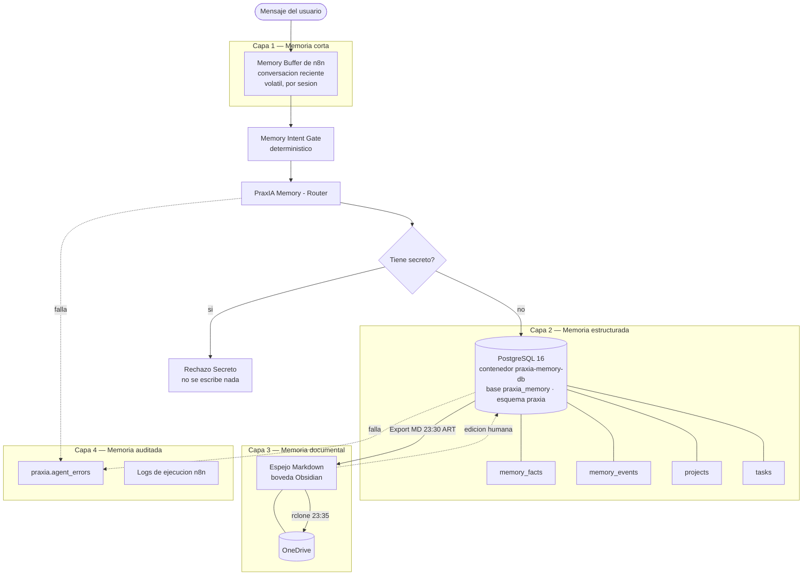

# PraxIA Memory Core — memoria en capas, sin RAG vectorial

PraxIA Memory Core es la memoria persistente del ecosistema: PostgreSQL como memoria viva, un espejo Markdown editable por humanos, y un gate que impide que un secreto entre a la base.

**Estado:** producción · **Corte de esta ficha:** 2026-08-05

---

## Objetivo

Que el agente recuerde lo que importa y sólo lo que importa: decisiones, preferencias, reglas, proyectos y tareas. No transcripciones enteras, no acumulación caótica, no "todo por las dudas".

La decisión maestra quedó grabada como el hecho #1 de la propia memoria, el 2026-07-18:

> *"La memoria viva vive en PostgreSQL (esquema `praxia`) en el VPS; MiBoveda es el espejo humano editable."*

Nace el 2026-07-18 con cinco workflows: Guardar, Consultar, Router, Tareas y Proyectos.

---

## Las 4 capas



| Capa | Qué guarda | Dónde vive | Vida |
|---|---|---|---|
| **1. Corta** | Conversación reciente | `Memory Buffer` de n8n | Volátil |
| **2. Estructurada** | Hechos, eventos, proyectos, tareas | PostgreSQL 16, esquema `praxia` | Permanente |
| **3. Documental** | Espejo legible y editable | Markdown en bóveda Obsidian + OneDrive | Permanente, regenerable |
| **4. Auditada** | Errores y ejecuciones | `praxia.agent_errors` + logs de n8n | Permanente |

**No hay RAG vectorial.** No hay embeddings, no hay base vectorial, no hay similitud coseno. La razón está en [ADR-003](../../docs/04-decisiones/adr-003-memoria-en-capas-sin-rag-vectorial.md): para un corpus de decenas de hechos escritos por una sola persona, la búsqueda full-text en español con normalización de acentos es más precisa, más barata, más explicable y no requiere reindexar nada.

---

## Infraestructura

| Ítem | Valor |
|---|---|
| Motor | PostgreSQL 16 |
| Contenedor | `praxia-memory-db` (imagen `postgres:16`) |
| Base | `praxia_memory` |
| Esquema | `praxia` |
| Exposición de puerto | **Sólo `127.0.0.1:5433`** — nada publicado a la interfaz externa |
| Red Docker | `n8n_default` |
| Cliente | n8n, por red interna |

El puerto en loopback es deliberado: la base no tiene superficie de red pública, ni siquiera detrás de Traefik. El único cliente es n8n en la misma red de Docker.

---

## Esquema `praxia`, tabla por tabla

### `memory_facts`

El corazón. Cada fila es un hecho estable que el agente debe poder recuperar.

| Columna | Para qué |
|---|---|
| `id` | Identificador. Los hechos se citan por número (el hecho #1, el hecho #14) |
| `fact` | El texto del hecho, en lenguaje natural |
| `category` | Clasificación cerrada. Valores vistos: `decision`, `recordar`, `preferencia`, `regla`, `seguridad`, `familia` |
| `project` | Proyecto al que pertenece, si aplica |
| `confidence` | Confianza declarada del hecho |
| `active` | Baja lógica. Un hecho superado se desactiva, no se borra |
| `updated_at` | Última modificación |

### `memory_events`

El registro de interacciones. Es materia prima, no memoria consultable: de acá salen hechos, pero no se consulta para responder.

| Columna | Para qué |
|---|---|
| `agent` | Qué agente generó el evento |
| `source` | Canal de origen |
| `device` | Dispositivo |
| `user_message` | Mensaje del usuario |
| `assistant_response` | Respuesta del agente |
| `intent` | Intención clasificada |
| `project` | Proyecto asociado |
| `importance` | Importancia estimada |
| `tags` | `jsonb` — etiquetas |
| `raw_json` | `jsonb` — carga cruda, para poder reconstruir sin perder nada |

### `projects`

| Columna | Para qué |
|---|---|
| `id` | Identificador |
| `proyecto` | Nombre del proyecto |
| `status` | Estado del ciclo de vida |
| `priority` | Prioridad |
| `owner` | Responsable |
| `next_action` | La próxima acción concreta. Un proyecto sin próxima acción es un deseo |
| `updated_at` | Última modificación |

### `tasks`

Tareas asociadas a proyectos, con el mismo criterio de baja lógica y actualización trazable.

### `agent_errors`

La capa auditada. Alimentada por **PraxIA — Avisador de Errores v1**, el `errorWorkflow` global.

Acompañada por la función `praxia.upsert_agent_error`, que hace dos cosas en una sola llamada:

1. **Deduplicación**: si ya existe un error equivalente (mismo workflow, mismo nodo, mismo mensaje normalizado), incrementa el contador y actualiza la última vista, en vez de insertar una fila nueva.
2. **Reserva de alerta**: devuelve si corresponde alertar o no, según una ventana anti-spam. Así, cien fallas en un minuto producen una fila y una notificación.

La implementación didáctica está en [`artifacts/sql/01-esquema-praxia-memoria.sql`](../../artifacts/sql/01-esquema-praxia-memoria.sql).

### Previstas en el esquema original, no en uso

`papers` y `content_calendar` estaban en el diseño inicial. Se documentan como previstas, no como implementadas. `[PENDIENTE DE VERIFICAR]` su estado actual en producción.

---

## Pipeline de export nocturno

```
23:30 ART  →  n8n "PraxIA Sync — Export MD"
              lee praxia.* → genera Markdown → escribe en la bóveda Obsidian

23:35      →  cron + rclone
              sincroniza la bóveda a OneDrive
```

Operativo desde el 2026-07-19/20. El primer export, el 2026-07-19, salió con 7 hechos, 1 proyecto y 1 tarea.

**Último export verificado — 2026-08-05 02:30 UTC:**

| Métrica | Valor |
|---|---|
| Proyectos | 2 |
| Hechos | 26 |
| Tareas | 4 |
| Deduplicadas | 1 |
| Secretos omitidos | 0 |

Que el export reporte "secretos omitidos: 0" no es decorativo: es la verificación de que el guard funcionó aguas arriba y que nada sensible llegó al archivo que se sube a la nube.

El sentido del espejo es doble. Hacia afuera, hace la memoria legible y editable por una persona sin abrir un cliente SQL. Hacia adentro, es una copia de seguridad semántica: si la base se pierde, el contenido sigue existiendo en texto plano versionable.

---

## El guard anti-secretos del Router

**PraxIA Memory — Router** despacha las operaciones de memoria, y antes de despachar cualquier escritura pasa por el gate **"¿Tiene secreto?"**. Si da positivo, la rama va a `Rechazo Secreto` y **no se escribe nada**.

La regla está grabada como hecho #14 de la propia memoria:

> *"Nunca guardar contraseñas, tokens, API keys, claves privadas, credenciales ni datos bancarios completos. Si Aldo intenta guardar algo sensible, advertirle y sugerir guardar solo una referencia segura."*

Tres cosas importan del diseño:

1. **El guard está en el Router, no en el prompt.** Un prompt se puede rodear con una reformulación; un nodo de código en el camino de escritura, no.
2. **La regla vive además como hecho consultable**, así que el agente puede citarla al rechazar y explicar por qué.
3. **La alternativa se ofrece.** No se rechaza y punto: se sugiere guardar una referencia segura ("la API key de X está en las credenciales de n8n"), que es lo que el agente realmente necesita recordar.

---

## Normalización y deduplicación

`Guardar Hecho` no escribe lo que le llega. Antes:

1. **Normaliza** el texto: minúsculas, acentos removidos, espacios colapsados, puntuación irrelevante descartada.
2. **Deduplica** contra la forma normalizada de los hechos activos. Si ya existe un hecho equivalente, actualiza en vez de insertar. Por eso el export reporta "1 deduplicada".
3. **Auto-clasifica reglas de seguridad**: un hecho que describe una política de seguridad entra con `category = 'seguridad'` sin que haya que pedirlo.
4. **Verifica después de escribir.** El patrón de todos los workflows de memoria es escribir y volver a leer para confirmar. Un `INSERT` que devuelve OK no es evidencia de que el dato esté consultable.

La deduplicación por forma normalizada resuelve el problema práctico de una memoria conversacional: la misma decisión se cuenta cinco veces con cinco redacciones distintas, y sin normalizar terminás con cinco filas que dicen lo mismo y ninguna que sea la buena.

---

## Búsqueda full-text en español

`Consultar Memoria` corre dentro de `BEGIN TRANSACTION READ ONLY`. Es una decisión de permisos aplicada en el nivel más barato posible: **la consulta no puede escribir aunque el SQL tenga un error**.

Piezas:

| Pieza | Para qué |
|---|---|
| `unaccent` | "gestion" encuentra "gestión". Los mensajes de Telegram vienen sin acentos la mitad de las veces |
| `to_tsvector('spanish')` | Stemming en español: "proyectos" encuentra "proyecto", "decidido" encuentra "decidir" |
| Stop-words en español | "el", "de", "que" no aportan y ensucian el ranking |
| **Tier estricto** | Todos los términos significativos presentes. Alta precisión |
| **Tier laxo** | Al menos un término significativo, o coincidencia parcial por `ILIKE` sobre la forma normalizada. Alta cobertura |

Los dos niveles se devuelven ordenados: primero los del tier estricto, después los del laxo. El agente ve la diferencia y puede decir "encontré esto exacto, y esto relacionado".

La consulta completa, comentada, está en [`artifacts/sql/02-consulta-memoria-fulltext.sql`](../../artifacts/sql/02-consulta-memoria-fulltext.sql).

---

## Límites conocidos

1. **Sin RAG vectorial y sin embeddings.** No hay búsqueda semántica: si el usuario pregunta con un vocabulario que no comparte ninguna raíz con el hecho guardado, no lo encuentra. Es una limitación aceptada, no un olvido — ver [ADR-003](../../docs/04-decisiones/adr-003-memoria-en-capas-sin-rag-vectorial.md).
2. **Sin memoria documental buscable.** Los PDFs y documentos se archivan en Drive y se espejan en Markdown, pero **no hay índice de contenido**. Buscar dentro de un PDF guardado no está resuelto.
3. **Escala chica.** Al 2026-08-05 hay 26 hechos, 2 proyectos y 4 tareas. Todo el diseño está calibrado para ese orden de magnitud. Con miles de hechos, el tier laxo devolvería ruido.
4. **Deduplicación por forma normalizada, no semántica.** Dos hechos que dicen lo mismo con palabras distintas conviven.
5. **`memory_events` crece sin política de retención definida.** `[PENDIENTE DE VERIFICAR]` — no hay purga ni archivado documentado.
6. **El espejo Markdown es de ida.** El export escribe de la base al archivo. La edición humana del archivo no vuelve automáticamente a la base; hay que reingresarla por el agente.
7. **Backups sin off-site ni ensayo de restauración demostrado.** El mismo riesgo abierto que el resto de la infraestructura.
8. **Un solo usuario.** El esquema no tiene todavía columna de tenant. La separación por usuario está en el diseño del ecosistema (identidad por `chat_id`), no en las tablas.

---

## Criterios de aceptación

1. **Ningún secreto llega a la base.** Todo intento de guardar credenciales termina en `Rechazo Secreto`, y el export nocturno reporta `secretos omitidos: 0` por ausencia de intentos exitosos, no por falta de control.
2. **Ninguna consulta puede escribir.** `Consultar Memoria` corre en transacción `READ ONLY`.
3. **Toda escritura se verifica leyendo después.** Un `INSERT` sin lectura de confirmación no cuenta como guardado.
4. **No se borra: se desactiva.** `active = false` y `updated_at` actualizado.
5. **Los hechos equivalentes no se duplican.** La normalización decide, y la deduplicación queda reportada en el export.
6. **La búsqueda tolera acentos y variaciones morfológicas.** "gestion de proyectos" encuentra "gestión del proyecto".
7. **El agente no dice "no tengo registrado" sin haber consultado** y recibido `facts=[]`.
8. **El export nocturno corre todos los días** y su resultado es contable: proyectos, hechos, tareas, deduplicadas, secretos omitidos.
9. **La base no tiene superficie de red pública.** Puerto en loopback, red interna de Docker.

---

## Pruebas mínimas

| # | Prueba | Resultado esperado |
|---|---|---|
| 1 | Guardar un hecho nuevo | Fila creada, lectura de verificación OK, id devuelto |
| 2 | Guardar el mismo hecho con otra redacción y sin acentos | **No** se crea fila nueva: se actualiza la existente |
| 3 | Guardar "la clave del banco es 1234" (valor sintético) | `Rechazo Secreto`. Cero filas escritas. Se sugiere guardar una referencia |
| 4 | Guardar una política de seguridad | Entra con `category = 'seguridad'` sin indicarlo explícitamente |
| 5 | Consultar con acentos contra un hecho sin acentos | Encontrado |
| 6 | Consultar sin acentos contra un hecho con acentos | Encontrado |
| 7 | Consultar en plural contra un hecho en singular | Encontrado (stemming español) |
| 8 | Consultar algo inexistente | `facts=[]`, sin resultados inventados |
| 9 | Consulta cuyos términos sólo coinciden parcialmente | Devuelto en tier laxo, marcado como tal |
| 10 | Intentar una escritura desde el camino de consulta | Falla la transacción `READ ONLY` |
| 11 | Desactivar un hecho superado | `active = false`, la fila sigue existiendo, deja de aparecer en consultas |
| 12 | Crear un proyecto sin `next_action` | Se acepta pero queda marcado como incompleto |
| 13 | Forzar un error en un workflow de memoria | Fila en `agent_errors` + una alerta |
| 14 | Repetir el mismo error N veces | Una fila, contador en N, una sola alerta por ventana |
| 15 | Correr el export nocturno a mano | Markdown regenerado, conteos coherentes con la base |
| 16 | Verificar el archivo exportado con un escaneo de secretos | Cero coincidencias |
| 17 | Intentar conectarse a la base desde fuera del host | Conexión rechazada (puerto en loopback) |

---

## Documentos relacionados

- [Qué recuerda y qué no](../../docs/00-manual-de-usuario/05-memoria-que-recuerda-y-que-no.md)
- [Memoria y RAG](../../docs/02-desglose-tecnico/07-memoria-y-rag.md)
- [Cuándo uso SQL](../../docs/02-desglose-tecnico/01-cuando-uso-sql.md)
- [ADR-002 — PostgreSQL propio en vez de Supabase](../../docs/04-decisiones/adr-002-postgres-propio-en-vez-de-supabase.md)
- [ADR-003 — Memoria en capas sin RAG vectorial](../../docs/04-decisiones/adr-003-memoria-en-capas-sin-rag-vectorial.md)
- [Esquema SQL didáctico](../../artifacts/sql/01-esquema-praxia-memoria.sql)
- [Consulta full-text comentada](../../artifacts/sql/02-consulta-memoria-fulltext.sql)

> Última verificación: 2026-08-05
